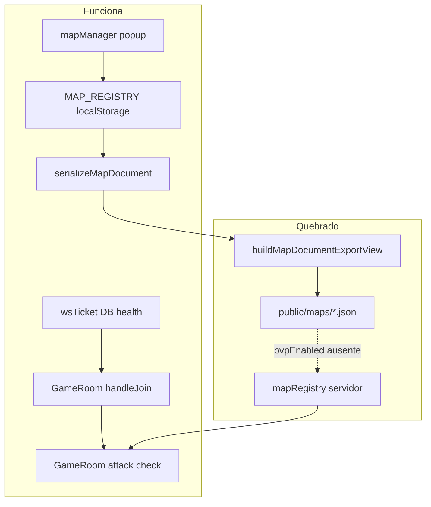

# Auditoria: PvP, Persistência de Vida e Morte

## Veredicto geral

| Área do plano | Status | Nota |
|---|---|---|
| 1. Persistência de HP (DB/ticket/servidor) | **Parcial** | Backend funcional; gaps de timing e cliente |
| 2. `pvpEnabled` no Studio/servidor | **Parcial com bug crítico** | UI e lógica de combate OK; **save JSON quebrado** |
| 3. Morte arena vs mundo aberto | **Implementado no servidor** | XP 10% fora da arena; sem penalidade na zona 3 |
| 4. Testes automatizados | **Parcial** | 7 testes PvP passam (53 total); não cobrem bugs reais |

`npm test` confirmado: **53/53 passando** (incluindo [`src/server/combat/pvp.test.ts`](src/server/combat/pvp.test.ts)).

---

## O que foi implementado corretamente

### Persistência de HP (servidor)

- Migração [`database/migrations/003_character_health.sql`](database/migrations/003_character_health.sql) adiciona coluna `health`.
- Repositório [`server/src/db/repositories/characters.repo.ts`](server/src/db/repositories/characters.repo.ts) lê/escreve `health` com `COALESCE` (omitir não apaga valor existente).
- Ticket WS em [`server/src/routes/wsTicket.ts`](server/src/routes/wsTicket.ts) + [`server/src/enterTicket.ts`](server/src/enterTicket.ts) propaga `health`.
- [`server/src/game/PositionPersistence.ts`](server/src/game/PositionPersistence.ts) inclui `health` no debounce (~20s) e no `saveNow`.
- [`server/src/GameRoom.ts`](server/src/GameRoom.ts):
  - Join: `health > 0` → `Math.min(ticket.health, maxHealth)`; caso contrário → `maxHealth`.
  - Disconnect: `persistPlayerPosition(player, true)`.
  - Movimento/mudança de mapa: persiste posição + HP.

### Regras de combate e morte

- Bloqueio PvP quando `mapEntry.pvpEnabled === false` (ex.: rookgaard hardcoded).
- Bloqueio em PZ (zona 1) para atacante e alvo.
- Morte fora da arena (`zoneId !== 3`): perda de 10% XP, `player_progress`, persistência imediata de progresso.
- Morte na arena (zona 3): sem penalidade de XP.
- Respawn no spawn do mapa (`getMapSpawn`) com `health = maxHealth` + `position_correction` à vítima.

### Studio (parcial)

- Tipo `pvpEnabled` em [`src/engine/types.ts`](src/engine/types.ts).
- Registry localStorage em [`src/engine/mapRegistryStorage.ts`](src/engine/mapRegistryStorage.ts).
- UI em [`src/editor/mapManager.ts`](src/editor/mapManager.ts) (popup Sim/Não + badge na lista).
- Serialização em memória via [`src/engine/worldMap.ts`](src/engine/worldMap.ts) + [`src/main.ts`](src/main.ts) (`buildCurrentMapDocument`).

---

## Bugs e gaps (por prioridade)

### P0 — Crítico: `pvpEnabled` não é salvo no JSON

[`src/engine/mapDocumentFormat.ts`](src/engine/mapDocumentFormat.ts) omite `pvpEnabled` em `buildMapDocumentExportView` (linhas 42–87) e em `formatMapDocumentJson` (`headerKeys`/`tailKeys`, linhas 182–212).

**Impacto confirmado:** nenhum arquivo em `public/maps/` contém `pvpEnabled`. O Studio grava a flag só no `localStorage`; o servidor lê do JSON e usa default `true` para mapas custom.

**Correção:** incluir `pvpEnabled` (e idealmente `instanced`) no export view e no formatador; atualizar `public/maps/map.schema.json`.

### P1 — Alto: HP do cliente não reflete valor persistido ao entrar

- [`WelcomeMessage`](shared/protocol.ts) não inclui `health`/`maxHealth` do jogador local.
- [`src/game/playApp.ts`](src/game/playApp.ts) (linhas 1382–1384) inicializa `player.health = stats.health` (máximo) antes da conexão WS.
- Servidor pode ter HP parcial (ex.: 45/100); UI mostra cheio até o primeiro `player_damaged`.

**Correção:** adicionar `health`/`maxHealth` ao `welcome` (ou mensagem `player_health_sync` no join) e aplicar no `playApp` ao conectar.

### P1 — Alto: observadores não veem respawn imediato de jogador morto

- [`src/net/gameNetClient.ts`](src/net/gameNetClient.ts): `player_died` seta `remote.health = 0`; não há teleporte nem cura.
- Respawn só aparece no próximo `state_sync` (~1s).
- Servidor não faz broadcast de `player_moved`/`player_respawned` após morte (diferente de `creature_respawned`).

**Correção:** broadcast de respawn (novo evento ou reutilizar padrão de criaturas) com posição + HP, ou incluir dados no `player_died` para espectadores.

### P2 — Médio: `maxHealth` desatualizado após level down na morte

Em [`server/src/GameRoom.ts`](server/src/GameRoom.ts) (linhas 991–1019): após perda de XP, `level` é recalculado mas `maxHealth` não. Respawn usa `maxHealth` do level antigo.

**Correção:** recalcular `maxHealth` via `calculateStatsForLevel` após alterar `level`; enviar `maxHealth` no `player_progress` ou mensagem dedicada.

### P2 — Médio: HP não persiste após dano sem movimento

Dano PvP atualiza `player.health` em memória mas não chama `persistPlayerPosition`. Só salva no próximo movimento (debounce) ou disconnect.

**Risco:** reconnect rápido (< debounce) lê ticket com HP antigo do DB.

**Correção:** `persistPlayerPosition` debounced após `player_damaged` significativo, ou flush de HP junto com progresso.

### P2 — Médio: registry servidor não atualiza após save

[`initServerMapRegistry()`](server/src/mapRegistry.ts) roda só no boot ([`server/src/index.ts`](server/src/index.ts)). `POST /api/save-map` grava JSON mas não recarrega registry em memória.

**Correção:** re-scan do mapa salvo (ou merge) após `saveMap`; para builtins, mesclar JSON sobre hardcoded.

### P2 — Médio: dessincronia registry ↔ JSON no Studio

- [`applyLoadedMap`](src/main.ts) (linhas 2184–2227) ignora `loaded.pvpEnabled` — não atualiza `MAP_REGISTRY`.
- [`duplicateFromCurrent`](src/main.ts) e duplicar em [`mapManager.ts`](src/editor/mapManager.ts) não propagam `pvpEnabled`.

**Correção:** sincronizar registry ao carregar/duplicar mapa.

### P3 — Baixo / UX

- `NO_PVP_MAP`: [`gameNetClient.ts`](src/net/gameNetClient.ts) só faz `console.warn` — sem toast para o jogador.
- `applyPlayProgressUpdate` em [`playApp.ts`](src/game/playApp.ts) sempre cura (`player.health = stats.health`) em qualquer `player_progress` — pode mascarar dano em combate.
- `flushAll()` em [`PositionPersistence.ts`](server/src/game/PositionPersistence.ts) existe mas nunca é chamado no shutdown.
- Mapas instanciados: persistência de posição/HP totalmente ignorada (`isInstancedMap` early return).
- Zonas hardcoded (`1`, `3`) em vez de importar `ZoneType` de [`src/engine/zones.ts`](src/engine/zones.ts).
- `verifyEnterTicket` chamado duas vezes em `handleJoin` (redundante).

---

## Cobertura de testes vs realidade

Os 7 testes em [`src/server/combat/pvp.test.ts`](src/server/combat/pvp.test.ts) cobrem bem a lógica **interna** do `GameRoom`:

| Caso | Coberto |
|---|---|
| Ataque em mapa PvP | Sim |
| Bloqueio `pvpEnabled: false` (rookgaard builtin) | Sim |
| PZ atacante/alvo | Sim |
| HP do ticket no join | Sim |
| 10% XP fora da arena | Sim (estado interno) |
| Sem XP na arena (zona 3) | Sim (estado interno) |

**Não coberto (onde estão os bugs reais):**

- Export JSON com `pvpEnabled` ([`mapDocumentFormat.ts`](src/engine/mapDocumentFormat.ts))
- Mensagens WS (`player_died`, `position_correction`, `player_progress`)
- Coordenadas de respawn assertadas
- `maxHealth` após level down
- Sync cliente (welcome/HP inicial, remotos pós-morte)
- Reload de registry após save
- Persistência de HP após dano sem movimento

---

## Plano de correções recomendado

### Fase 1 — Desbloquear `pvpEnabled` end-to-end (P0)

1. Adicionar `pvpEnabled` (e `instanced` se desejado) em [`mapDocumentFormat.ts`](src/engine/mapDocumentFormat.ts).
2. Atualizar [`public/maps/map.schema.json`](public/maps/map.schema.json).
3. Sincronizar registry em `applyLoadedMap` e fluxos de duplicar mapa.
4. Re-scan do mapa no servidor após `save-map`.

### Fase 2 — Sync de HP (P1)

1. Estender protocolo `welcome` com `health`/`maxHealth`.
2. Aplicar no [`playApp.ts`](src/game/playApp.ts) ao receber welcome.
3. Broadcast de respawn PvP para observadores.

### Fase 3 — Robustez de combate/morte (P2)

1. Recalcular `maxHealth` após penalidade de XP na morte.
2. Persistir HP após dano (debounce curto ou junto com eventos de combate).
3. Toast para `NO_PVP_MAP` no Play.

### Fase 4 — Testes adicionais

1. Teste de round-trip: `serializeMapDocument` → `formatMapDocumentJson` → parse → `pvpEnabled` preservado.
2. Teste de respawn: assert de `tileX/Y/Z` e mensagens WS.
3. Teste de `maxHealth` após level down na morte.

---

## Checklist de verificação manual (do plano original)

| Cenário | Esperado hoje | Risco |
|---|---|---|
| Studio: toggle PvP + salvar | JSON **não** terá `pvpEnabled` | **Falha** |
| Deslogar com meia vida e relogar | Servidor restaura HP do DB; cliente pode mostrar cheio até dano | **Parcial** |
| Morrer na PvP Arena (zona 3) | Sem perda XP; respawn no spawn | OK no servidor |
| Morrer fora da arena | 10% XP; respawn no spawn | OK no servidor; UI remota atrasada |

---

## Conclusão

A implementação **não está 100% concluída**. O walkthrough superestima o estado: os testes passam porque validam lógica isolada do `GameRoom` com mocks, mas o pipeline mais importante para o GM (**Studio → JSON → servidor**) está quebrado pelo export em [`mapDocumentFormat.ts`](src/engine/mapDocumentFormat.ts). A persistência de HP funciona no backend para disconnect/movimento, porém o cliente não reflete o HP salvo ao entrar, e há janelas de inconsistência após dano rápido ou morte observada por terceiros.
