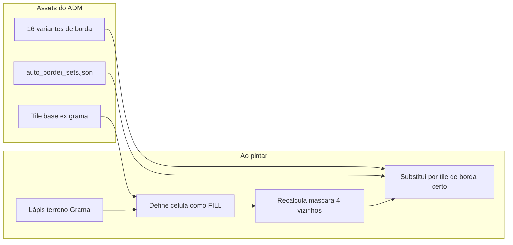

> **Cancelado (2026-05):** sistema de auto-borda removido do escopo. Motor e UI legados não estão no source atual. Reimplementar como feature nova se necessário.

# Plano: Auto-Borda (Preenchimento inteligente de bordas)

## Contexto no projeto hoje

- Pintura em [`src/main.ts`](src/main.ts) grava `worldMap[z][y][x] = selectedTileType` (lápis/balde) via [`mapEditorController`](src/editor/mapEditor.ts).
- Tiles vêm de PNG em `tiles/terrain/**` registrados em [`buildTileRegistry()`](src/engine/tileRegistry.ts); propriedades extras em `tiles/tile_properties.json` (API [`/api/save-map-sprite`](vite.config.ts)).
- **Não existe** conceito de “terreno base” vs “tile de borda” nem recálculo de vizinhos.

## Conceito (como no RME, adaptado)



**Regra:** o ADM pinta só o **preenchimento** (ex. grama). O sistema olha os 4 vizinhos cardinais (N, E, S, W) e escolhe o tile de borda correto no **conjunto de transição** ativo (ex. `grass_water`).

### Exemplo visual (grama perto de água)

Antes (ADM pintou só grama, água já existia):

```
~ ~ ~ ~ ~
~ G G G ~
~ G G ~ ~
~ ~ ~ ~ ~
```
(`G` = grama base, `~` = água)

Depois do Auto-Borda (bordas na interface grama|água):

```
~ ~ ~ ~ ~
~ B B B ~    B = tile "grama com borda para água" (lado que encosta na água)
~ B G B ~
~ ~ B ~ ~
```

Ao pintar **mais uma** célula de grama, o engine reprocessa essa célula **e os 4 vizinhos** (raio 1), para atualizar cantos e linhas.

### Máscara de vizinhos (MVP: 4 direções)

Para cada célula com terreno **A** (fill), comparar vizinhos com terreno **B** (ex. água):

| Bit | Vizinho |
|-----|---------|
| 1 | Norte é B |
| 2 | Leste é B |
| 4 | Sul é B |
| 8 | Oeste é B |

**Máscara 0–15** → escolhe um dos até 16 PNGs do conjunto `A_on_B` (ex. `grass_on_water_mask_5.png`).

Cantos internos/externos no MVP: cobrir os 16 índices com artes distintas (como RME faz no spritesheet 4×4).

---

## Modelo de dados

### 1. Estender propriedades do tile

Em [`tiles/tile_properties.json`](tiles/tile_properties.json) (e tipos em [`RegistryTile`](src/engine/types.ts)):

```json
{
  "grass": {
    "walkable": true,
    "terrainGroup": "grass",
    "tileRole": "fill"
  },
  "grass_water_n": {
    "terrainGroup": "grass",
    "tileRole": "border",
    "borderSetId": "grass_water",
    "borderMask": 1
  }
}
```

| Campo | Significado |
|-------|-------------|
| `terrainGroup` | Identificador lógico do terreno (`grass`, `water`, `stone`) |
| `tileRole` | `fill` \| `border` \| `neutral` (paredes/árvores não entram no auto-borda) |
| `borderSetId` | Conjunto de transição (só em `border`) |
| `borderMask` | 0–15, vizinhos do tipo “outro terreno” |

### 1.1 Campos na UI (resposta direta: “esta imagem é borda?”)

**Sim.** O ADM não precisa adivinhar só pelo nome do arquivo. Haverá campos explícitos em dois lugares:

#### A) Sprites de mapa (tile avulso) — estender painel existente

No fluxo **Criar → Sprites de mapa** ([`mapSpriteEditor.ts`](src/editor/mapSpriteEditor.ts)), bloco novo **“Auto-borda”** abaixo das propriedades físicas:

| Campo UI | Tipo | Quando aparece | Grava em |
|----------|------|----------------|----------|
| **Participa do auto-borda** | checkbox | Tipo = Terreno | `participatesInAutoBorder: true` |
| **Papel do tile** | select | checkbox ligado | `tileRole`: `fill` \| `border` \| `neutral` |
| **Terreno (grupo)** | text/select | checkbox ligado | `terrainGroup` ex. `grass` |
| **Conjunto de borda** | select | Papel = `border` | `borderSetId` ex. `grass_water` |
| **Máscara (0–15)** | number ou select visual | Papel = `border` | `borderMask` |

Comportamento:

- **Papel = Preenchimento (`fill`)** — tile base que o ADM pinta com o pincel; não escolhe borda na paleta.
- **Papel = Borda (`border`)** — arte de transição; exige **Conjunto** + **Máscara**; badge “Borda” na paleta.
- **Papel = Neutro** — paredes, árvores, decoração; auto-borda ignora.

Se o ADM importar um PNG de borda **sem** preencher máscara, o salvar bloqueia com aviso: *“Tiles de borda precisam de conjunto e máscara.”*

#### B) Aba Auto-Borda (importação em lote)

Ao importar spritesheet 4×4 ou 16 arquivos, o sistema **preenche automaticamente** `tileRole: border`, `borderSetId` e `borderMask` por posição na grade (célula 0 = máscara 0, etc.). O ADM só confirma na pré-visualização; pode clicar numa célula da grade para corrigir a máscina se a arte estiver trocada.

**Resumo:** campo manual no sprite avulso; atribuição automática (editável) no assistente de conjunto.

### 2. Manifest global de conjuntos

Novo arquivo [`public/auto_border_sets.json`](public/auto_border_sets.json) (ou `tiles/auto_border_sets.json`):

```json
{
  "version": 1,
  "sets": [
    {
      "id": "grass_water",
      "label": "Grama ↔ Água",
      "fillTerrain": "grass",
      "neighborTerrain": "water",
      "tiles": {
        "0": "grass_fill",
        "1": "grass_water_n",
        "2": "grass_water_e",
        "5": "grass_water_ne",
        "...": "..."
      }
    }
  ]
}
```

`tiles` mapeia **máscara → nome do arquivo** (sem `.png`). O loader resolve para `tileId` numérico após `buildTileRegistry()`.

---

## Como o ADM carrega as imagens

Reutilizar o fluxo existente **Criar → Sprites de mapa** ([`src/editor/mapSpriteEditor.ts`](src/editor/mapSpriteEditor.ts)) + novo assistente dedicado.

### Estrutura de pastas recomendada

```
tiles/terrain/
  grass/
    grass_64x64.png              # fill (tileRole: fill)
  borders/
    grass_water/
      grass_water_mask_0.png     # opcional: mesmo que fill
      grass_water_mask_1.png     # borda só ao norte
      ...
      grass_water_mask_15.png
  water/
    water_64x64.png              # fill água
```

**Alternativa (mais rápida para o ADM):** um único **spritesheet 4×4** (16 células) por conjunto; o assistente fatia e gera os 16 PNGs + entradas no manifest.

### Passo a passo para o ADM (documentar em `docs/auto-border.md`)

1. **Terreno base** — Em Studio → Criar → Sprites de mapa: importar `grass_64x64.png`, tipo Terreno, categoria `grass`, marcar walkable. Em **Auto-borda**: ligar “Participa do auto-borda”, **Papel = Preenchimento**, **Terreno = grass**. Salvar (grava PNG + `tile_properties.json`).
2. **Terreno vizinho** — Idem para `water`: **Papel = Preenchimento**, **Terreno = water** (ou **Neutro** se a água nunca receber borda automática — nesse caso só serve de vizinho no mapa).
3. **Abrir assistente Auto-Borda** — Studio → Mapa → aba **Auto-Borda** (nova).
4. **Criar conjunto** — Nome: `Grama ↔ Água`, Terreno pintado: `grass`, Vizinho: `water`.
5. **Importar bordas** — Opção A: 16 arquivos PNG nomeados `mask_0`…`mask_15`; Opção B: 1 imagem 256×256 (4×4 tiles 64px) → sistema fatia.
6. **Pré-visualizar grade 4×4** — Conferir se máscara 1 (só norte) bate com a arte correta; ajustar mapeamento se necessário.
7. **Salvar conjunto** — Grava PNGs em `tiles/terrain/borders/grass_water/` + atualiza `auto_border_sets.json` + `tile_properties.json` (borderMask por arquivo).
8. **Recarregar paleta** — Botão “Recarregar tiles” (ou F5) para `buildTileRegistry()` pegar novos PNGs.
9. **Pintar no mapa** — Aba Mapa: ligar **Auto-borda**, escolher pincel **Grama**, pintar perto da água; bordas aparecem sozinhas.
10. **Desligar** — Auto-borda OFF volta ao comportamento atual (tile único sem recálculo).

---

## UI proposta (GM Studio)

### A) Barra do editor de mapa (acima do canvas ou na coluna de ferramentas)

```
[ Ferramentas: P B E ... ]  |  [x] Auto-borda   Conjunto: [ Grama ↔ Água v ]   Pincel: [ Grama (fill) v ]
```

| Controle | Comportamento |
|----------|----------------|
| Checkbox **Auto-borda** | ON: após cada pintura chama `applyAutoBorderAt(x,y,z)` |
| Dropdown **Conjunto** | Lista `auto_border_sets.json`; define par fill↔neighbor |
| Dropdown **Pincel** | Só tiles com `tileRole: fill` do `fillTerrain` do conjunto |
| Paleta clássica | Continua mostrando todos os tiles; bordas ficam com badge “Borda” e desabilitadas para seleção manual quando auto-borda ON |

### B) Nova aba no painel Mapa: **Auto-Borda**

Layout em 2 colunas:

**Esquerda — Conjuntos**
- Lista: `grass_water`, `grass_stone`, …
- Botões: Novo, Duplicar, Excluir, Salvar

**Direita — Editor do conjunto**
- Campos: ID, Label, Terreno fill, Terreno vizinho
- Área de upload: drag-and-drop spritesheet ou 16 arquivos
- **Grade 4×4 preview** (16 miniaturas clicáveis) com número da máscara em cada célula; cada célula mostra badge **“Borda”** e dropdown para remapear máscara 0–15
- Ao salvar: todas as células da grade gravam `tileRole: border` + `borderSetId` + `borderMask` em `tile_properties.json`
- Botão “Testar no mapa” (pinta 5×5 de exemplo no canto do mapa)

### C) Feedback no canvas

- Overlay opcional: contorno azul claro em células recalculadas no último frame (debug, desligável).
- Toast: “Auto-borda aplicada em 12 células” após stroke do lápis.

---

## Implementação técnica (módulos)

### Novos arquivos

| Arquivo | Responsabilidade |
|---------|------------------|
| [`src/engine/autoBorder.ts`](src/engine/autoBorder.ts) | `computeMask`, `resolveBorderTileId`, `applyAutoBorderAt`, `applyAutoBorderRegion` |
| [`src/engine/autoBorderManifest.ts`](src/engine/autoBorderManifest.ts) | Load/parse `auto_border_sets.json`, índices por terrainGroup |
| [`src/editor/autoBorderEditor.ts`](src/editor/autoBorderEditor.ts) | UI aba Auto-Borda + upload |
| [`docs/auto-border.md`](docs/auto-border.md) | Guia ADM (passo a passo acima) |

### Algoritmo central (`applyAutoBorderAt`)

```typescript
// Pseudocódigo
function applyAutoBorderAt(map, x, y, z, activeSet) {
  for (const [cx, cy] of neighborsPlusSelf(x, y)) {
    const fillId = getFillTileForTerrain(activeSet.fillTerrain);
    const cellId = map[z][cy][cx];
    const group = getTerrainGroup(cellId);
    if (group !== activeSet.fillTerrain) continue;

    const mask = computeMask(map, cx, cy, z, activeSet.neighborTerrain);
    const borderTileId = activeSet.resolveTile(mask); // fill se mask 0 e sem vizinho B
    map[z][cy][cx] = borderTileId ?? fillId;
  }
}
```

Integrar em [`src/main.ts`](src/main.ts) após linhas que setam tile (lápis ~798, balde ~803, retângulo/linha ~984).

### Carregamento de registry

Estender [`buildTileRegistry()`](src/engine/tileRegistry.ts) ou pós-processo: ler `tile_properties.json` e anexar `terrainGroup`, `tileRole`, `borderMask` em cada `RegistryTile`.

API dev nova (opcional fase 2): `POST /api/save-auto-border-set` — recebe manifest + PNGs, grava pasta + JSON (espelha `save-map-sprite`).

---

## Fases de entrega

### Fase 1 — MVP (2 terrenos, máscara 4-bit)

- Manifest estático `grass_water` com 16 PNGs de exemplo commitados em repo
- `autoBorder.ts` + hook no lápis/balde
- UI: checkbox + dropdown conjunto + pincel fill only
- Doc ADM

**Aceite:** pintar grama ao lado de água atualiza bordas sem escolher tile de borda manualmente.

### Fase 2 — Assistente de upload

- Aba Auto-Borda com upload spritesheet 4×4
- Geração automática de `auto_border_sets.json` + propriedades
- Botão recarregar registry sem F5

### Fase 3 — Avançado (backlog)

- Transição bidirecional (água também ganha borda para grama — segundo conjunto `water_grass`)
- 8 vizinhos (diagonais) para cantos mais suaves
- Suporte a 3+ terrenos (tabela de prioridade: água > grama > terra)

---

## Exemplo completo de manifest + nomes de arquivo

Conjunto `grass_water` — trecho:

| Máscara | Vizinhos com água | Arquivo sugerido |
|--------|-------------------|------------------|
| 0 | nenhum | `grass_fill` (usa tile base) |
| 1 | N | `grass_water_n` |
| 2 | E | `grass_water_e` |
| 4 | S | `grass_water_s` |
| 8 | W | `grass_water_w` |
| 5 | N+E | `grass_water_ne` |
| … | … | … |
| 15 | N+E+S+W | `grass_water_inner` (grama “ilha” em lago) |

---

## Riscos e decisões

| Tema | Decisão |
|------|---------|
| Conflito com tile manual | Auto-borda ON sobrescreve células do `fillTerrain` no raio 1; OFF preserva comportamento atual |
| Histórico undo | Cada `applyAutoBorder` deve entrar no mesmo `saveState()` que a pintura (um undo desfaz stroke + bordas) |
| Performance | Balde grande: aplicar borda em batch após flood fill (uma passada na região afetada), não célula a célula com realloc |
| Tiles sem `terrainGroup` | Tratados como `neutral` — não participam do auto-borda |

---

## Referência no roadmap

Após implementação, marcar item 5 em [`ideas_rme_roadmap.md`](ideas_rme_roadmap.md) como em progresso/concluído e link para [`docs/auto-border.md`](docs/auto-border.md).
