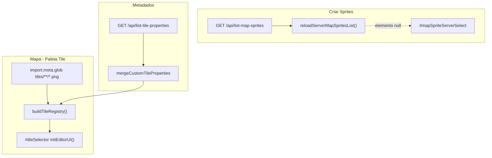

# Análise: busca de tiles/sprites e correções

## Resposta direta

**Parcialmente implementado.** Não existe um único sistema de “buscar tiles”; são **dois fluxos** com comportamentos diferentes:

| Onde | O que o usuário espera | O que existe hoje | Status |
|------|------------------------|-------------------|--------|
| **Criar → Sprites de mapa** | Lista/dropdown para abrir PNGs já salvos | `GET /api/list-map-sprites` + [`reloadServerMapSpritesList()`](src/editor/mapSpriteEditor.ts) | **API OK, UI ausente** |
| **Mapa → aba Tile** | Paleta com todos os PNGs de `tiles/` | [`buildTileRegistry()`](src/engine/tileRegistry.ts) via `import.meta.glob` | **Funciona em dev**, com bugs de filtro/recarga |
| **Propriedades extras** | walkable, auto-borda, etc. | `GET /api/list-tile-properties` em [`loadCustomTileProperties()`](src/main.ts) | OK (só metadados, não descobre PNGs novos) |

Na sua captura (**Criar Sprites**), o bloco Auto-borda com um único checkbox é **esperado** até marcar *Participa do auto-borda*; o que **não** aparece é o dropdown **“Selecionar Sprite Existente”** — porque o elemento HTML nunca foi criado.

---

## Arquitetura atual



---

## Bug 1 (crítico): seletor de sprites inexistente no HTML

**Código:** [`mapSpriteEditor.ts`](src/editor/mapSpriteEditor.ts) linhas 44–58:

```typescript
const serverSelect = document.getElementById('mapSpriteServerSelect');
// ...
async function reloadServerMapSpritesList() {
    if (!serverSelect) return;  // sai em silêncio
```

**HTML:** [`studio.html`](studio.html) — painel `sprite_creator` **não contém** `id="mapSpriteServerSelect"` (grep no repo: zero ocorrências fora do TS).

**Efeito:** em **Criar Sprites** não há como buscar/listar sprites; a função roda mas não faz nada visível. Sem erro na UI.

**Correção proposta:** inserir no painel (após “Tipo de Asset” ou antes de “Ações / Importar”):

```html
<label class="flyout-label">Sprites existentes</label>
<select id="mapSpriteServerSelect" class="select-full" style="margin-bottom: 12px; ...">
  <option value="">-- Selecionar Sprite Existente --</option>
</select>
```

Opcional: botão “Atualizar lista” que chama `reloadServerMapSpritesList()` e toast se a API falhar.

---

## Bug 2: filtro de categoria na paleta do mapa

**Código:** [`mapEditor.ts`](src/editor/mapEditor.ts) filtra `tile.category !== currentCategory`.

**Categorias na UI:** `ground`, `nature`, `walls`, `items` ([`studio.html`](studio.html) aba Tile).

**Categorias reais dos PNGs** (derivadas da pasta pai em [`tileRegistry.ts`](src/engine/tileRegistry.ts)):

| Arquivo | `tile.category` atribuída |
|---------|---------------------------|
| `terrain/grass/grass_64x64.png` | `grass` |
| `terrain/water/water_64x64.png` | `water` |
| `terrain/borders/grass_water/*.png` | `grass_water` |

**Efeito:** com aba **Pisos** (`ground`) ativa, a paleta fica **vazia**; só **Tudo** mostra tiles. Parece que “buscar tiles” não funciona.

**Correção proposta (escolher uma):**

1. **Mapeamento** em `buildTileRegistry`: normalizar pasta → `ground` | `nature` | `walls` | `items` (ex.: `grass`, `water` → `ground`; `borders/*` → `ground` ou categoria `borders`).
2. **Ou** alinhar botões da UI às pastas reais (`grass`, `water`, `borders`).
3. **Ou** usar `tile_properties.json` com campo `paletteCategory` explícito.

Recomendação: mapeamento + fallback `terrain` → `ground` para compatibilidade com ADM que usa subpasta `ground` no save ([`vite.config.ts`](vite.config.ts) `category` no save-map-sprite).

---

## Bug 3: tiles novos após salvar não aparecem sem recarga

- **Paleta:** `import.meta.glob` é resolvido pelo Vite; PNGs novos em `tiles/` exigem **F5** ou **Recarregar tiles** ([`abReloadRegistryBtn`](studio.html) / `reloadTileRegistryAndAutoBorder`).
- **Produção (`npm run build` + preview estático):** middleware `/api/*` **não existe** — salvar/listar sprites **só funciona com `npm run dev`**.

**Como identificar:** após salvar sprite, Network não mostra novo chunk; paleta igual até reload.

---

## Bug 4: possível confusão Auto-borda vs “buscar”

Auto-borda **não** é busca de sprites; só recalcula bordas ao pintar. Campos extras em Criar Sprites aparecem só se:

1. Tipo = **Terreno** (`syncAutoBorderUiVisibility` em [`mapSpriteEditor.ts`](src/editor/mapSpriteEditor.ts))
2. Checkbox **Participa do auto-borda** ligado

Isso está correto pelo plano; não é bug de fetch.

---

## Como identificar problemas (checklist)

### A) Criar Sprites — lista de existentes

1. DevTools → **Elements**: procurar `#mapSpriteServerSelect` → se **null**, bug 1 confirmado.
2. **Console**: não há log de erro (by design); opcional adicionar `console.warn` quando `!serverSelect`.
3. **Network** (com `npm run dev`): `GET http://localhost:5173/api/list-map-sprites` → deve retornar `{ success: true, sprites: [...] }` com ~18 entradas hoje.
4. Teste manual no terminal: abrir essa URL no browser.

### B) Mapa — paleta de tiles

1. Abrir **Mapa → Tile → Tudo**: deve listar grama, água, 16 bordas.
2. Clicar **Pisos**: se sumir tudo → bug 2 confirmado.
3. **Console**: erros de `auto_border_sets.json` ou manifest (auto-borda separado).
4. Após salvar PNG novo: F5 ou botão **Recarregar tiles** na aba Borda; comparar contagem no `#tileSelector`.

### C) APIs só em dev

- Se rodar build estático sem plugin Vite: `/api/list-map-sprites` → **404** — esperado.

---

## Implementação recomendada (ambos os fluxos)

### Parte A — Criar Sprites (busca de sprites existentes)

1. Adicionar `<select id="mapSpriteServerSelect">` em [`studio.html`](studio.html).
2. Em [`mapSpriteEditor.ts`](src/editor/mapSpriteEditor.ts):
   - Se `!serverSelect`, `toast.warn` uma vez (não falhar em silêncio).
   - Tratar erro de rede com `toast.error`.
3. (Opcional) Mini-galeria com thumbnails usando `sprite.relativePath` — melhora UX além do dropdown.

### Parte B — Paleta do editor de mapa

1. Em [`tileRegistry.ts`](src/engine/tileRegistry.ts), função `resolvePaletteCategory(relativePath, folderCategory)`:
   - `grass`, `water`, `stone_floor`, `wood`, `borders/*` → `ground`
   - `tree`, `bush` → `nature`
   - `wall*` → `walls`
   - `items/*` → `items`
2. Expor `paletteCategory` no `RegistryTile` (ou reutilizar `category` para a paleta).
3. Atualizar filtro em [`mapEditor.ts`](src/editor/mapEditor.ts) para usar `paletteCategory`.
4. Após **Salvar no Servidor** em map sprite: chamar callback global `reloadTileRegistryAndAutoBorder()` (wire de `main.ts` → `mapSpriteEditor`) para atualizar paleta sem F5.

### Parte C — Documentação

- Acrescentar seção “Onde aparecem os tiles” em [`docs/auto-border.md`](docs/auto-border.md) ou README: diferença glob vs API, necessidade de `npm run dev` para salvar/listar.

---

## Arquivos principais a alterar

| Arquivo | Mudança |
|---------|---------|
| [`studio.html`](studio.html) | `#mapSpriteServerSelect` (+ opcional botão refresh) |
| [`src/editor/mapSpriteEditor.ts`](src/editor/mapSpriteEditor.ts) | feedback de erro; hook pós-save → reload registry |
| [`src/engine/tileRegistry.ts`](src/engine/tileRegistry.ts) | `paletteCategory` / mapeamento de pastas |
| [`src/editor/mapEditor.ts`](src/editor/mapEditor.ts) | filtrar por `paletteCategory` |
| [`src/main.ts`](src/main.ts) | exportar `reloadTileRegistryAndAutoBorder` para o sprite editor |

Nenhuma mudança necessária em [`vite.config.ts`](vite.config.ts) para listagem — endpoint já implementado.
