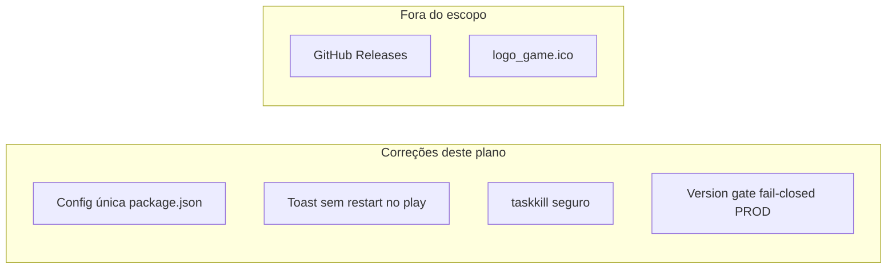

# Correções Electron — analise-chatgpt.md

## Contexto

A arquitetura Electron já está implementada (main/preload/updater, toast, version gate, scripts de build). O [docs/analise-chatgpt.md](docs/analise-chatgpt.md) aponta **4 riscos reais** antes de considerar o subsistema fechado. Você confirmou:

- **Version gate:** falha fechada em produção (bloqueia se API não responder)
- **Ícone:** fora do escopo agora

Auto-update via GitHub Releases permanece **documentado mas inativo** (sem publicar releases).



---

## 1. Config única do electron-builder

**Problema:** [package.json](package.json) (`build` + `publish` GitHub) e [electron-builder.yml](electron-builder.yml) coexistem com valores divergentes (`artifactName`, `allowToChangeInstallationDirectory`, `icon` inexistente, sem `publish` no YAML). O builder pode mesclar configs e gerar dúvida na hora do release.

**Ação:**
- **Remover** [electron-builder.yml](electron-builder.yml)
- Manter **somente** `package.json > build` (já tem `publish`, NSIS, `appId` alinhado)
- Atualizar referências em [README.md](README.md) (estrutura do repo) e menções em `docs/multiplatform-log.md` / `docs/studio-improvements-log.md` (uma linha cada, sem novo doc)

**Validação:** `npm run electron:compile` + inspecionar `builder-effective-config.yaml` após build — deve refletir só `package.json`.

---

## 2. Toast: sem "Reiniciar Agora" no play.html

**Problema:** [src/ui/desktopUpdateToast.ts](src/ui/desktopUpdateToast.ts) (linhas 81–101) muda o texto em play, mas ainda renderiza botão `Reiniciar Agora` que chama `updater.install()` — risco de restart durante combate.

**Ação:** ramificar o HTML do status `downloaded`:

| Página | UI |
|--------|-----|
| `play.html` | Só mensagem: *"Atualização pronta — saia do jogo para instalar"* + botão **Fechar** (ou **Depois**) |
| Demais páginas | Manter **Reiniciar Agora** + **Depois** (comportamento atual) |

Detecção existente (`/play\.html/i.test(location.href)`) permanece.

**Teste unitário leve:** extrair helper `buildDownloadedToastActions(isPlayPage: boolean)` ou testar a lógica de ramificação em novo arquivo `src/ui/desktopUpdateToast.test.ts` (Vitest, sem DOM pesado).

---

## 3. `prepare-electron-release.mjs` menos agressivo

**Problema:** [scripts/prepare-electron-release.mjs](scripts/prepare-electron-release.mjs) executa `taskkill /F /T /IM electron.exe`, matando qualquer app Electron em dev.

**Ação:**
- **Sempre** matar apenas `"Game 2D Railway.exe"`
- `taskkill electron.exe` **somente** se `FORCE_KILL_ELECTRON_DEV=true`
- Documentar a flag no README (seção troubleshooting do build)

```javascript
const commands = ['taskkill /F /T /IM "Game 2D Railway.exe"'];
if (process.env.FORCE_KILL_ELECTRON_DEV === 'true') {
  commands.push('taskkill /F /T /IM electron.exe');
}
```

---

## 4. Version gate: falha fechada em produção

**Problema:** [src/ui/desktopVersionGate.ts](src/ui/desktopVersionGate.ts) retorna `true` (permite jogar) em erro de rede, `!res.ok` ou JSON inválido — enfraquece o bloqueio de clientes antigos.

**Ação:** em `import.meta.env.PROD`:

| Situação | Comportamento |
|----------|---------------|
| `allowed: false` | Bloqueia + toast (já existe) |
| `!res.ok` | Bloqueia + toast de erro de validação |
| `fetch` throw / timeout | Bloqueia + toast *"Não foi possível verificar a versão. Tente novamente."* |
| `getVersion()` falha | Bloqueia em PROD (versão desconhecida = inseguro) |

Em **dev** (`import.meta.env.DEV`): manter falha aberta (não atrapalha `electron:dev` sem API).

Extrair helper `showVersionCheckFailedToast(message)` reutilizando estilos de [desktopUpdateToast.css](src/ui/desktopUpdateToast.css).

**Teste:** `src/ui/desktopVersionGate.test.ts` com `vi.stubEnv('PROD', 'true')` / mock de `fetch` e `electronAPI` — cobrir: rede ok + allowed, rede ok + blocked, rede falha em PROD.

**Impacto operacional:** se Railway estiver fora, clientes Electron **não entram no mundo** em produção. Aceitável conforme sua escolha; documentar no README na seção version gate.

---

## 5. Sync menor de versão (correção rápida)

**Problema colateral:** [`.env.production`](.env.production) tem `VITE_BUILD_VERSION=0.1.0` mas [package.json](package.json) está em `0.1.1` — painel F3 e join WS mostram versão errada no build Electron.

**Ação:** atualizar `.env.production` para `VITE_BUILD_VERSION=0.1.1` (uma linha; alinha com disciplina de versão citada no analise).

---

## Arquivos tocados

| Arquivo | Mudança |
|---------|---------|
| `electron-builder.yml` | Remover |
| `package.json` | Sem alteração estrutural (já é fonte de verdade) |
| `src/ui/desktopUpdateToast.ts` | Ramificar botões no `downloaded` |
| `src/ui/desktopUpdateToast.test.ts` | Novo — teste da ramificação |
| `src/ui/desktopVersionGate.ts` | Fail-closed em PROD |
| `src/ui/desktopVersionGate.test.ts` | Novo — testes do gate |
| `scripts/prepare-electron-release.mjs` | taskkill condicional |
| `.env.production` | `VITE_BUILD_VERSION=0.1.1` |
| `README.md` | Remover `electron-builder.yml`, nota version gate strict + flag `FORCE_KILL_ELECTRON_DEV` |
| `docs/analise-chatgpt.md` | Marcar os 4 itens como endereçados (checklist no final) |

---

## Verificação

```bash
npm test
npm run electron:compile
```

Checklist manual:
- [ ] `npm run electron:build` sem `electron-builder.yml` presente
- [ ] Simular toast `downloaded` em play → sem botão de restart
- [ ] `enforceDesktopVersionGate()` com fetch mock falhando em build PROD → bloqueia
- [ ] `npm run electron:dev` continua funcionando (falha aberta em DEV)

**Fora do escopo (fase planejamento):** GitHub Releases, `GH_TOKEN`, ícone `.ico`, code signing.
