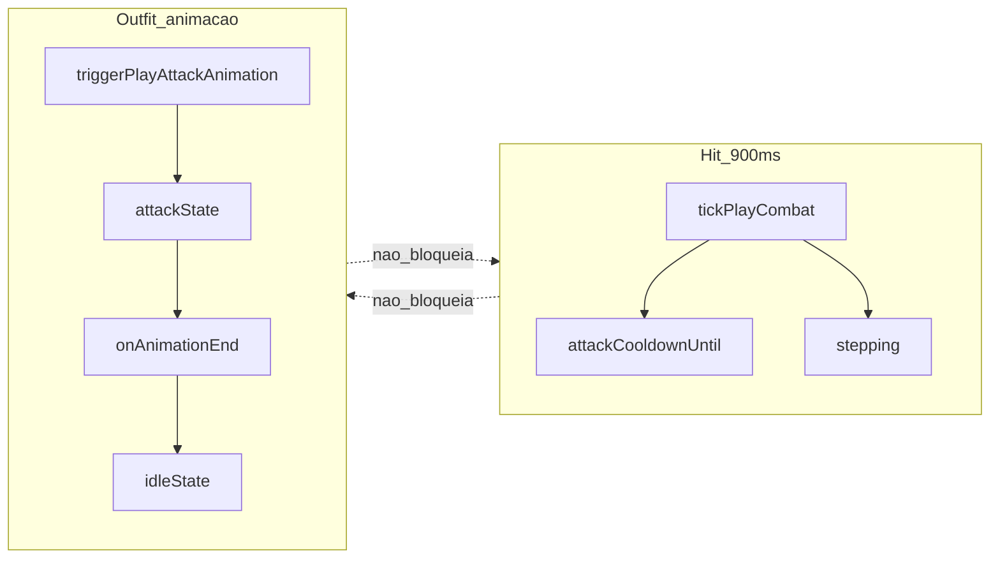

# Diagnóstico: trava no hit do knight (não é lentidão nem Railway)

## Resposta direta

- **Não é o Railway** — infra só pode atrasar o número de dano em multiplayer (~50–300ms RTT).
- **900ms de hit não está lento** — é o `attackSpeed` intencional do knight; não mexer em balance.
- **A trava é outra coisa** — o sprite fica visualmente preso no pose de ataque por ~1s ao atacar para a direita.

---

## Hit e outfit são coisas diferentes (concordo)

No código, **já estão desacoplados**:

| Sistema | Responsável | O que controla |
|---------|-------------|----------------|
| **Hit (combate)** | [`playCombat.ts`](src/game/playCombat.ts) | `attackCooldownUntil` (900ms) + bloqueio em `stepping` |
| **Outfit (visual)** | [`playApp.ts`](src/game/playApp.ts) → `spriteAnimation.ts` | pose `attack` → `idle` via `onAnimationEndCallback` |

`tickPlayCombat` **não** consulta `currentState === 'attack'` nem espera animação terminar. O próximo golpe pode sair aos 900ms mesmo que o sprite ainda esteja no frame de ataque.

O que engana o jogador: com `attack_right.speedFps: 1`, o personagem **parece** travado por 1 segundo — mas o timer de combate já liberou o hit aos 900ms. São camadas independentes; a calibração errada só quebra o **feedback visual**.

---

## Causa da trava: calibração `attack_right`

Na screenshot o knight ataca para a **direita**. Em [`tiles/characters/vocations/male/knight.calibration.json`](tiles/characters/vocations/male/knight.calibration.json):

| Animação | speedFps | frames | Duração visual |
|----------|----------|--------|----------------|
| attack_down / left / up | 5 | 1 | ~200ms |
| **attack_right** | **1** | 1 | **1000ms** |

Fórmula em [`spriteAnimation.ts`](src/character/spriteAnimation.ts): `frameDurationMs = 1000 / speedFps`.

Com `speedFps: 1`, o callback em [`triggerPlayAttackAnimation()`](src/game/playApp.ts) só volta para `idle` após **1 segundo** — isso é a trava perceptível.

**Não é lentidão de hit.** O `attackSpeed: 900` em [`vocations.json`](src/game-data/default/vocations.json) permanece como está.

---

## Railway (irrelevante para a trava)

Em multiplayer, o swing dispara no cliente na hora; o servidor valida o mesmo cooldown de 900ms. Railway só atrasa `creature_damaged` (HP / float de dano), não o pose do personagem.

---

## Correção (escopo mínimo)

### Fix único

Corrigir `attack_right.speedFps` de `1` para `5` em [`knight.calibration.json`](tiles/characters/vocations/male/knight.calibration.json) — igual às outras direções de ataque e ao fallback em [`characterSerializer.ts`](src/character/characterSerializer.ts).

### Fora de escopo

- Alterar `attackSpeed` em `vocations.json` — hit está OK.
- Mudar lógica de combate ou acoplar hit à animação — arquitetura já está certa.
- Opcional futuro: revisar `walk_left` (`speedFps: 1`) se andar para esquerda também parecer travado — problema de walk, não de hit.

---

## Como validar

1. Atacar à **direita**: sprite volta a idle em ~200ms (sem trava visual de 1s).
2. Intervalo entre golpes parado: continua **900ms** — sem mudança de ritmo.
3. Multiplayer no Railway: dano pode chegar um pouco depois; pose não deve mais travar 1s.
4. `npm test` — sem regressão.
