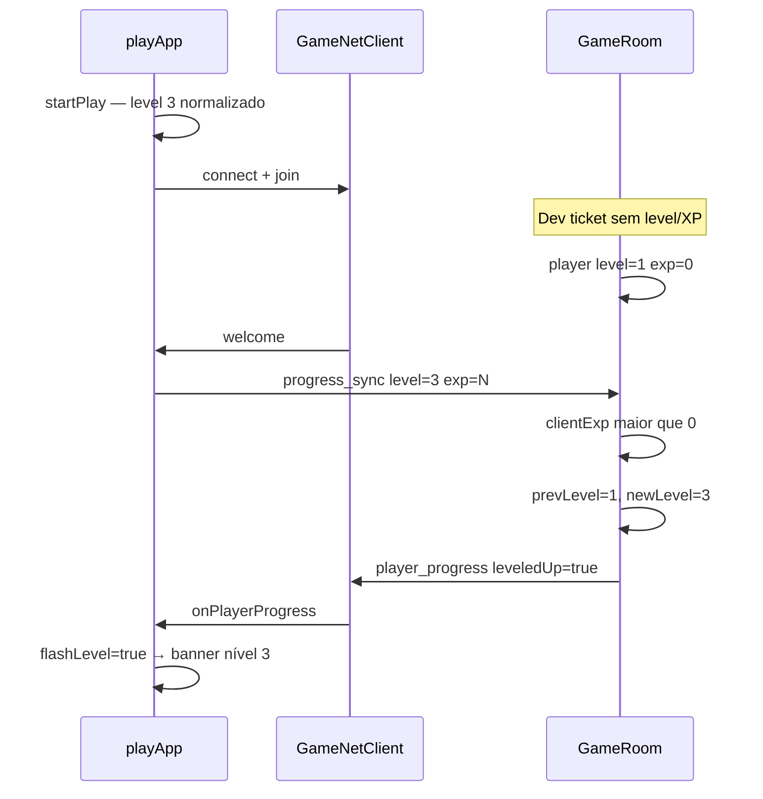

# Corrigir banner de level up no login

## Diagnóstico

O banner é exibido em [`characterStatsUi.ts`](src/game/ui/characterStatsUi.ts) quando `updateCharacterStatsUi(..., { flashLevel: true })` chama `showLevelUpBanner(level)`.

No login **não** há `flashLevel` em [`startPlay`](src/game/playApp.ts) (linha ~1154) — correto. O problema vem **depois**, quando o WebSocket conecta:

### Causa raiz (2 camadas)

1. **Ticket dev incompleto** — [`createEnterTicket`](src/shared/enterTicket.ts) (client) não envia `level` nem `experience`. O servidor em [`verifyEnterTicket`](server/src/enterTicket.ts) cai em defaults `level=1`, `experience=0`.

2. **Sync tratado como level up** — [`onWelcome`](src/game/playApp.ts) chama `syncProgressToServer()`. Em [`handleProgressSync`](server/src/GameRoom.ts) (linhas 744–758), qualquer XP maior que o do servidor recalcula level e responde `leveledUp: player.level > prevLevel` — no login isso vira `1 → 3` mesmo sem combate.

Personagens **mock** (`characterId=mock_...`) usam ticket dev local, por isso o bug aparece sempre ao entrar. Com `/api/ws-ticket` e DB correto, o join já traria XP certo e o sync seria no-op — mas o bug ainda pode voltar se houver dessync.

---

## Correções propostas

### 1. Cliente: celebrar só subida real na sessão (fix principal de UX)

Em [`playApp.ts`](src/game/playApp.ts):

- Adicionar `playSessionLevel` (inicializado em `startPlay` após `normalizeCharacterProgress`).
- Criar helper `applyPlayProgressUpdate(level, experience)` que:
  - Atualiza `activeCharacter` / `characterSpeed`
  - Calcula `const leveledUp = level > playSessionLevel` (ignorar `msg.leveledUp` do servidor para UI)
  - Chama `updateCharacterStatsUi` com `flashLevel: leveledUp` **somente** se subiu
  - Atualiza `playSessionLevel = level`
- Usar esse helper em:
  - `onPlayerProgress` (WS)
  - `onProgressUpdated` (combate offline)

Assim, login em level 3 → baseline 3 → sem banner. Kill que sobe 2→3 → banner uma vez.

### 2. Servidor: `progress_sync` nunca é celebração

Em [`GameRoom.ts`](server/src/GameRoom.ts) `handleProgressSync`:

- Manter atualização de `player.experience` / `player.level`
- Responder `player_progress` com **`leveledUp: false`** sempre neste handler

Level up real online continua vindo de [`handleAttack`](server/src/GameRoom.ts) (linha ~830) com `leveledUp: gain.leveledUp` após kill — correto.

### 3. Ticket dev: incluir level e experience

Em [`src/shared/enterTicket.ts`](src/shared/enterTicket.ts):

- Estender `CreateEnterTicketOptions` com `level?` e `experience?`
- Incluir no payload assinado (alinhar com [`server/src/enterTicket.ts`](server/src/enterTicket.ts))

Em [`resolveEnterTicket`](src/game/playApp.ts):

- Passar `level` e `experience` já normalizados do personagem

Isso faz o join do servidor começar no level certo; `progress_sync` no welcome vira no-op (`clientExp <= player.experience`).

### 4. Testes

Adicionar testes em [`src/engine/tileRefResolver.test.ts`](src/engine/tileRefResolver.test.ts) ou novo `src/game/playProgress.test.ts`:

- Helper de level-up da sessão: level 3 → 3 = sem celebração; 2 → 3 = celebração
- (Opcional) teste unitário de `handleProgressSync` no server se houver runner no pacote `server`

### 5. Documentação

Entrada curta em [`docs/studio-improvements-log.md`](docs/studio-improvements-log.md): banner só em subida real; sync silencioso; ticket dev com progresso.

---

## Arquivos a alterar

| Arquivo | Mudança |
|---------|---------|
| [`src/game/playApp.ts`](src/game/playApp.ts) | `playSessionLevel` + helper de progresso |
| [`server/src/GameRoom.ts`](server/src/GameRoom.ts) | `leveledUp: false` em `handleProgressSync` |
| [`src/shared/enterTicket.ts`](src/shared/enterTicket.ts) | level/exp no ticket dev |
| [`src/game/playApp.ts`](src/game/playApp.ts) | passar level/exp em `createEnterTicket` |
| Testes + log de melhorias | Regressão |

---

## Verificação manual

1. Login com personagem mock level 3 → **sem** banner
2. Matar mob e subir de level → banner **uma vez**
3. Relogar após level up salvo → **sem** banner repetido
4. Com API auth + ws-ticket → mesmo comportamento
