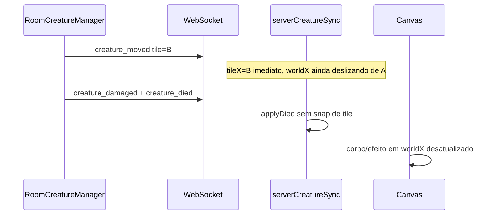

# Desync de movimento e morte de mobs (análise + correção)

## O que você está vendo (interpretação)



- **Ponto amarelo:** onde você *viu* o mob ao atacar (deslize visual atrasado).
- **Ponto vermelho:** tile lógico (`tileX/tileY`) que o cliente já tinha recebido via `creature_moved`, ou posição `worldX/worldY` no meio do deslize quando `applyDied` roda.
- **Servidor mais rápido:** tick de IA a cada **50 ms** ([`RoomCreatureManager`](server/src/game/RoomCreatureManager.ts)); passo anunciado com **`MONSTER_STEP_MS = 320`** ([`shared/creatureChase.ts`](shared/creatureChase.ts)). O cliente atualiza `tileX` **no pacote**, mas só desliza `worldX` ao longo de ~320 ms ([`applyMoved`](src/net/serverCreatureSync.ts) L183–211 + [`tick`](src/net/serverCreatureSync.ts) L219–267). Vários passos enfileirados = sensação de “teleporte” quando `tileDelta > 1` força `snapEntityToTile`.

## Causas raiz no código

| # | Problema | Onde |
|---|----------|------|
| 1 | `CreatureDiedMessage` **não inclui** `tileX/tileY/z` | [`shared/protocol.ts`](shared/protocol.ts) L248–256 |
| 2 | `applyDied()` chama `beginCreatureDeath` **sem snap** — corpo fica em `worldX/worldY` do deslize | [`serverCreatureSync.ts`](src/net/serverCreatureSync.ts) L121–128 |
| 3 | `beginCreatureDeath` limpa `stepDest` mas **não** chama `syncWorldToTile` | [`creatureDeathLifecycle.ts`](src/game/creatureDeathLifecycle.ts) L43–57 |
| 4 | `applyMoved` atualiza `tileX/tileY` **antes** do deslize terminar (by design) | [`serverCreatureSync.ts`](src/net/serverCreatureSync.ts) L183–184 |
| 5 | Entre `creature_damaged` e `creature_died` o mob ainda não é `isDead` no cliente — `applyMoved` ainda aceita moves pendentes na fila WS | [`applyMoved`](src/net/serverCreatureSync.ts) L163 |

O ataque no servidor usa **tile autoritativo** ([`processAttack`](server/src/game/RoomCreatureManager.ts) L179–188), não o sprite visual — por isso o kill “funciona” mesmo com desync visual.

---

## Fase 1 — Instrumentação (confirmar no Electron)

Adicionar flag `localStorage.setItem('debug.creature.sync', '1')` que loga (throttle 200 ms):

| Evento | Campos |
|--------|--------|
| `creature_moved` | id, tile, world, delta px vs tile×32 |
| `creature_damaged` | id, health |
| `creature_died` | id, tile cliente, world cliente |
| `applyDied` pós-fix | tile snap aplicado |

Implementar em [`serverCreatureSync.ts`](src/net/serverCreatureSync.ts) (helper `logCreatureSync` local) — sem spam no draw loop.

**Checklist manual com debug ligado:**

1. Matar mob parado adjacente — `delta px` deve ser ~0 no `creature_died`.
2. Matar mob perseguindo — se `delta px` > 8 no died, confirma bug antes do fix.
3. Repetir cenário da screenshot (matar, andar 1 SQM) — ver se `creature_died` chega com tile diferente do tile visual percebido.

Painel **F3** ([`clientDiagnostics.ts`](src/game/debug/clientDiagnostics.ts)): opcional linha “creature desync max” se houver entidade com maior `|worldX - tileX*32|`.

---

## Fase 2 — Correção (implementar)

### 2.1 Protocolo: tile na morte

Em [`shared/protocol.ts`](shared/protocol.ts), estender `CreatureDiedMessage`:

```typescript
tileX: number;
tileY: number;
z: number;
```

Em [`RoomCreatureManager.processAttack`](server/src/game/RoomCreatureManager.ts) ao montar `died`, incluir `creature.tileX/Y/z`.

### 2.2 Cliente: snap autoritativo na morte

[`serverCreatureSync.applyDied`](src/net/serverCreatureSync.ts):

```typescript
applyDied(creatureId: string, tile: { tileX, tileY, z }): void {
    ...
    snapEntityToTile(entity, tile.tileX, tile.tileY);
    entity.worldZ = tile.z;
    beginCreatureDeath(entity, performance.now());
}
```

Atualizar handler em [`playApp.ts`](src/game/playApp.ts) `onCreatureDied` para passar tile do msg.

### 2.3 Hardening: ignorar move após fatal damage

Em `applyDamaged`, se `health <= 0`, marcar flag interna `pendingDeath` ou setar `isDead` early **antes** do `creature_died` chegar, bloqueando `applyMoved` para essa entidade. Alternativa mínima: em `applyMoved`, pular se `entity.combatHealth <= 0`.

### 2.4 `beginCreatureDeath` — snap defensivo

Em [`creatureDeathLifecycle.ts`](src/game/creatureDeathLifecycle.ts), após marcar morto:

```typescript
entity.syncWorldToTile(ENGINE_CONFIG.TILE_SIZE);
```

Protege offline e qualquer caller que esqueça snap.

---

## Fase 3 — Suavizar “pulo” de movimento (opcional, menor prioridade)

Se após Fase 2 ainda houver saltos visuais (não só morte):

- **Opção A (baixo risco):** aumentar `MONSTER_STEP_MS` no servidor para ~400–450 ms alinhado ao deslize percebido.
- **Opção B (médio):** no cliente, não aplicar novo `tileX` se ainda houver deslize ativo — enfileirar passos (1 passo de buffer).
- **Opção C:** reduzir tick IA de 50 ms para só enviar move quando `lastAggroMoveTime + MONSTER_STEP_MS` (já existe em [`creatureChase`](shared/creatureChase.ts) — verificar se cliente recebe bursts de direction-only `creature_moved` com mesmo tile).

Recomendação: validar Fase 2 primeiro; só então tunar `MONSTER_STEP_MS` se necessário.

---

## Testes

**Automatizado:** [`src/net/serverCreatureSync.death.test.ts`](src/net/serverCreatureSync.death.test.ts) (novo)

- Mock entity mid-slide (`tileX=6`, `worldX=5.5*TILE`); `applyDied` com tile `(5,5)` → após snap, `worldX === 5*TILE`.
- `applyMoved` ignorado quando `combatHealth <= 0`.

**Regressão:** `npm test` (inclui [`playCombat.pick.test.ts`](src/game/playCombat.pick.test.ts)).

**Manual (Electron):** repetir screenshot — corpo/morte no SQM amarelo (tile autoritativo do kill), sem offset após andar 1 SQM.

---

## Documentação

Atualizar [`docs/studio-improvements-log.md`](docs/studio-improvements-log.md) §43 (nova entrada) e checklist em [`docs/multiplayer-remote-players.md`](docs/multiplayer-remote-players.md).

---

## Resumo

Sim, é possível e o caminho é claro: o bug não é o targeting por SQM (já corrigido), e sim **morte sem posição autoritativa + tile lógico adiantado vs deslize visual**. A correção principal é **`tileX/Y/z` em `creature_died` + snap na morte**, com debug `debug.creature.sync` para provar antes/depois.
