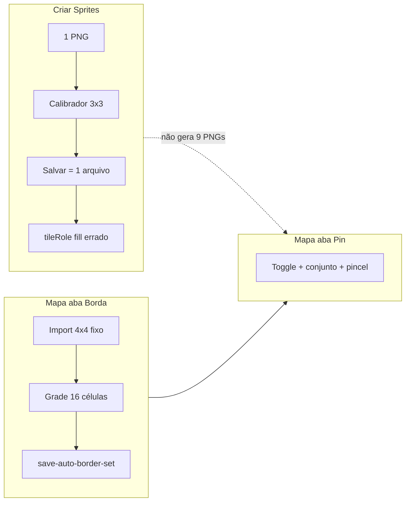
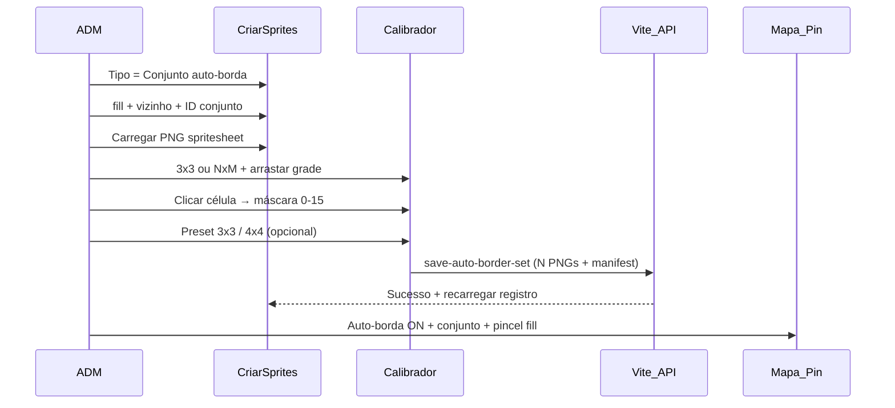

> **Cancelado (2026-05):** auto-borda removido do escopo. Plano arquivado; não implementar a partir deste documento.

# Plano: Auto-borda no Criar Sprites + Calibrador

## Diagnóstico do fluxo atual (por que está “péssimo”)

Hoje existem **três caminhos desconectados**:



| Problema | Onde |
|----------|------|
| Calibrador fatia grade mas **salva 1 PNG** | [`mapSpriteEditor.ts`](src/editor/mapSpriteEditor.ts) → `POST /api/save-map-sprite` |
| Conjunto + máscaras só na **aba Borda** | [`autoBorderEditor.ts`](src/editor/autoBorderEditor.ts) + [`studio.html`](studio.html) `#mapTabContent_autoborder` |
| Import de sheet **só 4×4** | `sliceSheetToCells()` em [`autoBorderEditor.ts`](src/editor/autoBorderEditor.ts) |
| Máscara por tile avulso no formulário | Campos `borderSetId` / `borderMask` em Criar Sprites — impraticável para 9+ células |

O **motor** ([`autoBorder.ts`](src/engine/autoBorder.ts)) está correto (máscaras 0–15, bits N/E/S/O). O gargalo é **UX e persistência**, não o algoritmo.

---

## Fluxo alvo (definição de pronto)



**Editor de mapa (sua escolha):** manter **só aba Pin** — toggle, select de conjunto, pincel de preenchimento ([`autoBorderState.ts`](src/editor/autoBorderState.ts)). **Remover aba Borda** e botão `BORDA` do `mapEditorTabs`.

---

## Modelo de dados (flexível)

Novo tipo compartilhado (ex. [`src/editor/borderSetTypes.ts`](src/editor/borderSetTypes.ts)):

```ts
export interface BorderSetCell {
  row: number;
  col: number;
  frameIndex: number;      // ordem row-major na grade
  mask: number;            // 0–15
  walkable?: boolean;
  speedModifier?: number;
}

export interface BorderSetDraft {
  setId: string;
  label: string;
  fillTerrain: string;
  neighborTerrain: string;
  grid: { cols: number; rows: number; offsetX: number; offsetY: number; gapX: number; gapY: number; frameWidth: number; frameHeight: number };
  cells: BorderSetCell[];
  layoutPreset?: 'custom' | 'blob3x3' | 'blob4x4';
}
```

**Presets de máscara** (código, não hardcoded no PNG):

| Preset | Grade | Células com máscara |
|--------|-------|---------------------|
| `blob3x3` | 3×3 | 9 máscaras cantos/arestas/centro (9,1,3 / 8,0,2 / 12,4,6) |
| `blob4x4` | 4×4 | 16 máscaras alinhadas ao RME (índice da célula = máscara default, ajustável) |

Células **sem** máscara atribuída → não exportam PNG (ou aviso no confirmar).

Manifest [`public/auto_border_sets.json`](public/auto_border_sets.json) e API existente **permanecem**; só muda quem produz o payload.

---

## Fase 1 — Tipos, presets e utilitário de fatiamento

**Arquivos:** `borderSetTypes.ts`, `borderSetPresets.ts`, `borderSetSlicer.ts` (extrair lógica de canvas de [`autoBorderEditor.ts`](src/editor/autoBorderEditor.ts) `sliceSheetToCells`).

- `sliceImageToCells(image, grid) → { mask, dataUrl, row, col }[]` genérico **cols×rows** (reusa [`calibratorGrid.ts`](src/editor/calibratorGrid.ts)).
- `applyMaskPreset(preset, cols, rows) → BorderSetCell[]`.
- Validação: máscaras 0–15, `setId` slug, `fillTerrain`/`neighborTerrain` não vazios, pelo menos máscara **0** presente.

---

## Fase 2 — Calibrador: modo `borderSet`

**Arquivos:** [`characterCalibratorModal.ts`](src/editor/characterCalibratorModal.ts), [`studio.html`](studio.html) (novo painel no modal).

Estender `CalibratorOpenOptions`:

```ts
mode?: 'character' | 'mapTile' | 'borderSet';
borderSetDraft?: Partial<BorderSetDraft>;
onConfirmBorderSet?: (result: BorderSetCalibrationResult) => void;
```

### UI no calibrador (modo `borderSet`)

1. **Metadados do conjunto** (topo da coluna direita): ID, nome, terreno pintado (fill), terreno vizinho.
2. **Grade** (já existe): cols/rows, margem, gap, botões 1×1, **3×3**, **4×4**, Aplicar.
3. **Painel “Máscaras por célula”** (novo):
   - Lista ou mini-grade clicável espelhando a preview.
   - Ao clicar na célula na imagem OU na lista: dropdown máscara (labels de [`MASK_LABELS`](src/editor/autoBorderEditor.ts)).
   - Badge na overlay: `célula (r,c) → máscara N`.
4. **Botão “Aplicar preset 3×3”** — preenche máscaras automaticamente (usuário ainda pode corrigir célula a célula).
5. **Confirmar** — valida e chama callback com `BorderSetCalibrationResult` (draft + image ref).

### Comportamento visual

- Célula selecionada: borda destacada na preview.
- Células sem máscara: contorno tracejado + aviso.
- Modo `mapTile` (tile único 1×1): sem painel de máscaras; comportamento atual.

---

## Fase 3 — Criar Sprites: fluxo unificado

**Arquivos:** [`mapSpriteEditor.ts`](src/editor/mapSpriteEditor.ts), [`studio.html`](studio.html) (seção Criar Sprites).

### Novo seletor “Tipo de terreno”

| Tipo | Calibrador | Salvar |
|------|------------|--------|
| **Tile simples** | `mapTile` 1×1 | `save-map-sprite` (1 PNG) |
| **Conjunto auto-borda** | `borderSet` N×M | `save-auto-border-set` (N PNGs + manifest) |
| **Item** | opcional 1×1 | `save-map-sprite` |

### Formulário “Conjunto auto-borda” (substitui checkbox confuso atual)

- Campos: ID conjunto, nome exibido, `fillTerrain`, `neighborTerrain`.
- Botão **“Calibrar conjunto”** (obrigatório antes de salvar).
- Remover do formulário principal: `borderMask` manual por tile, papel “borda” para sheet inteiro.
- Manter bloco **tile simples** com: participa auto-borda + papel **fill** + `terrainGroup` (para grama/água soltas).

### Ao confirmar calibrador (`borderSet`)

1. Fatia todas as células com máscara definida.
2. Monta `tiles: Record<string, fileKey>` e array `pngs` para API.
3. `POST /api/save-auto-border-set` ([`vite.config.ts`](vite.config.ts) — já implementado).
4. `reloadTileRegistryAndAutoBorder()` via handler existente ([`setMapSpriteAfterSaveHandler`](src/editor/mapSpriteEditor.ts)).
5. Toast com resumo: “9 tiles salvos em `terrain/borders/terra_grass/`”.

### Editar conjunto existente

- Dropdown “Sprites existentes” passa a listar também **conjuntos** (`GET /api/list-auto-border-sets` — endpoint novo, lê `auto_border_sets.json`).
- Ao selecionar: carrega metadados; reimportar PNG opcional; reabrir calibrador com máscaras do manifest + `tile_properties.json`.

---

## Fase 4 — Remover criação do editor de mapa

**Arquivos:** [`studio.html`](studio.html), [`main.ts`](src/main.ts), [`autoBorderEditor.ts`](src/editor/autoBorderEditor.ts).

- Remover aba `data-map-tab="autoborder"` e conteúdo `#mapTabContent_autoborder`.
- Remover `initAutoBorderEditor()` de [`main.ts`](src/main.ts) (ou reduzir a zero — arquivo pode ser deletado na fase 4).
- Manter em **Pin**: `#autoBorderEnabledToggle`, `#autoBorderSetSelect`, `#autoBorderBrushSelect` ([`initAutoBorderToolbar`](src/main.ts)).
- Opcional: link de ajuda “Criar conjunto → menu Criar → Sprites de mapa”.

---

## Fase 5 — API e listagem

**Arquivo:** [`vite.config.ts`](vite.config.ts)

| Endpoint | Função |
|----------|--------|
| `GET /api/list-auto-border-sets` | Lista `id`, `label`, `fillTerrain`, `neighborTerrain` |
| `POST /api/save-auto-border-set` | Manter; aceitar payload do calibrador |
| `POST /api/save-map-sprite` | Manter só para tile simples |

Melhorias na API:

- Validar duplicata de máscara no mesmo conjunto (warn ou último vence).
- Gravar `layoutPreset` opcional no manifest (campo novo, backward compatible).

---

## Fase 6 — Documentação e migração

**Arquivo:** [`docs/auto-border.md`](docs/auto-border.md)

- Passo a passo único: Criar → Conjunto → Calibrar → Salvar → Mapa Pin.
- Tabela 3×3 de máscaras (referência rápida).
- Nota: 3×3 não cobre máscaras 5,7,10… (fallback máscara 0).
- Remover referências à aba Borda do mapa.

**Migração `01_terra_border`:** documentar reimport como conjunto `terra_*` via novo fluxo (não migrar automaticamente no código).

---

## Riscos e mitigação

| Risco | Mitigação |
|-------|-----------|
| PNG grande (1254²) com 3×3 | Calibrador já calcula frame 418px; validar memória ao fatiar |
| Glob Vite não vê PNGs novos | Manter F5 / recarregar após save (já documentado) |
| Conjuntos antigos só na aba Borda | `list-auto-border-sets` + edição em Criar Sprites |
| Regressão personagem | `mode: 'character'` inalterado; testes manuais no calibrador de personagem |

---

## Ordem de implementação sugerida

1. `borderSetTypes` + `borderSetSlicer` + presets 3×3/4×4  
2. Calibrador `borderSet` (UI máscaras + confirm)  
3. `mapSpriteEditor` tipo “Conjunto” + save em lote  
4. Remover aba Borda + limpar `autoBorderEditor`  
5. `GET list-auto-border-sets` + editar conjunto  
6. Docs + smoke test manual (terra 3×3 → pintar no mapa)

---

## Critérios de aceite

- ADM cria conjunto **sem abrir aba Mapa → Borda**.
- Spritesheet 3×3: calibrador aplica preset, ajusta 1 célula se necessário, salva **9 PNGs** + manifest.
- Aba **Pin** lista o conjunto e pincel de fill funciona após salvar (sem F5 obrigatório se handler rodar).
- Tile simples (grama 1×1) continua funcionando com `save-map-sprite`.
- Aba **Borda** removida do editor de mapa.
