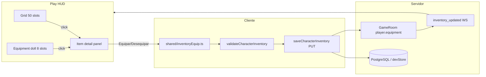

# Inventário — layout + equip/desequip

## Contexto atual

O loot já funciona (bolsa recebe itens + chat). O HUD é **somente leitura**:

- Markup em [`play.html`](play.html) — equipamento empilhado acima da bolsa, slots `disabled`
- Render em [`src/game/ui/playHudInventory.ts`](src/game/ui/playHudInventory.ts)
- Modelo em [`shared/inventory.ts`](shared/inventory.ts) — hoje **6** slots (`head`, `body`, `legs`, `feet`, `ring`, `amulet`); `wooden_shield` está incorretamente em `body` (conflita com armadura)
- API `PUT /api/characters/:id/inventory` + `validateCharacterInventory` já validam equip ↔ bolsa
- `saveCharacterInventory()` em [`src/game/characterInventoryApi.ts`](src/game/characterInventoryApi.ts) existe mas **nunca é chamado**
- `ConnectedPlayer.equipment` no servidor **não atualiza** após PUT → bônus de ataque/defesa/velocidade ficam desatualizados em combate

**Decisões confirmadas:**
- Interação: **clique no item** → painel de detalhes → botão **Equipar** (Upgrade desabilitado / “em breve”)
- Mochila: **50 slots** (grid 10×5), **sem** sistema de bags dentro de bags
- **Slots de mãos:** `weapon` (arma, esquerda no layout) + `shield` (escudo, direita) — `body` fica **só armadura**
- Visual: inspirado na imagem 2 (equip à esquerda, grid à direita), mantendo o tema escuro atual do Play (frames ornamentados pesados ficam para fase visual futura)

### Slots de equipamento (8 total)

| Slot | Uso | Exemplo no catálogo |
|------|-----|---------------------|
| `head` | Capacete | `iron_helmet` |
| `amulet` | Amuleto | `amulet_of_life` |
| `body` | Armadura / torso | `leather_armor` |
| `ring` | Anel | `warrior_ring` |
| `legs` | Calças | *(ainda sem item — slot reservado)* |
| `feet` | Botas | `boots_of_haste`, `leather_boots` |
| `weapon` | Arma principal | *adicionar placeholder, ex. `iron_sword`* |
| `shield` | Escudo / off-hand | `wooden_shield` (migrar de `body` → `shield`) |

Layout do doll (referência imagem 2):

```
        [head]
[weapon] [body] [shield]
[amulet] [legs] [ring]
        [feet]
```



---

## Fase 0 — Expandir modelo (`weapon` + `shield`)

Antes do layout/UI, alinhar tipos, validação, DB e catálogo.

### Tipos e validação

- [`src/game-data/itemCatalogTypes.ts`](src/game-data/itemCatalogTypes.ts): `EquipmentSlot` += `'weapon' | 'shield'`; atualizar `EQUIPMENT_SLOTS`
- [`shared/inventory.ts`](shared/inventory.ts): `createEmptyEquipment()` com `weapon: null`, `shield: null`
- [`src/character/equipment/equipment.ts`](src/character/equipment/equipment.ts): mesma lista de slots
- [`shared/equipmentBonuses.ts`](shared/equipmentBonuses.ts): sem mudança (já soma todos os slots equipados)

### Banco de dados

Nova migration [`database/migrations/005_equipment_weapon_shield.sql`](database/migrations/005_equipment_weapon_shield.sql):

```sql
alter table character_equipment drop constraint if exists character_equipment_slot_check;
alter table character_equipment add constraint character_equipment_slot_check
  check (slot in ('head','body','legs','feet','ring','amulet','weapon','shield'));
```

Rodará automaticamente no boot (`runMigrations()`).

### Catálogo de itens

- [`public/item_catalog.json`](public/item_catalog.json): `wooden_shield` → `"slot": "shield"`
- Adicionar arma placeholder `iron_sword` (`slot: "weapon"`, `attackBonus`, ícone em `tiles/items/icons/`)
- Loot do Magao Bruto pode incluir `iron_sword` em fase futura (opcional nesta entrega)

### Dados existentes em produção

Jogadores com `wooden_shield` em `body` no PG: na carga, se item em slot errado, **não** migrar automaticamente — ao equipar de novo via UI o catálogo já exige slot correto. Opcional: script one-off ou regra no GET que move shield de body→shield se `item.slot === 'shield'`.

---

## Fase 1 — Layout (duas colunas)

### HTML — [`play.html`](play.html)

Reestruturar `#inventoryPanelBody`:

```html
<div class="inventory-layout">
  <aside class="inventory-equip-column">
    <div class="equipment-doll" id="equipmentGrid">…8 slots…</div>
  </aside>
  <div class="inventory-main-column">
    <div class="bag-grid bag-grid--50" id="bagGrid"></div>
  </div>
</div>
<div class="inventory-item-detail" id="inventoryItemDetail" hidden>
  <!-- ícone, nome, categoria, bônus, descrição -->
  <button id="inventoryItemEquipBtn">Equipar</button>
  <button id="inventoryItemUpgradeBtn" disabled>Upgrade (em breve)</button>
</div>
<footer class="inventory-footer">…</footer>
```

- Remover títulos “Equipamento” / “Bolsa” soltos; usar rótulos sutis nos slots (Arma, Escudo, Corpo, etc.)
- **Não** adicionar slot de “bag” aninhada (sem bags dentro de bags)
- Slots `weapon` e `shield` nas laterais do torso, como nos mockups de referência

### CSS — [`src/game/play-inventory.css`](src/game/play-inventory.css) + [`src/game/play-panels.css`](src/game/play-panels.css)

| Mudança | Detalhe |
|---------|---------|
| Painel mais largo | `.play-panel--inventory { width: min(780px, …) }` (referência: `.play-panel--spells` ~860px) |
| Layout | `inventory-layout`: `grid-template-columns: 220px 1fr; gap: 16px` |
| Equipment doll | Silhueta via CSS; **8 slots** — `weapon` à esquerda e `shield` à direita do `body`; head/amulet/ring/legs/feet como no diagrama acima; sem assets PNG ornamentados na v1 |
| Grid 50 | `bag-grid--50`: `grid-template-columns: repeat(10, 1fr)`; mobile: `repeat(5, 1fr)` com scroll |
| Slots interativos | `cursor: pointer`, estados `.is-selected`, `.is-saving`, hover |
| Item detail | Faixa fixa abaixo do layout (padrão similar ao detalhe de magias em [`play-spell-modal.css`](src/game/play-spell-modal.css)) |

---

## Fase 2 — Lógica equip/desequip (shared)

### Novo [`shared/inventoryEquip.ts`](shared/inventoryEquip.ts)

Funções puras (testáveis com vitest):

| Função | Comportamento |
|--------|----------------|
| `equipFromBackpack(inv, backpackIndex, catalog)` | Remove 1 unidade do stack (ou linha inteira se qty=1); coloca no slot correto; se slot ocupado → item anterior volta para **primeiro slot livre** da mochila |
| `unequipToBackpack(inv, slot, catalog)` | Move item equipado para primeiro slot livre; erro se mochila cheia |
| `canEquipItem(itemId, catalog)` | `category === 'equipment'`, `implemented`, slot definido |
| `describeItemStats(entry)` | Texto para UI: ATK/DEF/SPD |

Reutilizar [`validateCharacterInventory`](shared/inventory.ts) no cliente **antes** do PUT (com `previous: lastInventory`) para feedback imediato.

### Aumentar mochila para 50

- [`shared/inventory.ts`](shared/inventory.ts): `BACKPACK_SLOT_COUNT = 50`
- DB já aceita `slot_index < 100` ([`004_character_inventory.sql`](database/migrations/004_character_inventory.sql)) — sem migration
- Atualizar `#inventoryCapacity`, `ensureBagGrid()`, testes existentes

---

## Fase 3 — UI controller

### Refatorar [`src/game/ui/playHudInventory.ts`](src/game/ui/playHudInventory.ts)

Estado local:

```ts
type InventorySelection =
  | { kind: 'backpack'; slotIndex: number }
  | { kind: 'equipment'; slot: EquipmentSlot }
  | null;
```

Fluxo:

1. **Habilitar** todos os slots (`disabled` removido)
2. **Clique** em slot com item → `selection` + mostrar `#inventoryItemDetail`
3. **Detalhe** preenche: ícone grande, nome, slot, bônus, descrição, quantidade (se stack)
4. **Botão Equipar** — visível se item é equipável e está na bolsa; chama `equipFromBackpack` → `persistInventory()`
5. **Botão Desequipar** — visível se item está equipado; chama `unequipToBackpack`
6. **Upgrade** — `disabled` + tooltip “Em breve”
7. Itens `loot` (gold, poção): detalhe sem botão equipar; texto “Item de consumo” / “Moeda”
8. `persistInventory()`: loading no painel → `saveCharacterInventory` → `applyPlayInventorySnapshot` → toast em erro

Opcional nesta fase: **ouro** no footer — contar `gold_coin` no inventário e exibir em `#inventoryGold` (sem slot dedicado).

### Sincronizar bônus no cliente Play

Em [`src/game/playApp.ts`](src/game/playApp.ts), após inventário atualizado:

- Atualizar `characterSpeed.equipmentBonus` via `calculateEquipmentSpeedBonus` (hoje só o demo legado em `main.ts` faz isso)
- Combate melee já lê `getLastPlayInventory()` — passa a refletir equip real após PUT

---

## Fase 4 — Servidor: sessão WS alinhada

Hoje o PUT persiste mas **não** atualiza o jogador online.

### [`server/src/routes/characterInventory.ts`](server/src/routes/characterInventory.ts)

Após `replaceCharacterInventory` / `setDevCharacterInventory` com sucesso:

1. Localizar jogador online por `characterId` (novo método em [`server/src/GameRoom.ts`](server/src/GameRoom.ts): `getPlayerByCharacterId`)
2. `player.equipment = saved.equipment`
3. Enviar WS `inventory_updated` (mesmo contrato do autoloot em [`grantAutoloot.ts`](server/src/game/grantAutoloot.ts))

Injetar referência ao `GameRoom` no router via factory (padrão já usado em `wsTicket` / `characters`).

### [`server/src/gameRoom/playerLoadout.ts`](server/src/gameRoom/playerLoadout.ts)

Corrigir `hydratePlayerEquipment`: em dev sem DB, ler de `getDevCharacterInventory(characterId)` — hoje retorna cedo e o servidor combate com equip vazio.

---

## Fase 5 — Testes e docs

| Arquivo | Testes |
|---------|--------|
| `shared/inventoryEquip.test.ts` | equip com slot vazio; swap slot ocupado; unequip mochila cheia; stack parcial |
| Ajustar `shared/inventory.test.ts` | validação com 50 slots |

Atualizar [`docs/item-sprite-pipeline.md`](docs/item-sprite-pipeline.md) ou criar trecho em [`docs/loot-system.md`](docs/loot-system.md) descrevendo fluxo equip manual pós-autoloot.

---

## Fora de escopo (fases futuras)

- Drag-and-drop entre slots
- Frames ornamentados PNG (imagens 2/3) — CSS v1 primeiro
- Armas de duas mãos (ocupam weapon + bloqueiam shield)
- Sistema de upgrade de itens
- Usar poções / consumíveis
- Reordenar mochila arrastando

---

## Ordem de implementação sugerida

1. **Fase 0:** slots `weapon` + `shield` (types, migration, catálogo, testes)
2. `BACKPACK_SLOT_COUNT = 50` + testes
3. Layout HTML/CSS (painel largo, duas colunas, doll 8 slots, grid 10×5)
4. `shared/inventoryEquip.ts` + testes
5. UI: seleção + painel de detalhes + Equipar/Desequipar + PUT
6. Sync servidor (PUT → GameRoom + WS) + fix `hydratePlayerEquipment` dev
7. `characterSpeed.equipmentBonus` no Play

## Verificação manual

1. Matar mob → itens na bolsa (autoloot intacto)
2. Clicar `Leather Armor` → Equipar → slot **Corpo**; `wooden_shield` → slot **Escudo** (não Corpo)
3. Equipar `iron_sword` → slot **Arma** (esquerda no doll)
4. Armadura + escudo + arma podem estar equipados ao mesmo tempo (3 slots distintos)
5. Slot ocupado: equipar outro item do mesmo slot → anterior volta à bolsa
6. Mochila cheia (50/50): desequipar falha com mensagem clara
7. PvE: dano melee reflete `attackBonus` de arma + anel após equip
8. Console: `[ItemCatalog] N itens` > 0; capacidade `X / 50`
