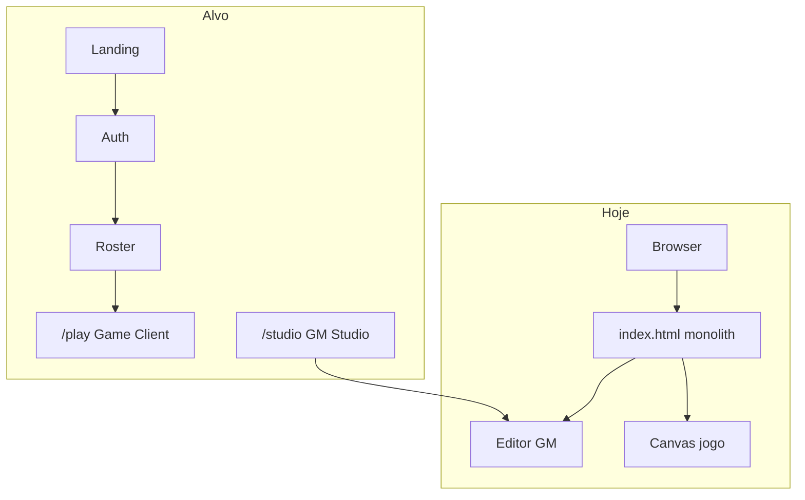
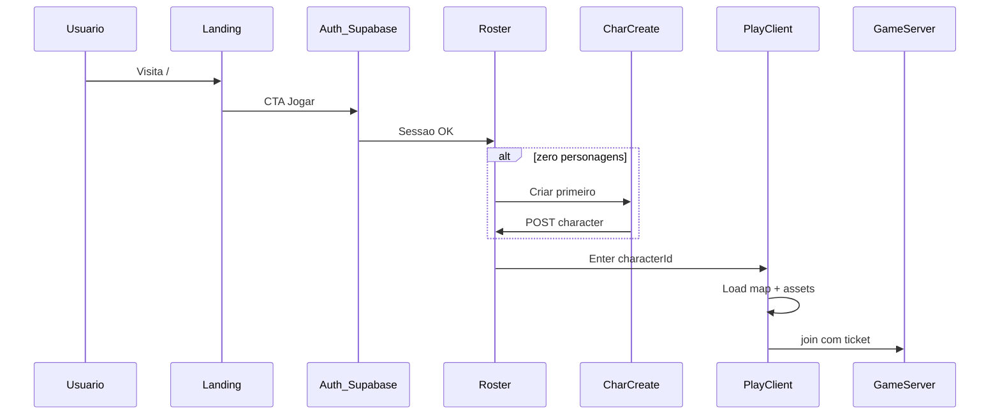
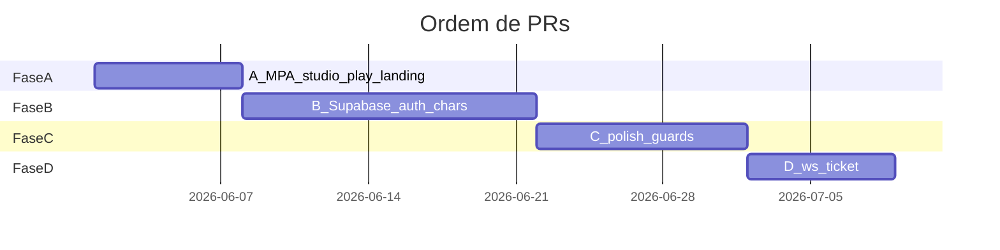

# Plano: Jornada do Jogador (seções 1–13)

Documento mestre de implementação. Cada fase termina com critérios de aceite verificáveis. Decisões fixadas:

| Decisão | Escolha | Motivo |
|---------|---------|--------|
| Auth + DB | **Supabase Auth + Postgres** | Não é lento para login/roster (ms); escala até milhares de CCU na camada auth. Hostgator compartilhado **não** roda bem WebSocket nem Node 24/7 — vocês já precisam de VPS/Fly para [`server/`](server/). Supabase cobre conta/personagens; jogo continua em [`server/`](server/) + Vercel estático. |
| Frontend | **Multi-page Vite** (opção A) | Bundle do jogador sem editor; [`src/main.ts`](src/main.ts) (~1800 linhas) vira só `/studio`. |
| GM | Rota `/studio` + claim `canAccessStudio` no perfil Supabase | Papel GM vem do servidor, não do [`roleSelector`](src/functions/roles.ts) no cliente. |

---

## 1. Diagnóstico (estado atual)

### 1.1 O que existe

| Componente | Arquivo / local | Papel hoje |
|------------|-----------------|------------|
| App monolítico | [`index.html`](index.html) + [`src/main.ts`](src/main.ts) | Engine + editor GM + jogo na mesma página |
| Papéis | [`src/functions/roles.ts`](src/functions/roles.ts) + `#roleSelector` | GM/Player/Tutor **só no browser** (inseguro) |
| Personagem | [`src/editor/characterEditor.ts`](src/editor/characterEditor.ts), `localStorage` `game2d_active_character_config` | Calibrador GM + “personagem ativo” local |
| Mapas | [`src/engine/mapRegistry.ts`](src/engine/mapRegistry.ts), portais, instâncias | Pronto para spawn pós-login |
| Multiplayer | [`src/net/gameNetClient.ts`](src/net/gameNetClient.ts), [`server/`](server/) | Join/move; ainda sem vínculo com conta |
| APIs dev | [`vite.config.ts`](vite.config.ts) `/api/save-character`, `/api/list-characters` | Só `npm run dev`; não é produção |

### 1.2 Lacuna de produto



### 1.3 Entregável desta seção (documentação)

- [ ] Criar [`docs/player-journey.md`](docs/player-journey.md) espelhando este plano + wireframes ASCII
- [ ] Atualizar [`README.md`](README.md): “como jogar” vs “como desenvolver mapas”
- [ ] Link em [`ideas_rme_roadmap.md`](ideas_rme_roadmap.md) → `docs/player-journey.md`

---

## 2. Princípios de arquitetura

1. **Superfícies separadas** — URLs e bundles distintos: marketing, auth, play, studio.
2. **Identidade no servidor** — JWT Supabase; `role`/`canAccessStudio` em tabela `profiles`, não em `<select>`.
3. **Personagem ≠ conta** — 1 conta → até N personagens; enter no mundo sempre com `characterId`.
4. **Funnel mensurável** — evento por tela (ver seção 11).
5. **Progressive disclosure** — `/play` sem menubar Arquivo/Mapas/Editar.
6. **Fail closed** — sem sessão → redirect `/login`; sem `characterId` → redirect `/characters`.
7. **Fatias entregáveis** — cada fase abaixo = 1–3 PRs revisáveis.

---

## 3. Jornada do usuário (fluxo completo)



### 3.1 Personas

| Persona | Rotas | Permissão |
|---------|-------|-----------|
| Visitante | `/` | — |
| Jogador | `/login`, `/characters`, `/play` | `profiles.role = player` |
| GM | + `/studio` | `profiles.can_access_studio = true` |
| Admin (futuro) | painel separado | fora do escopo inicial |

### 3.2 Checklist de fluxo (QA manual)

- [ ] Visitante em `/` vê landing sem canvas
- [ ] Registro → login → `/characters`
- [ ] 0 chars → wizard → volta ao roster com 1 card
- [ ] Enter → loading → movimento no mapa
- [ ] Logout → `/login`; sessão inválida em `/play` → `/login`
- [ ] GM: `/studio` abre editor; jogador sem claim recebe 403 ou redirect

---

## 4. Arquitetura de informação (rotas)

| Rota | HTML Vite | Entry TS | Descrição |
|------|-----------|----------|-----------|
| `/` | `index.html` | `src/landing/main.ts` | Apresentação |
| `/login.html` | `login.html` | `src/auth/login.ts` | Login |
| `/register.html` | `register.html` | `src/auth/register.ts` | Registro |
| `/characters.html` | `characters.html` | `src/characters/roster.ts` | Seleção |
| `/characters/new.html` | `characters-new.html` | `src/characters/create.ts` | Criação |
| `/play.html` | `play.html` | `src/game/bootstrap.ts` | Jogo |
| `/studio.html` | `studio.html` | `src/studio/bootstrap.ts` | Move lógica atual de [`src/main.ts`](src/main.ts) |

**Redirects**

| Condição | Ação |
|----------|------|
| Autenticado visita `/` | → `/characters.html` |
| `/play` sem `?characterId=` | → `/characters.html` |
| `/studio` sem `canAccessStudio` | → `/` ou `/characters` + toast |

**Config Vite:** `build.rollupOptions.input` com múltiplos HTML (padrão Vite MPA).

---

## 5. Especificação tela a tela

### 5.1 Landing (`/`)

**Objetivo:** conversão; zero engine.

**UI (blocos)**

- Hero: nome do jogo, tagline, arte, CTA primário “Jogar agora” → `login.html`
- Features (3–4): multi-mapas, dungeons instanciadas, multiplayer
- Mídia: GIF `mainland` ou screenshot
- FAQ: navegador, conta gratuita
- Footer: termos, privacidade (placeholder)
- Link secundário: “Área de desenvolvimento” → `studio.html` (texto pequeno)

**CSS:** reutilizar tokens de [`src/style.css`](src/style.css); pasta `src/landing/landing.css` se necessário.

**Checklist implementação**

- [ ] Novo `index.html` minimal (sem `#gameCanvas`, sem menubar GM)
- [ ] `src/landing/main.ts` só handlers de CTA
- [ ] Mover conteúdo GM antigo para `studio.html` (ver fase A)

---

### 5.2 Login / Registro

**Objetivo:** sessão Supabase.

**Login**

- Email, senha, “Entrar”, link registro, link esqueci senha (pode ser stub fase B)
- Erros: credenciais inválidas, rede, email não confirmado

**Registro**

- Email, senha, confirmar senha, checkbox termos (obrigatório)
- Pós-registro: criar linha em `profiles` via trigger ou `POST` edge function
- Redirect `/characters.html`

**Stack**

- `@supabase/supabase-js` em `src/shared/supabaseClient.ts`
- Variáveis: `VITE_SUPABASE_URL`, `VITE_SUPABASE_ANON_KEY` (`.env.example`)

**Checklist**

- [ ] Projeto Supabase criado; tabelas seção 6
- [ ] `src/auth/login.ts`, `register.ts`
- [ ] `src/shared/authGuard.ts` — `requireAuth()`, `getSession()`
- [ ] Layout compartilhado `src/shared/shell.css` (card centralizado, logo)

---

### 5.3 Seleção de personagem (roster)

**Objetivo:** escolher quem entra no mundo.

**UI**

- Grid/lista de cards: nome, preview sprite (preset), `last_played_at`
- Botões: “Entrar no mundo”, “Criar personagem” (se `count < MAX_CHARS`, ex. 4)
- “Excluir” com modal de confirmação (soft delete)
- “Sair da conta”

**Estado vazio:** ilustração + CTA criar

**Dados:** `GET` via Supabase `from('characters').select()` com RLS `account_id = auth.uid()`

**Checklist**

- [ ] `characters.html` + `src/characters/roster.ts`
- [ ] Preview: canvas pequeno ou `` do preset (`tiles/characters/knight.png`)
- [ ] Enter: `sessionStorage.setItem('activeCharacterId', id)` + `location.href = '/play.html?characterId=' + id`

---

### 5.4 Criação de personagem (wizard)

**Objetivo:** criar jogador em &lt; 2 min sem ferramentas GM.

| Step | Campos | Validação |
|------|--------|-----------|
| 1 | Nome | 3–20 chars, regex, único (unique index) |
| 2 | Preset outfit | lista fechada: `knight`, futuros… |
| 3 | Confirmar | resumo + “Nascer em Rookgaard” |

**Reuso código**

- [`createDefaultCharacterConfig()`](src/character/characterSerializer.ts) com `spriteSheetUrl` do preset
- **Não** importar [`characterEditor.ts`](src/editor/characterEditor.ts) no bundle de criação

**Checklist**

- [ ] `characters-new.html` + `src/characters/create.ts`
- [ ] `POST` insert em `characters` com `outfit_config` JSONB
- [ ] `spawn_map_id = 'rookgaard'` default
- [ ] Tratamento erro nome duplicado (23505)

---

### 5.5 Loading + Game Client (`/play`)

**Objetivo:** bootstrap jogo enxuto.

**Sequência técnica**

1. `requireAuth()` + ler `characterId` da query
2. Supabase: carregar `characters` row (nome, `outfit_config`, `spawn_map_id`)
3. Aplicar config em `SpriteAnimationController` (extrair de [`main.ts`](src/main.ts) L339–368)
4. `loadMapFile(getMapEntry(spawn_map_id))` — [`worldLoader.ts`](src/engine/worldLoader.ts)
5. Posicionar player no `spawn` do mapa
6. `gameNet.connect()` se `VITE_GAME_SERVER_WS` — enviar `name` do personagem
7. Loop `update`/`draw` sem editor

**UI jogador (mínimo)**

- Canvas fullscreen/container existente
- HUD: nome, mapa ([`statusMapName`](src/main.ts)), opcional HP futuro
- Menu esc: Configurações, Trocar personagem, Sair
- **Remover/ocultar:** menubar, `data-requires-edit`, painéis map editor, `roleSelector`, dev buffs

**Checklist**

- [ ] `play.html` — só DOM necessário (canvas, HUD, loading overlay)
- [ ] `src/game/bootstrap.ts` — extrair loop de `main.ts`
- [ ] `src/game/playerHud.ts` — menu mínimo
- [ ] Flag compile-time ou runtime: `import.meta.env.VITE_APP_MODE=play`

---

## 6. Modelo de dados e APIs

### 6.1 Schema Supabase (SQL)

```sql
-- profiles (1:1 com auth.users)
create table profiles (
  id uuid primary key references auth.users(id) on delete cascade,
  display_name text,
  role text not null default 'player' check (role in ('player','gm','admin')),
  can_access_studio boolean not null default false,
  created_at timestamptz default now()
);

-- characters
create table characters (
  id uuid primary key default gen_random_uuid(),
  account_id uuid not null references profiles(id) on delete cascade,
  name text not null,
  outfit_config jsonb not null,
  spawn_map_id text not null default 'rookgaard',
  deleted_at timestamptz,
  created_at timestamptz default now(),
  last_played_at timestamptz
);

create unique index characters_name_unique on characters (lower(name)) where deleted_at is null;
```

**RLS:** `account_id = auth.uid()` em SELECT/INSERT/UPDATE/DELETE.

**Trigger:** `on auth.users insert` → criar `profiles` row.

### 6.2 Tabela de contratos (REST via Supabase client)

| Operação | Cliente | Notas |
|----------|---------|-------|
| Registro | `auth.signUp` | + profile trigger |
| Login | `auth.signInWithPassword` | |
| Logout | `auth.signOut` | |
| Listar chars | `from('characters').select()` | roster |
| Criar char | `insert` | wizard |
| Soft delete | `update deleted_at` | |
| Enter mundo | `update last_played_at` | antes de redirect play |

### 6.3 WebSocket (fase D)

Estender [`shared/protocol.ts`](shared/protocol.ts):

- `join` aceita `enterTicket` ou `accessToken` (JWT curto emitido por Edge Function)
- [`server/src/GameRoom.ts`](server/src/GameRoom.ts) valida ticket → `characterId`, `name`

### 6.4 Mapeamento código existente → novo

| Existente | Destino |
|-----------|---------|
| [`src/main.ts`](src/main.ts) | `src/studio/bootstrap.ts` (GM completo) |
| Loop jogo + rede | `src/game/bootstrap.ts` |
| [`roles.ts`](src/functions/roles.ts) | Manter; `getRolePermissions` lê `profile.role` em play |
| `game2d_active_character_config` | Deprecar em play; usar row Supabase |
| [`characterEditor.ts`](src/editor/characterEditor.ts) | Só studio |

---

## 7. Segurança e compliance

| Item | Implementação | Fase |
|------|---------------|------|
| GM no cliente | Remover trust em `#roleSelector` para `canEditMap` | A |
| Studio guard | Checar `can_access_studio` antes de montar studio | C |
| RLS Supabase | Políticas por `account_id` | B |
| Nome personagem | Unique index + filtro palavras (lista estática MVP) | B |
| WS anti-spoof | Ticket no join | D |
| Sessão em play | `requireAuth` cada load | A |
| Termos / privacidade | Páginas estáticas placeholder | C |
| LGPD delete conta | `auth.admin` ou pedido suporte — backlog | F |

---

## 8. Design system e UX

- **Tokens:** cores/spacing de [`src/style.css`](src/style.css)
- **Componentes compartilhados** em `src/shared/ui/`: `Button`, `Input`, `Card`, `Modal` (wrap [`popup.ts`](src/utils/popup.ts) onde fizer sentido)
- **Densidade:** landing/auth = marketing espaçado; play = HUD compacto; studio = densidade atual
- **A11y:** labels em inputs, foco visível, `aria` nos modais
- **Responsivo:** landing/auth mobile-first; play desktop-first (min-width 1024 recomendado)

**Checklist**

- [ ] `src/shared/shell.css`
- [ ] Tipografia única (já Inter no index)
- [ ] Estados loading/erro/vazio em cada tela

---

## 9. Fases de entrega (checklist mestre)

### Fase A — Fundação e separação (1–2 semanas)

**Meta:** URLs separadas; studio intacto; play esqueleto.

| # | Tarefa | Arquivos |
|---|--------|----------|
| A1 | Configurar MPA no Vite | [`vite.config.ts`](vite.config.ts) |
| A2 | `studio.html` = migrar body atual de `index.html` | `studio.html`, `src/studio/bootstrap.ts` |
| A3 | `play.html` esqueleto com canvas + auth guard mock | `play.html`, `src/game/bootstrap.ts` |
| A4 | `index.html` nova landing | `src/landing/` |
| A5 | `shared/authGuard` com sessão mock opcional (`VITE_AUTH_MOCK=true`) | `src/shared/authGuard.ts` |
| A6 | Documentar rotas em `docs/player-journey.md` | docs |

**Aceite:** `npm run dev` abre landing em `/`; `/studio.html` = editor GM igual hoje; `/play.html` mostra mapa sem menubar GM.

---

### Fase B — Supabase + Auth + Personagens (2–3 semanas)

| # | Tarefa |
|---|--------|
| B1 | Projeto Supabase + schema seção 6.1 + RLS |
| B2 | `login.html` / `register.html` funcionais |
| B3 | `characters.html` roster + enter |
| B4 | `characters-new.html` wizard 3 passos |
| B5 | `play.html` carrega personagem do Supabase |
| B6 | `.env.example` documentado |

**Aceite:** fluxo completo registro → criar char → jogar em rookgaard/mainland; dados persistem após F5.

---

### Fase C — Polish produto (1–2 semanas)

| # | Tarefa |
|---|--------|
| C1 | Landing com copy/arte real |
| C2 | Loading unificado em play (reusar `#mapLoadingOverlay` pattern) |
| C3 | Logout, trocar personagem, sessão expirada |
| C4 | Studio: guard `can_access_studio` |
| C5 | Remover `roleSelector` do play; GM só no studio |
| C6 | Páginas termos/privacidade |

**Aceite:** jogador nunca vê ferramentas GM; GM acessa studio com conta flagrada.

---

### Fase D — Multiplayer + identidade (1–2 semanas)

| # | Tarefa |
|---|--------|
| D1 | Edge Function `createEnterTicket(characterId)` |
| D2 | `join` WS valida ticket |
| D3 | Nome na rede = `characters.name` |

**Aceite:** dois browsers com contas/chars distintos veem nomes corretos no WS.

---

### Fase E — GM profissional (contínuo)

| # | Tarefa |
|---|--------|
| E1 | Flag `can_access_studio` atribuível no Supabase dashboard |
| E2 | Auditoria save map (`/api/save-map` só dev/studio) |

---

### Fase F — Escala e hospedagem (quando beta público)

| Serviço | Hospeda |
|---------|---------|
| Landing + auth + play + studio estático | Vercel / Cloudflare Pages |
| Supabase | Auth + Postgres (plano free → pro) |
| Game server WS | Fly.io / Hetzner VPS (não Hostgator shared) |

**Nota Hostgator:** adequado só para PHP/site estático; **não** substitui Supabase Auth nem game server.

---

## 10. Estrutura de pastas final

```
src/
  landing/          # index
  auth/             # login, register
  characters/       # roster, create
  game/             # play bootstrap, hud
  studio/           # ex-main.ts
  shared/           # supabase, authGuard, ui, shell.css
  engine/           # (inalterado)
  net/              # (inalterado)
  editor/           # (só usado por studio)
docs/
  player-journey.md # cópia executável deste plano
```

---

## 11. Métricas (KPIs) e eventos

| Evento | Quando | Meta inicial |
|--------|--------|--------------|
| `landing_view` | `/` load | baseline |
| `cta_play_click` | CTA hero | CTR &gt; 15% |
| `register_complete` | pós signUp | — |
| `character_created` | insert OK | &gt; 60% dos registros |
| `first_world_enter` | play load OK | &gt; 80% dos chars |
| `first_tile_move` | primeiro move | &lt; 3 min após landing |

**Ferramenta sugerida:** PostHog ou Plausible (script só em landing/auth/play).

**Checklist**

- [ ] `src/shared/analytics.ts` wrapper `track(event, props)`
- [ ] Chamar nos pontos acima (fase C)

---

## 12. Riscos e decisões registradas

| Risco | Mitigação |
|-------|-----------|
| `main.ts` difícil de dividir | PR A2: copy para studio; extrair `initGameWorld()` compartilhado em `src/game/worldSession.ts` |
| Bundle play grande | MPA + não importar editor em play |
| Nome duplicado | unique index + UX erro claro |
| Supabase latência | só auth/roster; jogo local + WS |
| Instância dungeon vs rede | manter lógica atual [`mapInstance.ts`](src/engine/mapInstance.ts); `instanceId` rede vem do server (já Fase 2b) |

**Decisões fechadas**

- Nome único global (um shard)
- Soft delete personagem
- Studio fechado por flag

---

## 13. Próximos passos imediatos (ordem de PRs)



| PR | Título | Entregável |
|----|--------|------------|
| PR-1 | `chore(mpa): studio + play + landing shells` | Fase A completa |
| PR-2 | `feat(auth): supabase login/register` | B1–B2 |
| PR-3 | `feat(characters): roster + create` | B3–B4 |
| PR-4 | `feat(play): bootstrap from character row` | B5 |
| PR-5 | `feat(polish): landing + guards + logout` | C1–C6 |
| PR-6 | `feat(net): enter ticket on join` | D1–D3 |

**Primeira ação após aprovação:** PR-1 (separação física sem Supabase) para validar arquitetura em 1–2 dias.

---

## Hospedagem: resposta direta (Supabase vs Hostgator)

| Camada | Hostgator shared? | Recomendado |
|--------|-------------------|-------------|
| Site estático (landing, HTML) | Sim | Vercel / Hostgator OK |
| Login / banco personagens | Não (sem Postgres gerenciado + RLS) | **Supabase** |
| WebSocket jogo | Não | **VPS/Fly** + [`server/`](server/) |

Supabase **não** deixa o jogo lento; o canvas e o loop rodam no browser. Latência perceptível vem do WS e assets, não do login.
