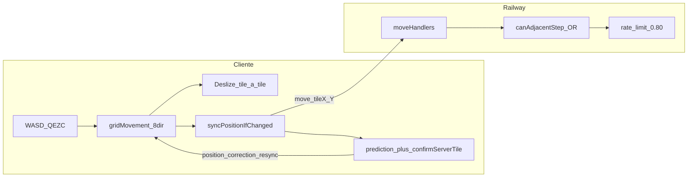
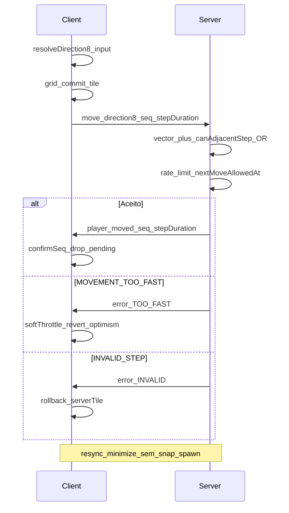

# Plano: Movimento 8 direções (Zezenia-like)

Baseado em [docs/andar-zezenia.md](docs/andar-zezenia.md), cruzado com o código atual e correções recentes (sync `onPositionSynced`, lifecycle minimize, `MOVEMENT_TOO_FAST` suave).

## Estado atual (não recomeçar do zero)



| Área | Já existe | Gap vs doc |
|------|-----------|------------|
| Grid 8-dir local | [src/movement/gridMovement.ts](src/movement/gridMovement.ts) — acorde 50ms, Q/E/Z/C, √2 duração | Sem buffer de 2 inputs |
| Validação diagonal | [shared/tileWalkable.ts](shared/tileWalkable.ts) — Chebyshev 1, canto **OR** | Doc pedia AND — **decisão: manter OR** |
| Protocolo WS | Tile destino + `direction` 4 vias opcional | **Migrar para Direction8 + seq** |
| Predição/resync | [clientMovementPrediction.ts](src/movement/clientMovementPrediction.ts), [playApp.ts](src/game/playApp.ts) lifecycle | `seq` não vai na rede |
| Combate range | Chebyshev em [shared/playerAttack.ts](shared/playerAttack.ts) | OK para 8-dir |
| Monstros | Só passos cardinais em [shared/creatureChase.ts](shared/creatureChase.ts) | Fase posterior |
| Auto-walk / A* | Não existe | Fase 7 |
| Sprites 8-dir | 4 vias + facing por última tecla WASD | Fase visual opcional |

**Conclusão:** não refatorar `gridMovement` inteiro; **formalizar Direction8 + seq na rede** e extrair validação/timing compartilhados. O cliente já anda em diagonal — o risco é quebrar sync, combate e minimize.

---

## Decisões fixadas

1. **Canto diagonal:** manter regra **OR** (`sideXOk || sideYOk`) — alinhada a Tibia/flanco; documentar em [docs/andar-zezenia.md](docs/andar-zezenia.md) como divergência intencional do doc original.
2. **Protocolo:** migrar para **`direction: Direction8` + `seq`** (servidor deriva destino); período de compatibilidade curto aceitando `tileX/Y` legado só se `direction` ausente (1 release).
3. **Duração diagonal:** servidor autoritativo com fator **1.15** (doc) em vez de confiar só no √2 do cliente — reduz `MOVEMENT_TOO_FAST` e PvP desbalanceado.
4. **`position_correction`:** manter sem envio em rejeição de `move` (anti rubber-band); cliente continua com `handleMovementTooFastSoft` + rollback em `INVALID_*`.

---

## Arquitetura alvo



---

## Fase 0 — Estabilização (pré-requisito)

**Objetivo:** garantir baseline antes de mudar protocolo.

- [ ] Release **0.1.3+** com fixes já feitos: `onPositionSynced`, lifecycle blur≠minimize, `handleMovementTooFastSoft`, build server `tsconfig.build.json`.
- [ ] Checklist manual (produção Electron + browser):
  - Andar 20 tiles retos/diagonais sem `INVALID_STEP` em campo aberto
  - Minimizar/restaurar parado e andando — sem teleporte ao spawn
  - F3: `pendingPredictions` baixo quando parado
- [ ] Adicionar testes Vitest mínimos:
  - `shared/movement/direction8.test.ts` (vetores, round-trip tile↔direction)
  - Regressão `canAdjacentStep` OR (casos canto documentados em [shared/tileWalkable.test.ts](shared/tileWalkable.test.ts) se ausente)

**Anti-bug:** não iniciar Fase 1 com minimize ou “só primeiro passo” ainda reproduzível.

---

## Fase 1 — Primitivos compartilhados

**Arquivos novos:**

- `shared/movement/direction8.ts` — tipos, `DIRECTION_VECTORS`, `isDiagonalDirection`, `directionFromDelta`, `applyDirection(tile, dir) → tile`
- `shared/movement/distance.ts` — `chebyshevDistance`, `manhattanDistance` (mover lógica de [shared/playerAttack.ts](shared/playerAttack.ts) para reexport, sem quebrar imports)

**Mapeamento de nomes** (unificar cliente/servidor/doc):

| gridMovement | Direction8 protocolo |
|--------------|----------------------|
| `northwest` | `north_west` |
| `northeast` | `north_east` |
| `southwest` | `south_west` |
| `southeast` | `south_east` |

Funções `toProtocolDirection8` / `fromProtocolDirection8` em `direction8.ts`.

**Não alterar** ainda `moveHandlers` nem `gameNetClient`.

**Anti-bug:** testes puros sem I/O; 100% cobertura dos 8 vetores + deltas inválidos (0,0), (2,0).

---

## Fase 2 — Servidor: validator + timing + anti-cheat

**Arquivos novos** (extrair de [moveHandlers.ts](server/src/gameRoom/handlers/moveHandlers.ts)):

- `server/src/gameRoom/movement/movementValidator.ts` — `validatePlayerStep({ from, direction8, mapId, z, isWalkable, isOccupied? })` usando `canAdjacentStep` existente (OR)
- `server/src/gameRoom/movement/movementTiming.ts` — `getAuthoritativeStepDurationMs(base, direction8)` com `DIAGONAL_FACTOR = 1.15`
- `server/src/gameRoom/movement/movementRateLimit.ts` — `nextMoveAllowedAt`, tolerância 35ms (doc §7), integrar com `lastObservedMoveIntervalMs` atual

**Refatorar** `moveHandlers.ts` para delegar validação/timing — **comportamento observável igual** exceto fator diagonal servidor.

**Ocupação (opcional nesta fase):** `isOccupied` para jogador/criatura no destino — hoje **não** bloqueia `move`; adicionar só se reproduzir bug em teste; senão Fase 5.

**Anti-bug:**

- Nunca duplicar regra de canto — **única fonte:** `canAdjacentStep` em [shared/tileWalkable.ts](shared/tileWalkable.ts)
- `rejectMove(..., sendCorrection=false)` inalterado para todos os códigos de `move`
- Testes servidor: passo diagonal válido, canto bloqueado (OR), `MOVEMENT_TOO_FAST`, `map_change` sem rate limit

---

## Fase 3 — Protocolo Direction8 + seq

**Alterar** [shared/protocol.ts](shared/protocol.ts):

```typescript
// Novo (alvo)
interface MoveMessage {
  type: 'move';
  direction: Direction8;      // obrigatório em v2
  seq: number;
  clientTime?: number;
  mapId; instanceId?; z;
  stepDurationMs?;
  steppingDestTileX/Y?;
  // Legado 1 release: tileX/tileY opcional para clientes antigos
}
```

**Servidor** ([moveHandlers.ts](server/src/gameRoom/handlers/moveHandlers.ts)):

- Se `direction` presente: `to = applyDirection(player, direction)`; ignorar `tileX/Y` do cliente (ou rejeitar se divergir > 0 tiles — anti-cheat)
- Guardar `lastAckSeq` por jogador; incluir `seq` em `player_moved` (campo novo opcional)

**Cliente** ([gameNetClient.ts](src/net/gameNetClient.ts), [playApp.ts](src/game/playApp.ts)):

- `recordPredictedMove` já gera `seq` local — **enviar o mesmo `seq` no WS**
- `onPositionSynced` / `confirmServerTile` só após `seq` confirmado (match em `player_moved` ou manter otimista com revert em erro — ver Fase 0)
- Mapear `GridDirection` → `Direction8` ao enviar

**Compatibilidade:** flag `PROTOCOL_VERSION` bump ou campo `v` no `move`; servidor aceita tile-only se `direction` ausente (log deprecation).

**Anti-bug:**

- **Nunca** reintroduzir validação contra `serverTile` stale em `syncPositionIfChanged` (bug que causava “só primeiro passo”)
- `seq` monotônico; descartar pacotes `seq < lastAckSeq`
- Teste integração: 10 passos diagonais, servidor e cliente no mesmo tile final

---

## Fase 4 — Cliente: input buffer + alinhamento visual

**Arquivos novos:**

- `src/movement/inputDirection8.ts` — extrair lógica de `resolveDirection` / acordes de [gridMovement.ts](src/movement/gridMovement.ts) (refactor, não reimplementar)
- `src/movement/movementInputBuffer.ts` — fila máx. 2 direções; `clear()` em `handleMovementRejected`, lifecycle hidden, combate cast

**Ajustes:**

- Servidor manda `stepDurationMs` com fator 1.15 — cliente **usa valor do servidor** em remotos; local alinhar `gridMovement` para não enviar √2 se servidor já aplicou 1.15 (evitar double factor)
- `facingForStep` / sprite: manter 4 vias (doc Opção B) — `getVisualFacing(direction8)`

**Anti-bug:**

- Buffer limpo em `handlePlayPageHidden` e `handleMovementTooFastSoft`
- Não bufferizar durante `positionCorrectionSlide.active`
- Teste: spam WASD não gera fila > 2 nem `INVALID_STEP` em linha reta

---

## Fase 5 — Combate, magias e ocupação

**Arquivos:** [attackHandlers.ts](server/src/gameRoom/handlers/attackHandlers.ts), [spellCast.ts](server/src/combat/spellCast.ts), [playCombat.ts](src/game/playCombat.ts)

- Padronizar **Chebyshev** para melee e range de magia (já parcialmente em `playerAttack`)
- Validar `direction8` coerente com facing em ataque (cosmético)
- Avaliar bloqueio de tile por jogador/criatura no `movementValidator.isOccupied`

**Anti-bug:** testes PvP existentes em [server/src/combat/pvp.test.ts](server/src/combat/pvp.test.ts) devem passar; adicionar caso ataque diagonal adjacente.

---

## Fase 6 — Monstros (diagonal chase)

**Manter cardinais na Fase 6a**; **6b** opcional diagonal com **mesmo** `movementValidator` do jogador.

- [shared/creatureChase.ts](shared/creatureChase.ts) — `getChaseDirection8` simples (doc §14)
- [RoomCreatureManager.ts](server/src/game/RoomCreatureManager.ts) — reutilizar validator; nunca regra paralela

**Anti-bug:** mobs não podem cortar canto com regra diferente do player; testes `creatureChase.test.ts`.

---

## Fase 7 — Auto-walk e pathfinding 8-dir

**Novo:** A* 8 vizinhos com custo 1 / 1.15 e filtro `canAdjacentStep` em cada expansão diagonal.

- Cliente: preview + sugestão de caminho
- Servidor: valida **cada passo** individualmente (não confiar no path do cliente)

**Anti-bug:** pathfinding não substitui rate limit; um `move` por tile por tick.

---

## Fase 8 — Mobile (Capacitor)

- `src/game/movement/mobileDirection8.ts` — joystick com snap 8 direções
- Reutilizar `MovementInputBuffer` e protocolo Direction8

---

## Riscos e mitigação (checklist anti-regressão)

| Risco | Mitigação |
|-------|-----------|
| Teleporte ao minimize | Nunca `snap` para `serverTile` stale; `stabilizeLocalPlayerOnLifecyclePause` + resync |
| Só primeiro passo / dessync | `onPositionSynced` + sem validação `getServerAuthoritativeTile`; teste 20 tiles |
| `MOVEMENT_TOO_FAST` em loop | `handleMovementTooFastSoft` + throttle 120ms; servidor `nextMoveAllowedAt` |
| Cortar canto ilegal | Testes OR em `tileWalkable`; mapas com cantos no Studio |
| Double diagonal speed | Uma fonte de fator: **servidor 1.15**; cliente deixa de multiplicar √2 no envio |
| Protocolo misto | 1 release legado tile-only; logs + métrica de clientes antigos |
| Rubber-band | Sem `position_correction` em `MOVEMENT_TOO_FAST` |
| `INVALID_STEP` pós-resync | `forceResyncPosition` só reenvia tile adjacente a `lastSynced` |
| Electron minimize | blur ≠ background ([electron-desktop.md](docs/electron-desktop.md) §4) |
| Build Railway | `npm run check` + `build` server no pipeline ([hosting.md](docs/hosting.md)) |

Checklist §20 do doc + itens acima antes de marcar “pronto”.

---

## Ordem de PRs sugerida (commits pequenos)

1. `feat(movement): shared direction8 primitives + tests`
2. `refactor(server): extract movement validator and timing`
3. `feat(protocol): move message direction8 + seq (dual support)`
4. `feat(client): send direction8 + seq; align step duration with server`
5. `feat(client): movement input buffer`
6. `docs: update andar-zezenia + multiplayer-remote-players + AGENTS invariantes`
7. (Posterior) combate / mobs / pathfinding / mobile — um PR por fase

---

## Documentação a atualizar (cada fase)

- [docs/andar-zezenia.md](docs/andar-zezenia.md) — marcar o que já existe, decisão OR + protocolo direction8
- [docs/multiplayer-remote-players.md](docs/multiplayer-remote-players.md) — §2 movimento WS
- [docs/studio-improvements-log.md](docs/studio-improvements-log.md) — nova seção por fase
- [AGENTS.md](AGENTS.md) — invariante Direction8 + seq após Fase 3

---

## O que NÃO fazer (evitar bugs)

- Não trocar protocolo e grid local no mesmo PR
- Não mudar regra OR→AND sem playtest em mapas reais
- Não adicionar `position_correction` em `MOVEMENT_TOO_FAST`
- Não snap lifecycle para `movementPrediction.serverTile` sem `position_correction` recente
- Não criar validação de movimento só no cliente para mobs e outra para players
- Não implementar auto-walk antes de Fase 3 estável em produção
