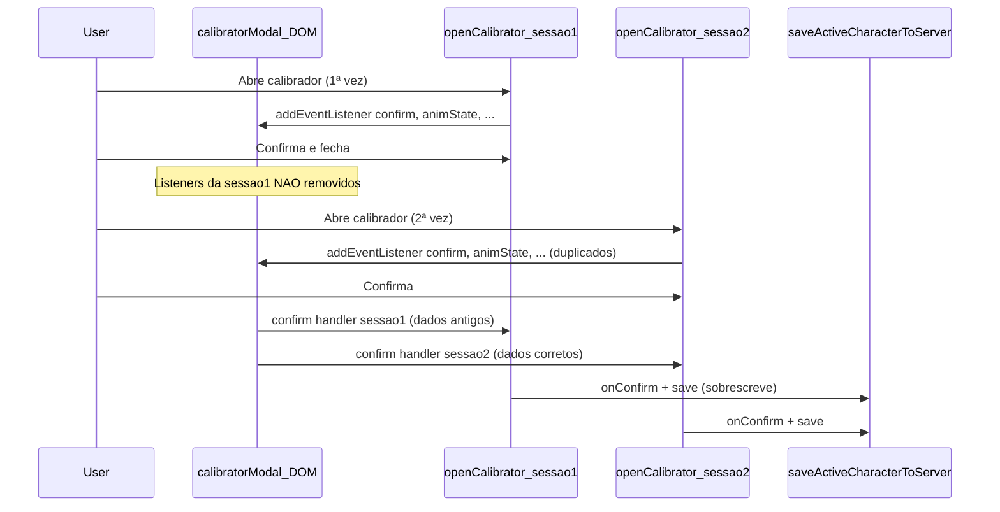
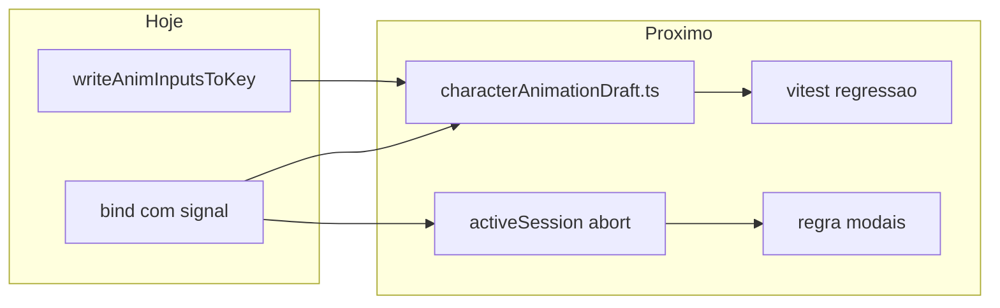

# Por que aconteceu e como evitar de novo

## Por que aconteceu (causa raiz)

Não foi “salvar errado no servidor” nem corrupção do JSON. Foi um **bug de ciclo de vida do modal**:



[`openCharacterCalibrator()`](src/editor/characterCalibratorModal.ts) é chamada **a cada abertura** (por [`spriteSheetEditor.ts`](src/editor/spriteSheetEditor.ts) e [`mapSpriteEditor.ts`](src/editor/mapSpriteEditor.ts)), mas o HTML do modal é **único** (`#calibratorModal` em [`studio.html`](studio.html)).

O padrão correto já existia no mesmo arquivo para canvas/mouse (`AbortController` + `{ signal }`), porém **~25 outros listeners** (confirm, anim state/dir, inputs, botões) foram adicionados sem `signal`. Ao fechar, só `abortController.abort()` nos listeners novos — os antigos continuavam vivos com closures de `localAnimations` de sessões passadas.

**Sintoma percebido:** você salva, reabre, e “está tudo diferente” — porque um handler fantasma gravava de novo um snapshot antigo **depois** do save correto.

**Bug secundário (painel lateral):** em [`spriteSheetEditor.ts`](src/editor/spriteSheetEditor.ts), trocar Estado/Direção no `<select>` disparava `change` **já com o valor novo**, mas o código só carregava a próxima animação sem persistir a anterior nos inputs. Isso podia descartar edições fora do modal.

**Correção já aplicada nesta sessão:**
- `bind()` centralizado com `{ signal }` em todo o calibrador
- `writeAnimInputsToKey()` + `focus`/`change` no painel principal

---

## “Tem tanto código que vocês se perdem?” — resposta honesta

Sim, **há complexidade real**, mas o bug não foi “volume genérico” — foi um **anti-padrão específico** fácil de passar batido:

| Arquivo | Linhas | Papel |
|---------|--------|--------|
| [`mapSpriteEditor.ts`](src/editor/mapSpriteEditor.ts) | ~1324 | Criar sprites de mapa |
| [`characterCalibratorModal.ts`](src/editor/characterCalibratorModal.ts) | ~1135 | Modal **3 em 1**: personagem + mapa + auto-borda |
| [`spriteSheetEditor.ts`](src/editor/spriteSheetEditor.ts) | ~967 | Outfits/NPCs/mobs + save servidor |

Riscos estruturais atuais:

1. **Modal polivalente** — personagem, tile e borderSet compartilham o mesmo DOM e o mesmo `openCharacterCalibrator()`.
2. **Lógica de animação duplicada** — `syncUIToAnimation` / `syncAnimationToUI` (calibrador) vs `writeAnimInputsToKey` / `syncUIToController` (editor lateral); mesma regra de chave `estado_direção`, implementada duas vezes.
3. **Zero testes** — nenhum `*.test.ts` cobre calibrador ou persistência de `animations`.
4. **Outros modais com padrões diferentes** — [`vocationEditorModal.ts`](src/editor/vocationEditorModal.ts) registra listeners **uma vez** no init (seguro); calibrador registra **a cada open** (exige cleanup). Inconsistência de convenção no projeto.

Ou seja: não é que o código seja “ingovernável”, mas **falta convenção explícita para modais reabertos** e **falta extrair a lógica de animação** para um lugar testável.

---

## O que fazer para não ocorrer mais

### Nível 1 — Já feito (manter)

- Todos os listeners do calibrador passam por `bind(..., { signal })`.
- Troca de estado/direção no painel lateral salva o par anterior antes de carregar o próximo.

### Nível 2 — Extrair lógica de animação (recomendado, baixo risco)

Criar [`src/editor/characterAnimationDraft.ts`](src/editor/characterAnimationDraft.ts) (~80 linhas) com API única:

```ts
// Conceito
class CharacterAnimationDraft {
  constructor(animations: Record<string, AnimationDef>, sheetLayout: ...)
  switchSelection(state, dir): void  // salva UI no par anterior, carrega novo
  readFromInputs(row, start, frames, speed): void
  writeToInputs(): { row, startFrame, frames, speedFps }
  toJSON(): Record<string, AnimationDef>
}
```

Usar no calibrador **e** no `spriteSheetEditor` — uma implementação, dois consumidores. Elimina divergência futura entre modal e painel lateral.

### Nível 3 — Testes de regressão (recomendado)

Arquivo [`src/editor/characterAnimationDraft.test.ts`](src/editor/characterAnimationDraft.test.ts) com casos:

- Trocar `idle_down` → `walk_down` preserva valores editados em `idle_down`
- `confirm` serializa todas as chaves, não só a ativa
- Layout `vertical` vs `horizontal` não altera o objeto salvo (só interpretação de clique — testar `resolveAnimationFrameCell` já existe indiretamente em [`sheetFrameLayout.ts`](src/character/sheetFrameLayout.ts); adicionar 2–3 casos se necessário)

Teste opcional de integração leve: mock de `addEventListener` + abrir/fechar calibrador 2× e assert que `confirm` dispara **1** callback (exigiria extrair `bind` ou injetar contador no teste).

### Nível 4 — Guard de sessão no modal (barato, alta segurança)

No início de [`openCharacterCalibrator`](src/editor/characterCalibratorModal.ts):

- Manter `let activeSession: AbortController | null` no **módulo** (não dentro da função).
- Se já houver sessão aberta: `activeSession.abort()` antes de criar nova.
- Impede overlap mesmo se alguém esquecer `bind()` no futuro.

### Nível 5 — Documentar convenção (anti-regressão)

Adicionar seção curta em [`.cursor/rules/studio-map-sprites.mdc`](.cursor/rules/studio-map-sprites.mdc) ou [`docs/sprite-exporter-walkthrough.md`](docs/sprite-exporter-walkthrough.md):

> Modais reabertos (`openX()` por chamada): **obrigatório** `AbortController` + `signal` em **todos** os listeners; nunca `addEventListener` nu em elementos globais do `studio.html`.

Checklist manual no walkthrough:
- Abrir calibrador 3×, editar, confirmar — valores estáveis após reload do servidor
- Trocar estado/direção no modal e no painel lateral — sem reset

### Nível 6 — Refatoração maior (opcional, não urgente)

Dividir [`characterCalibratorModal.ts`](src/editor/characterCalibratorModal.ts) em:

- `calibratorCharacterMode.ts`
- `calibratorMapMode.ts`
- `calibratorBorderSetMode.ts`
- `calibratorModalShell.ts` (bind, zoom, grade, close)

Só vale a pena se você for mexer muito no calibrador nos próximos sprints; **não é pré-requisito** para evitar este bug.

### Nível 7 — CI barato (opcional)

Script em `package.json`:

```bash
rg "addEventListener\(" src/editor/characterCalibratorModal.ts | rg -v "bind\(|signal"
```

Falha se alguém reintroduzir listener sem `bind`. (Frágil se o arquivo mudar de nome, mas custo zero.)

---

## O que NÃO precisa fazer agora

- Reescrever `spriteSheetEditor` ou `mapSpriteEditor` do zero
- Migrar modais para React/componentes
- Trocar formato JSON de personagem

---

## Ordem sugerida de implementação

1. Extrair `CharacterAnimationDraft` e plugar nos dois editores
2. Testes unitários do draft
3. Guard `activeSession` no módulo do calibrador
4. Nota na documentação + checklist manual
5. (Opcional) split do calibrador por modo


