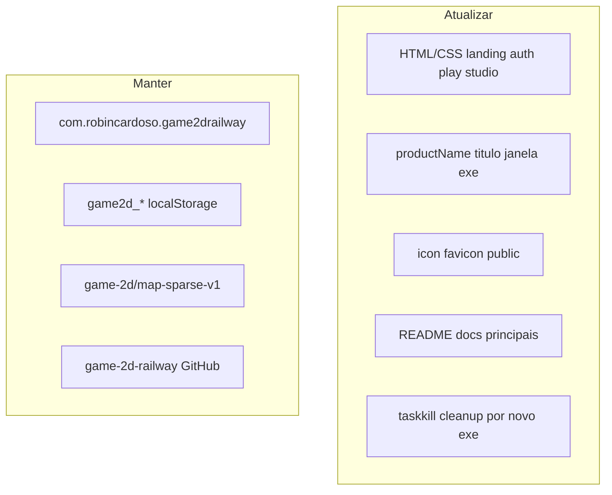

# Rebrand para Elarion Online

## Decisões confirmadas

| Escolha | Valor |
|---------|--------|
| Nome do jogo | **Elarion Online** |
| Escopo | **Só branding visível** — IDs técnicos permanecem |
| Asset | [`icon_Elarion.png`](icon_Elarion.png) (logo com espada/asas) |

## O que NÃO mudar (anti-regressão)

Manter intacto para não invalidar dados, deploy ou instaladores já publicados:

- `package.json` → `"name": "tibia-web-engine"` (npm interno)
- `build.appId` → `com.robincardoso.game2drailway` (Electron/Capacitor — trocar = app novo nas lojas)
- Repositório GitHub `robinCardoso/game-2d-railway`
- Chaves `localStorage` (`game2d_auth_token`, `game2d_camera_zoom`, etc.)
- Formato de mapa `game-2d/map-sparse-v1` em [`src/engine/tileCatalog.ts`](src/engine/tileCatalog.ts) e JSONs de mapa
- Referências à plataforma **Railway** (hospedagem, não nome do jogo)
- Pasta do projeto no disco (`game-2d-railway`)



---

## Fase 1 — Constantes de marca (fonte única em TS)

Criar [`shared/brand.ts`](shared/brand.ts):

```ts
export const BRAND = {
  gameName: 'Elarion Online',
  studioName: 'Elarion Studio',
  tagline: 'MMORPG 2D persistente',
} as const;
```

Usar em código TypeScript onde hoje há strings soltas:
- [`desktop/electron/main.ts`](desktop/electron/main.ts) — `title` da janela
- [`src/game-data/default/game.config.ts`](src/game-data/default/game.config.ts) — `name: 'Game 2D Default'` → `'Elarion Default'`
- [`capacitor.config.ts`](capacitor.config.ts) — `appName` (display Android; `appId` mantido)

Teste opcional em `shared/brand.test.ts` (só export estável).

---

## Fase 2 — Assets e ícone

1. **Copiar** `icon_Elarion.png` → [`public/brand/icon-elarion.png`](public/brand/icon-elarion.png) (path estável no Vite/Electron)
2. **Remover ou arquivar** [`logo_game.png`](logo_game.png) da raiz se ficar órfão (ou mover para `docs/assets/` como referência)
3. **Favicon** — adicionar em todos os HTML principais:

```html
<link rel="icon" type="image/png" href="/brand/icon-elarion.png" />
```

Arquivos: [`index.html`](index.html), [`login.html`](login.html), [`register.html`](register.html), [`characters.html`](characters.html), [`characters-new.html`](characters-new.html), [`play.html`](play.html), [`studio.html`](studio.html), [`terms.html`](terms.html), [`privacy.html`](privacy.html)

4. **Electron builder** — em [`package.json`](package.json) `build.win.icon`: `public/brand/icon-elarion.png` (electron-builder aceita PNG 256×256+)

---

## Fase 3 — UI web (substituir "2D World" / placeholder "W")

### Landing ([`index.html`](index.html) + [`src/landing/landing.css`](src/landing/landing.css))

| Antes | Depois |
|-------|--------|
| `<title>2D World — MMORPG 2D</title>` | `Elarion Online — MMORPG 2D` |
| `<div class="landing-logo-box">W</div>` + `<span>2D World</span>` | `` + texto **Elarion Online** |
| Hero pode mencionar o nome na copy (opcional, 1 linha) | — |

### Shell auth/roster ([`login.html`](login.html), [`register.html`](register.html), [`characters.html`](characters.html), [`characters-new.html`](characters-new.html))

- Títulos: `— 2D World` → `— Elarion Online`
- Adicionar logo `` acima do `<h1>` em cada `shell-logo` (CSS em [`src/shared/shell.css`](src/shared/shell.css): `.shell-brand-img` ~48px)

### Play ([`play.html`](play.html))

- `<title>Jogando — Elarion Online</title>`

### Studio GM ([`studio.html`](studio.html))

| Antes | Depois |
|-------|--------|
| `2D World Builder — GM Studio` | `Elarion Studio` |
| Loading `W` / `2D World Builder` | logo + **Elarion Studio** |
| Header `logo-box W` | `` do ícone |

### Legal ([`terms.html`](terms.html), [`privacy.html`](privacy.html))

- Títulos e corpo placeholder: trocar "2D World" por **Elarion Online**

---

## Fase 4 — Electron e scripts de build

Em [`package.json`](package.json) `build`:

```json
"productName": "Elarion Online",
"shortcutName": "Elarion Online"
```

Impacto: o executável Windows passa a ser **`Elarion Online.exe`** (não mais `Game 2D Railway.exe`).

Atualizar scripts que referenciam o nome antigo:

| Arquivo | Mudança |
|---------|---------|
| [`scripts/prepare-electron-release.mjs`](scripts/prepare-electron-release.mjs) | `taskkill` → `"Elarion Online.exe"` |
| [`scripts/cleanup-orphan-desktop-install.ps1`](scripts/cleanup-orphan-desktop-install.ps1) | grep `*Elarion Online*`; path `Program Files\Elarion Online` |
| [`desktop/electron/main.ts`](desktop/electron/main.ts) | comentário + `title` via `BRAND.gameName` |

Instalador gerado: `Elarion Online-0.1.2-Setup.exe` (artifactName já usa `${productName}`).

> **Nota:** quem tem `Game 2D Railway 0.1.1` instalado precisará desinstalar manualmente e instalar o novo — `appId` igual permite coexistência até limpar o registro órfão.

---

## Fase 5 — Documentação (superfície pública)

Atualizar títulos e menções ao **nome do jogo** (não renomear repo/paths técnicos):

| Arquivo | O que mudar |
|---------|-------------|
| [`README.md`](README.md) | Título `# Elarion Online`; seções Electron/Android; exemplos de `.exe` |
| [`AGENTS.md`](AGENTS.md) | Primeira linha / descrição do projeto |
| [`docs/playstore-steam-roadmap.md`](docs/playstore-steam-roadmap.md) | Nome do produto |
| [`docs/hosting.md`](docs/hosting.md) | Só onde citar nome do jogo (manter Railway) |
| [`docs/player-journey.md`](docs/player-journey.md) | Se houver "2D World" |
| [`public/maps/map.schema.json`](public/maps/map.schema.json) | `"title": "Elarion MapDocument"` (metadado, sem quebrar schema) |

**Não reescrever** em massa: `.cursor/plans/*`, `release-build-*`, logs históricos em `docs/studio-improvements-log.md` (opcional: nota § nova no log).

---

## Fase 6 — Verificação

```bash
npm test
npm run build
npm run electron:compile
```

Checklist manual:

- [ ] Landing mostra logo Elarion + nome **Elarion Online**
- [ ] Favicon na aba do browser
- [ ] Login/register/characters com logo
- [ ] Studio exibe **Elarion Studio**
- [ ] `npm run electron:dev` — título da janela **Elarion Online**
- [ ] `npm run electron:build` — instalador `Elarion Online-*-Setup.exe`
- [ ] Busca no repo: zero `2D World` e zero `Game 2D Railway` em HTML/TS de produto (exceto histórico em plans/release)

Comando de auditoria pós-implementação:

```bash
rg -i "2D World|Game 2D Railway|World Builder" --glob "!release*" --glob "!.cursor/**"
```

---

## Ordem de implementação sugerida

1. `shared/brand.ts` + assets em `public/brand/`
2. `package.json` + Electron scripts (exe name)
3. HTML/CSS (landing → auth → play → studio → legal)
4. `capacitor.config.ts` + `game.config.ts` + `main.ts`
5. README + docs
6. Testes + build final

## Fora do escopo deste rebrand

- Renomear repositório GitHub
- Trocar `appId` / bundle identifier
- Migrar chaves `localStorage`
- Conteúdo legal real (termos/privacidade continuam placeholder)
- Publicar GitHub Releases / auto-update
