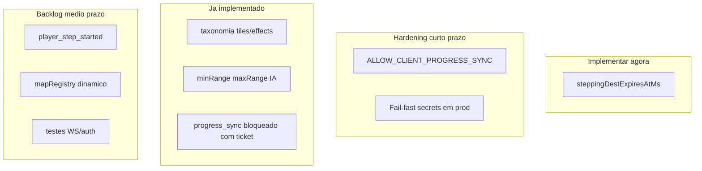

# Revisão da análise GPT — o que implementar

## Veredicto geral

A análise em [`docs/analise-chatgpt.md`](docs/analise-chatgpt.md) está **majoritariamente correta**, mas mistura itens **já resolvidos**, **1 bug real de gameplay online** e **melhorias futuras**. Não é necessário implementar tudo de uma vez.



---

## 1. Reserva de movimento — **IMPLEMENTAR** (prioridade alta)

### O que o GPT diz
Falta `steppingDestExpiresAtMs` para evitar “tile fantasma” se a reserva não confirmar.

### Estado atual (confirmado no código)
- Cliente envia `steppingDestTileX/Y` durante deslize ([`src/game/playApp.ts`](src/game/playApp.ts)).
- Servidor grava reserva em [`server/src/GameRoom.ts`](server/src/GameRoom.ts) (linhas 534–572) e **só limpa** no movimento confirmado (575–576).
- [`RoomCreatureManager.isPlayerAt()`](server/src/game/RoomCreatureManager.ts) trata destino reservado como ocupado (448).
- **Não existe TTL** — se pacote final se perde, jogador cancela passo ou lag estranho, o mob pode bloquear aquele SQM indefinidamente enquanto o player estiver conectado.

### Recomendação
Implementar exatamente o que o GPT sugere, com um ajuste: **expirar com base em `stepDurationMs` + margem** (ex. `Date.now() + stepMs + 80`), não TTL fixo de 250 ms — passos remotos já usam até ~300 ms ([`src/net/remotePlayerSprites.ts`](src/net/remotePlayerSprites.ts)).

**Arquivos:**
- [`server/src/GameRoom.ts`](server/src/GameRoom.ts) — campo `steppingDestExpiresAtMs` em `ConnectedPlayer`; set na reserva; clear no movimento confirmado
- [`server/src/GameRoom.ts`](server/src/GameRoom.ts) — helper `expireStaleSteppingDest(player)` chamado em `playersInRoomAsRefs()` antes de montar refs
- Teste unitário pequeno em `shared/` ou `server/` (mock de tempo) — opcional mas barato

**Esforço:** ~1–2 h | **Risco se não fizer:** mobs “travados” ocasionalmente em produção multiplayer.

---

## 2. `player_moved` como reserva visual — **NÃO implementar agora**

### O que o GPT diz
Ideal separar `player_step_started` vs `player_moved` confirmado; mini-desync possível se passo não confirmar.

### Estado atual
Reserva já emite `player_moved` com tile destino antes da posição autoritativa ([`GameRoom.ts`](server/src/GameRoom.ts) 556–571). Documentado em [`docs/studio-improvements-log.md`](docs/studio-improvements-log.md) §38.

### Recomendação
**Backlog.** O GPT mesmo diz “não precisa mudar agora”. Só revisitar se aparecer desync visível frequente entre jogadores. Exige mudança de protocolo (`shared/protocol.ts`), cliente remoto e possivelmente versão de protocolo.

---

## 3. `progress_sync` / XP — **PARCIALMENTE OK; hardening opcional**

### O que o GPT diz
Garantir que produção nunca aceite XP do cliente; sugerir `ALLOW_CLIENT_PROGRESS_SYNC`.

### Estado atual
```737:737:server/src/GameRoom.ts
        if (this.requireWsTicket) return;
```
[`server/src/config/env.ts`](server/src/config/env.ts): `requireWsTicket` é **true automaticamente** em produção **com** `DATABASE_URL` (Railway configurado conforme [`docs/hosting.md`](docs/hosting.md)).

Em produção Railway normal: XP vem do servidor ao matar mob; cliente **não** altera XP via WS.

### Gap real (menor)
Produção **sem** `DATABASE_URL` aceitaria `progress_sync` — cenário de misconfig, não o deploy padrão.

### Recomendação
**Hardening de baixo esforço** (não urgente se Railway já tem Postgres):
- Adicionar `ALLOW_CLIENT_PROGRESS_SYNC` (default `false`; `true` só em dev explícito)
- Ou: `if (env.isProduction) return` no início de `handleProgressSync`
- Boot warning/fail se `isProduction && !requireWsTicket`

**Não é bug ativo** no setup Railway documentado.

---

## 4. Validação de mapa/assets — **JÁ FEITO; manter**

### O que o GPT diz
Separar `tiles/maps`, `effects`, `characters`; bloquear brush 9000+.

### Estado atual
Já coberto por:
- [`.cursor/rules/studio-map-sprites.mdc`](.cursor/rules/studio-map-sprites.mdc)
- [`docs/asset-taxonomy.md`](docs/asset-taxonomy.md)
- [`src/engine/tileRefResolver.ts`](src/engine/tileRefResolver.ts) + testes
- `validateMapDocument()` bloqueia ids 9000+

**Ação:** nenhuma implementação nova; só continuar seguindo checklist ao editar mapas/sprites.

---

## 5. Mobs ranged (`minRange` / `maxRange`) — **JÁ FEITO**

Implementado em [`shared/creatureChase.ts`](shared/creatureChase.ts) e [`src/game-data/mobPresetTypes.ts`](src/game-data/mobPresetTypes.ts) com UI no Studio.

`kiteBehavior: "keep_distance"` do GPT é **evolução futura**, não correção.

---

## Gaps adicionais (fora do doc GPT, relevantes)

| Gap | Impacto | Prioridade |
|-----|---------|------------|
| [`server/src/mapRegistry.ts`](server/src/mapRegistry.ts) — só 3 mapas hardcoded | Mapas novos do Studio não têm colisão/spawns no WS até editar código | Média (bloqueia conteúdo Studio em prod) |
| [`docs/architecture.md`](docs/architecture.md) desatualizado | Confunde agentes/devs | Baixa (docs) |
| 3 arquivos de teste Vitest | Regressões em WS/auth não cobertas | Média (qualidade) |
| Defaults fracos de `JWT_SECRET` em prod sem env | Segurança se misconfig | Baixa se Railway segue hosting.md |
| `target_ring` + DATA_ROOT | FX 404 no volume | **Resolvido** na sessão anterior (fallback + seed `effects/`) |

---

## Plano de ação recomendado

### Fase A — Agora (1 PR pequeno)
1. `steppingDestExpiresAtMs` no servidor (TTL = stepDuration + buffer)
2. Teste unitário da expiração
3. Entrada em [`docs/studio-improvements-log.md`](docs/studio-improvements-log.md)

### Fase B — Próximo sprint (hardening)
1. `ALLOW_CLIENT_PROGRESS_SYNC` ou block explícito em produção
2. Log de boot se prod sem ticket/DB
3. Checklist manual: 2 clientes, cancelar passo no meio, mob não trava tile

### Fase C — Backlog Studio/multiplayer
1. Registry dinâmico de mapas no servidor (ler `public/maps` ou volume)
2. Evento `player_step_started` (se desync visual persistir)
3. Atualizar `architecture.md`
4. Testes de integração GameRoom / auth

---

## O que **não** precisa ser feito agora

- Separar mensagem WS de passo (Fase C)
- `kiteBehavior` avançado
- Reorganizar pastas de assets (já documentado e enforced)
- Reimplementar XP (já funciona em Railway com ticket)
