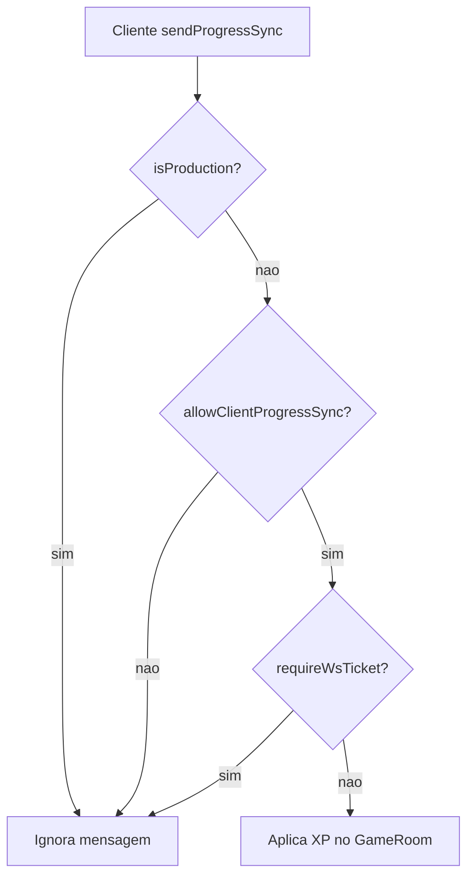

# Revisão da análise GPT (v2) — verificação do sistema

## Contexto

O arquivo [`docs/analise-chatgpt.md`](docs/analise-chatgpt.md) foi **atualizado** e não repete mais os pontos originais (TTL, assets, ranged). Agora comenta o **estado pós-implementação** do plano anterior. A verificação abaixo cruza cada afirmação do GPT com o código atual.

---

## O que o GPT analisa vs. estado real

| Tópico GPT | Verificação no código | Veredicto |
|------------|----------------------|-----------|
| TTL reserva (`steppingDestExpiresAtMs`) | Implementado em [`shared/steppingDestReserve.ts`](shared/steppingDestReserve.ts) + [`server/src/GameRoom.ts`](server/src/GameRoom.ts); 5 testes em [`shared/steppingDestReserve.test.ts`](shared/steppingDestReserve.test.ts) | **Feito** — GPT não reabre este ponto |
| Registry dinâmico | [`server/src/mapRegistry.ts`](server/src/mapRegistry.ts) scan `paths.mapsDir`; boot em [`server/src/index.ts`](server/src/index.ts); [`MapCollisionStore`](server/src/MapCollisionStore.ts) itera `getServerMapRegistry()` | **Feito** — GPT aprova |
| Boot warnings (JWT / ticket) | [`server/src/index.ts`](server/src/index.ts) avisa prod sem `requireWsTicket` ou JWT dev | **Feito** |
| `progress_sync` hardening | [`handleProgressSync`](server/src/GameRoom.ts) linhas 747–748 | **Gap real** — ver seção 1 |
| Mapas descobertos `instanced: false` | [`discoverMapsFromDir()`](server/src/mapRegistry.ts) linha 33 | **Aceitável agora** — backlog futuro |

Itens do plano original **fora** do doc GPT v2 mas já resolvidos antes:
- Taxonomia `effects/`/`characters/` — regras + testes
- `minRange`/`maxRange` ranged — [`shared/creatureChase.ts`](shared/creatureChase.ts)
- `target_ring` + DATA_ROOT — fallback Express + seed `effects/`

---

## 1. Único gap que vale corrigir agora: `progress_sync`

### O que o GPT diz (correto)

Guard atual:

```747:748:server/src/GameRoom.ts
        if (env.isProduction && !env.allowClientProgressSync) return;
        if (this.requireWsTicket) return;
```

Cenário de misconfig perigoso:

```
NODE_ENV=production
ALLOW_CLIENT_PROGRESS_SYNC=true
REQUIRE_WS_TICKET=false
```

Neste caso a **primeira** linha **não** bloqueia (`allowClientProgressSync=true`), a segunda também não (`requireWsTicket=false`) → cliente pode enviar XP arbitrário via WS.

No Railway documentado ([`docs/hosting.md`](docs/hosting.md)) isso não ocorre: `requireWsTicket` liga automaticamente com `DATABASE_URL`. Mas o GPT tem razão: a trava deveria ser **incondicional em produção**.

### Correção recomendada (1 linha de lógica, ~5 min)

Reordenar guards conforme GPT:

```typescript
if (env.isProduction) return;              // produção: nunca aceita XP do cliente
if (!env.allowClientProgressSync) return;  // dev: opt-in explícito
if (this.requireWsTicket) return;          // dev com ticket: servidor é autoritativo
```

### Impacto em dev local

Hoje, `syncProgressToServer()` roda no `onWelcome` ([`src/game/playApp.ts`](src/game/playApp.ts) ~1162) **sem** precisar de `ALLOW_CLIENT_PROGRESS_SYNC`.

Com a nova ordem, dev offline precisará de:

```
ALLOW_CLIENT_PROGRESS_SYNC=true
```

no `.env` do servidor (documentar em [`.env.example`](.env.example)).

Em produção Railway com ticket: **sem mudança** — XP continua vindo só do kill no servidor.

### Teste sugerido

Teste unitário pequeno (mock `env`) ou teste de integração leve verificando que `handleProgressSync` retorna cedo em `isProduction=true` independente de `allowClientProgressSync`.

---

## 2. Registry dinâmico — OK, nota futura

GPT confirma evolução importante. Ponto de atenção válido:

- Builtins preservam flags (`orc_cave` → `instanced: true`)
- Mapas **descobertos** pelo scan entram sempre com `instanced: false`

**Não precisa implementar agora.** Quando Studio criar dungeons instanciadas, ler metadata do JSON do mapa (ex. campo `instanced` no `MapDocument`) ou manifest separado — alinhado a [`docs/map-format.md`](docs/map-format.md).

---

## 3. O que NÃO precisa de ação

| Item | Motivo |
|------|--------|
| `player_step_started` vs `player_moved` | Backlog; GPT original dizia “não mudar agora” |
| `kiteBehavior` avançado | Evolução de IA, não bug |
| Reorganizar pastas de assets | Já enforced |
| Atualizar `architecture.md` | Docs; baixa prioridade |
| Testes WS/auth integração | Qualidade contínua; fora do escopo desta análise |

---

## Diagrama: fluxo XP após correção



---

## Plano de implementação (mínimo)

1. Reordenar guards em [`server/src/GameRoom.ts`](server/src/GameRoom.ts) `handleProgressSync`
2. Documentar `ALLOW_CLIENT_PROGRESS_SYNC=true` em [`.env.example`](.env.example) (comentário dev only)
3. Atualizar [`docs/studio-improvements-log.md`](docs/studio-improvements-log.md) §40.2
4. Opcional: 1–2 testes em `shared/` ou helper exportável para política de sync
5. `npm test` + `npm run build`

**Esforço total:** ~30 min | **Risco se não fizer:** baixo no Railway bem configurado; médio se alguém misconfigurar env de produção.
