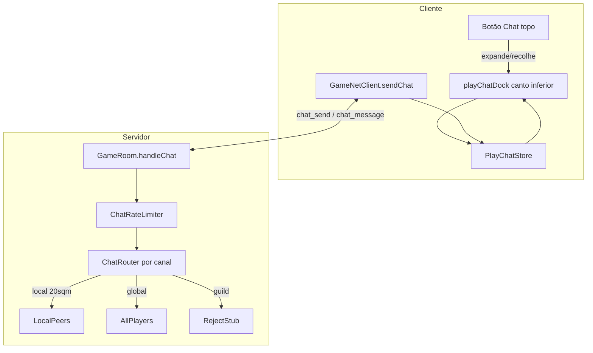

# Plano: Sistema de Chat (estrutura + anti-spam)

## Diagnóstico do estado atual

| Item | Estado |
|------|--------|
| Botão Chat na barra | **Ausente** em [`play.html`](play.html) (linhas 146–175) |
| Painel `#chatPanel` | Existe como modal placeholder — **não será usado** (substituído pelo dock) |
| `PlayPanelName` | Já inclui `'chat'` em [`playHudPanels.ts`](src/game/ui/playHudPanels.ts) — remover do fluxo modal |
| Protocolo WS | Sem tipos de chat em [`shared/protocol.ts`](shared/protocol.ts) |
| Servidor | `broadcastToRoom` por sala; proximidade só em combate via `chebyshevTileDistance` em [`shared/playerAttack.ts`](shared/playerAttack.ts) |
| Bottom-left | Livre na fase 4 — `#playMapStatus` está oculto por `.play-ui-redesign--phase4` |



---

## Resposta: cooldown vale a pena?

**Sim, mas sozinho não basta.** Cooldown por canal no servidor é barato, previsível e alinhado a MMORPGs (Tibia, WoW, etc.). Com os valores que você propôs:

| Canal | Cooldown | Avaliação |
|-------|----------|-----------|
| Local | 1 s | Adequado — conversa fluida sem flood |
| Global / Guilda | 3 s | Padrão razoável — 20 msgs/min no máximo |
| Sistema (jogador) | 5 min | Só faz sentido se jogadores puderem enviar (ex. reportar bug); ver nota abaixo |

**Camadas recomendadas (servidor obrigatório, cliente só UX):**

1. **Cooldown por canal** — `lastSentAt[channel]` no `ConnectedPlayer`
2. **Limite de caracteres** — truncar/rejeitar em `parseClientMessage` (sugestão: **200 chars**, constante em `shared/chatConfig.ts`)
3. **Sanitização** — `trim()`, colapsar espaços, bloquear caracteres de controle
4. **Detecção de duplicata** — mesma mensagem em &lt;30 s → rejeitar silenciosamente
5. **Erro explícito ao cliente** — `{ type: 'error', code: 'CHAT_COOLDOWN', retryAfterMs }` para feedback no input
6. **Futuro** — mute/ban, log de abuso, captcha em contas novas

Cooldown **sozinho** ainda permite 1 msg/3s no global (spam lento). A combinação cooldown + limite + duplicata cobre 90% dos casos sem complexidade excessiva.

**Canal Sistema:** tratar como **somente servidor** (anúncios, manutenção, bugs). Jogadores não enviam — sem cooldown de 5 min no cliente. Se depois quiser "reportar bug", criar sub-canal ou comando `/report` com cooldown de 5 min.

**Canal Loot:** somente servidor — eventos de drop/combate alimentam a aba Loot via `chat_message` com `kind: 'loot'`.

---

## Arquitetura proposta

### 1. Constantes compartilhadas — novo [`shared/chatConfig.ts`](shared/chatConfig.ts)

```ts
export type ChatChannel = 'local' | 'global' | 'guild' | 'loot' | 'system';
export type ChatMessageKind = 'player' | 'system' | 'loot' | 'combat';

export const CHAT_MAX_TEXT_LENGTH = 200;
export const CHAT_LOCAL_RANGE_SQM = 20;
export const CHAT_COOLDOWN_MS: Record<ChatChannel, number> = {
  local: 1_000,
  global: 3_000,
  guild: 3_000,
  loot: 0,      // servidor-only
  system: 0,    // servidor-only
};
export const CHAT_PLAYER_CHANNELS: ChatChannel[] = ['local', 'global', 'guild'];
```

### 2. Protocolo — estender [`shared/protocol.ts`](shared/protocol.ts)

**Cliente → servidor:**
- `ChatSendMessage { type: 'chat_send'; channel: 'local'|'global'|'guild'; text: string }`

**Servidor → cliente:**
- `ChatBroadcastMessage { type: 'chat_message'; messageId; channel; kind; text; senderName?; senderPlayerId?; sentAtMs }`

Validação em `parseClientMessage`: canal permitido, texto não vazio após trim, `text.length <= CHAT_MAX_TEXT_LENGTH`.

### 3. Servidor — [`server/src/GameRoom.ts`](server/src/GameRoom.ts) + módulo [`server/src/chat/chatService.ts`](server/src/chat/chatService.ts)

Handler `handleChatSend(socket, msg)`:

1. Resolver jogador autenticado (`socketToPlayerId`)
2. Rejeitar `guild` com `CHAT_CHANNEL_DISABLED` até existir sistema de guilda
3. Rejeitar `loot` / `system` de jogadores
4. `ChatRateLimiter.canSend(playerId, channel)` — cooldown + duplicata
5. **Local:** iterar `this.players` — mesma `roomKey`, mesmo `z`, `chebyshevTileDistance <= 20`
6. **Global:** iterar todos os `this.players` conectados (independente de `mapId`)
7. Broadcast `chat_message` aos destinatários

Reutilizar `chebyshevTileDistance` de [`shared/playerAttack.ts`](shared/playerAttack.ts) — já testado.

Função auxiliar exportável para fase futura:

```ts
// server/src/chat/pushServerChat.ts
export function pushServerChat(room, channel: 'loot'|'system', text, kind)
```

### 4. Cliente rede — [`src/net/gameNetClient.ts`](src/net/gameNetClient.ts)

- `sendChat(channel, text)` → `chat_send`
- Callback `onChatMessage?: (msg: ChatBroadcastMessage) => void`
- Tratar `error` com `CHAT_COOLDOWN` para mostrar timer no input

### 5. Store + controller — novos módulos

| Arquivo | Responsabilidade |
|---------|------------------|
| [`src/game/chat/playChatStore.ts`](src/game/chat/playChatStore.ts) | Buffer circular por canal (ex. 100 msgs), unread count, tab ativa |
| [`src/game/chat/playChatController.ts`](src/game/chat/playChatController.ts) | Liga store ↔ net ↔ dock; API `appendLocalPreview()` para testes |
| [`src/game/ui/playChatDock.ts`](src/game/ui/playChatDock.ts) | Tabs, log scrollável, input, badge, expand/collapse |

API pública do store (preparada para loot/combate depois):

```ts
appendMessage(channel, entry: ChatLogEntry): void
getMessages(channel): ChatLogEntry[]
setActiveTab(channel): void
getUnreadCount(channel): number
```

### 6. UI — [`play.html`](play.html) + [`src/game/play-hud-chat.css`](src/game/play-hud-chat.css)

**Botão topo** (entre Config. e Menu, ordem do [`docs/analise-chatgpt.md`](docs/analise-chatgpt.md)):

```html
<button type="button" class="play-hud-action-btn" id="playHudChatToggle" aria-expanded="true" aria-controls="playChatDock">
  
  <span class="play-hud-action-btn__label">Chat</span>
  <span class="play-hud-action-btn__badge" hidden>0</span>
</button>
```

- **Sem** `data-panel="chat"` — não abre modal
- Criar [`public/ui/play-hud/chat.svg`](public/ui/play-hud/chat.svg) (balão de fala, estilo dos outros ícones)
- Atualizar [`playHudActionIcons.ts`](src/game/ui/playHudActionIcons.ts) com key `chat`

**Dock fixo** dentro de `#canvasContainer` (position absolute, bottom-left, z-index ~14 — acima do canvas, abaixo de painéis):

```
#playChatDock
  button.play-chat-dock__collapse-btn   (ícone balão — recolhe só o corpo)
  .play-chat-dock__panel
    nav.play-chat-dock__tabs            (Local | Global | Guilda | Loot | Sistema)
    .play-chat-dock__log               (área scroll, mensagens coloridas por kind)
    .play-chat-dock__composer          (input + botão enviar; desabilitado em Loot/Sistema/Guilda)
    .play-chat-dock__badge             (não lidas na aba inativa)
```

Estados:
- `is-expanded` / `is-collapsed` — corpo visível ou só botão circular
- `is-composer-disabled` — Guilda ("Em breve"), Loot/Sistema (somente leitura)
- Persistir `localStorage` key `play.chat.dock.expanded`

**Remover** `#chatPanel` modal de [`play.html`](play.html) e `'chat'` de `PlayPanelName` em [`playHudPanels.ts`](src/game/ui/playHudPanels.ts) para evitar duplicidade.

**Bootstrap:** registrar `initPlayChatDock()` em [`bootstrap.ts`](src/game/bootstrap.ts) após `initPlayHudActionBar()`.

### 7. Estilo visual (referência imagem 2)

- Fundo escuro semi-transparente, bordas arredondadas, tabs com underline dourado na ativa
- Cores por `kind`: combat (vermelho dano), xp (verde), loot (amarelo), player (branco/cinza), system (azul claro)
- Mensagens de exemplo estáticas no dock na fase 1 (placeholder) até eventos reais existirem
- Responsivo: em mobile, dock menor ou colapsado por padrão ([`play-mobile.css`](src/game/play-mobile.css))

---

## Fases de entrega

### Fase A — UI + estrutura (este plano)
- Botão Chat + SVG
- Dock com 5 abas, expand/collapse, input com contador de chars
- `playChatStore` + mensagens mock por canal
- `chatConfig.ts` com constantes
- Remover modal `#chatPanel`

### Fase B — Rede + validação servidor
- Tipos no protocolo + `handleChatSend` + rate limiter
- `GameNetClient.sendChat` + render de mensagens recebidas
- Feedback de cooldown no composer

### Fase C — Integrações futuras (fora do escopo imediato)
- Guilda: habilitar canal quando existir `guildId` no jogador
- Loot: hook em `CreatureDiedMessage` / drop de itens → `pushServerChat('loot', ...)`
- Sistema: endpoint/admin ou cron para anúncios
- Combate no Loot ou Local: decidir se dano/XP vai para Loot ou canal `combat` interno

---

## Testes sugeridos

- Unit: `ChatRateLimiter` — cooldown, duplicata, canais desabilitados
- Unit: `getLocalChatRecipients()` — 20 sqm, mesmo Z, salas diferentes
- Unit: `parseClientMessage` — texto longo, canal inválido
- Manual: botão topo recolhe/expande; badge de não lidas; Guilda/Loot/Sistema sem input

---

## Arquivos principais a criar/alterar

| Ação | Arquivo |
|------|---------|
| Criar | `shared/chatConfig.ts` |
| Criar | `server/src/chat/chatService.ts` |
| Criar | `src/game/chat/playChatStore.ts` |
| Criar | `src/game/chat/playChatController.ts` |
| Criar | `src/game/ui/playChatDock.ts` |
| Criar | `src/game/play-hud-chat.css` |
| Criar | `public/ui/play-hud/chat.svg` |
| Alterar | `play.html` |
| Alterar | `shared/protocol.ts` |
| Alterar | `server/src/GameRoom.ts` |
| Alterar | `src/net/gameNetClient.ts` |
| Alterar | `src/game/bootstrap.ts` |
| Alterar | `src/game/ui/playHudActionIcons.ts` |
| Alterar | `src/game/ui/playHudPanels.ts` (remover chat do modal) |
