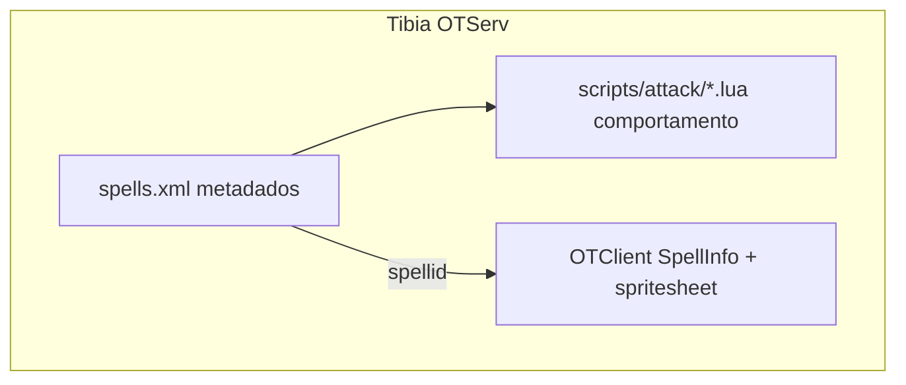
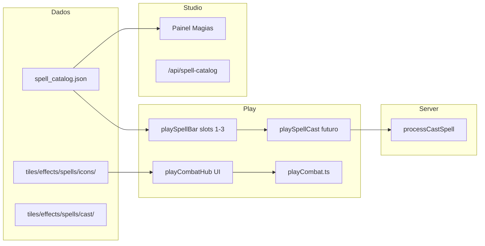

# Plano — Hub de Combate e Sistema de Magias

## Diagnóstico atual (Elarion)

| Existe | Falta |
|--------|-------|
| Auto-ataque com alvo (`[playCombat.ts](src/game/playCombat.ts)`) | Catálogo de magias |
| Cooldown de ataque via `attackCooldownUntil` + `stats.attackSpeed` | Hotbar de combate na UI |
| MP no HUD, `calculateMagicDamage` no engine | Custo de mana / CD por spell |
| Vocações com `attackProfile` (`[shared/playerAttack.ts](shared/playerAttack.ts)`) | Protocolo `cast_spell` |
| FX `target_ring` em `tiles/effects/combat/` | Ícones/VFX de magias |
| Animação `cast` no sprite do personagem | Painel Studio de magias |

O combate hoje é **clique direito → alvo → auto-attack**. Não há tecla de golpe nem slots 1–3.

---

## Referência Tibia 8.6 (`C:\8.6\...\data\spells\`)

Modelo útil para adaptar (não copiar XML+Lua literalmente):



**Campos típicos por magia instantânea:**
- Identidade: `name`, `words`, `spellid`
- Custo: `mana`, `soul` (opcional)
- Restrição: `lvl`, `maglv`, `<vocation>`
- Timing: `exhaustion` (CD individual), `groupcooldown` (CD de grupo: attack/healing/support)
- Combate: `range`, `needtarget`, `direction`, `aggressive`
- Comportamento: `script="attack/energy strike.lua"` (dano, área, efeito visual)

**Lição para Elarion:** separar **catálogo editável** (JSON) de **execução** (TypeScript no client/server), e **ícones** em `tiles/effects/spells/` (fora do tile registry, como `target_ring`).

---

## Arquitetura proposta (visão completa)



### Pastas e arquivos (alvo final)

| Caminho | Papel |
|---------|-------|
| `public/spell_catalog.json` | Fonte de verdade das magias (como `creature_presets.json`) |
| `src/game-data/spellCatalog.ts` | Loader + tipos (`SpellDefinition`) |
| `src/game-data/spellCatalogTypes.ts` | Schema TypeScript |
| `tiles/effects/spells/icons/{id}.png` | Ícone 32×32 da hotbar |
| `tiles/effects/spells/cast/{id}.json` + `.png` | VFX de conjuração (strip, como `target_ring.json`) |
| `tiles/effects/spells/projectiles/` | Projéteis (fase posterior) |
| `src/game/ui/playCombatHub.ts` | Hub inferior direito (Fase 1) |
| `src/game/ui/playSpellBar.ts` | Slots 1–3 + persistência |
| `src/game/playSpellCast.ts` | Execução de magia (fase 4+) |
| `src/game/play-hud-combat.css` | Estilos RPG do hub |
| `server/src/game/SpellCatalogStore.ts` | Leitura servidor |
| `server/src/routes/studio/spellCatalog.ts` | CRUD Studio |
| `src/editor/spellEditor.ts` | UI Studio (fase 3) |

### Schema `SpellDefinition` (proposta inicial)

```typescript
interface SpellDefinition {
  id: string;                    // ex. "energy_strike"
  name: string;                  // "Energy Strike"
  description: string;           // texto para o jogador
  words?: string;                // "exori vis" (opcional, flavor)
  group: 'attack' | 'healing' | 'support';
  icon: string;                  // "tiles/effects/spells/icons/energy_strike.png"
  manaCost: number;
  cooldownMs: number;
  groupCooldownMs: number;
  minLevel: number;
  minMagicLevel?: number;
  vocations: string[];           // ["mage","sorcerer"]
  range: number;
  requiresTarget: boolean;
  requiresLineOfSight?: boolean;
  damage?: {
    type: 'magic' | 'melee' | 'healing';
    multiplier: number;
    formula?: 'level_magic';      // extensível depois
  };
  castEffect?: string;           // path JSON VFX
  implemented: boolean;          // false = só UI/mock
}
```

### Persistência do jogador (fase 5)

- `CharacterRow.spellBar: { slot1?: string; slot2?: string; slot3?: string }`
- `learnedSpells?: string[]` ou desbloqueio automático por level
- Até lá: `localStorage` `play.spellBar.{characterId}`

### UX de escolha de magias (fase 5)

Painel **Magias** (aba no `#characterPanel` ou painel dedicado):
- Lista filtrada por vocação + level aprendido
- Card: ícone, nome, descrição, mana, CD, tipo de ataque, alcance
- Botões "Equipar no slot 1/2/3"
- Estado vazio: "Arraste uma magia ou clique em Equipar"

---

## Fase 1 — UI mock (implementar agora)

**Objetivo:** 4 elementos visíveis no canto inferior direito (desktop + mobile), alinhados ao mockup, com aviso claro de que magias ainda não funcionam.

### Layout

```
                    [3] [2] [1]   ← slots magia (arco acima)
              [F1 poção] [F2]     ← placeholder opcional fase 1.5
                    [ATAQUE]      ← botão grande (espada)
```

Fase 1 mínima: **1 botão grande + 3 slots numerados** (poções/interagir ficam para fase 1.5).

### HTML em `[play.html](play.html)`

Novo bloco `#playCombatHub` dentro de `.play-viewport`, após minimapa:

- `#playCombatAttackBtn` — botão principal com ícone mock espada
- `#playCombatAttackCooldown` — overlay circular SVG (anel que esvazia)
- `#playCombatSlot1/2/3` — botões com badge `1`,`2`,`3` e ícone mock (fogo/raio/void)
- Classe wrapper `play-combat-hub--mock` + `data-mock="true"` para estilizar label "Em breve"

### Assets mock

`public/ui/play-hud/combat/`:
- `attack.svg` — espada (botão grande)
- `spell_fire.svg`, `spell_lightning.svg`, `spell_void.svg` — slots 1–3
- `slot_empty.svg` — slot sem magia equipada

### CSS novo: `[src/game/play-hud-combat.css](src/game/play-hud-combat.css)`

- Posição: `bottom-right`, safe-area, acima do chão do mapa
- Botão ataque: ~72px, borda dourada glow
- Slots: ~48px em arco (CSS `transform` ou grid posicionado)
- Overlay cooldown: `conic-gradient` ou SVG `stroke-dashoffset` animado
- Media queries mobile: tamanhos ~85% mas mesma estrutura
- Fase CSS: `play-ui-redesign--phase4` (minimapa + combate ativos; coords/chat ainda ocultos)

### TypeScript: `[src/game/ui/playCombatHub.ts](src/game/ui/playCombatHub.ts)`

- `initPlayCombatHub()` em `[bootstrap.ts](src/game/bootstrap.ts)`
- `tickPlayCombatHub(nowMs)` chamado do loop em `[playApp.ts](src/game/playApp.ts)`
- Exportar de `playCombat.ts`: `getPlayAttackCooldownProgress(nowMs) → { active: boolean; percent: number }` (0–1)
- Botão ataque: chama `clearPlayCombatTarget`? **Não** — na fase 1 só dispara `triggerPlayAttackAnimation` se houver alvo, ou toast "Selecione um alvo" (reutiliza alvo existente)
- Slots 1–3: `toast('Magias — em breve')` + tooltip com texto mock do spell

### Integração cooldown real (só ataque básico)

Reaproveitar lógica existente em `playCombat.ts`:

```typescript
// já existe:
attackCooldownUntil = nowMs + getPlayerAttackCooldownMs(...)
```

Novo getter público para UI pintar o anel sem duplicar timers.

### O que NÃO fazer na Fase 1

- Não criar `spell_catalog.json` funcional ainda (só comentário/TODO no código)
- Não alterar protocolo WS
- Não consumir mana
- Não adicionar teclas 1/2/3 ainda (opcional stub comentado)

---

## Fases seguintes (roadmap)

### Fase 2 — Catálogo + mocks reais
- Criar `public/spell_catalog.json` com 3 magias `implemented: false`
- `loadSpellCatalog()` no client
- Slots leem ícone/nome do catálogo (ainda sem cast)
- Documentar em `docs/spell-system.md`

### Fase 3 — Studio: criar/editar magias
- Painel flyout `data-panel="spells"` em `[studio.html](studio.html)`
- Formulário: nome, descrição, mana, CD, vocação, alcance, tipo dano
- Upload ícone 32×32 → `tiles/effects/spells/icons/`
- Calibrador VFX cast (reutilizar padrão `[target_ring.json](tiles/effects/combat/target_ring.json)`)
- API `GET/POST /api/spell-catalog` espelhando `[creature_presets.json](public/creature_presets.json)`

### Fase 4 — Gameplay: conjurar magia
- `playSpellCast.ts`: valida mana, CD, alvo, vocação
- Animação `cast` no `SpriteAnimationController`
- Cliente: `calculateMagicDamage` (hoje só melee no preview)
- Servidor: `processCastSpell` + mensagem `cast_spell` em `[shared/protocol.ts](shared/protocol.ts)`
- CD de grupo (attack/healing/support) como Tibia

### Fase 5 — Escolha de magias pelo jogador
- Painel Magias no Play
- Persistência em `CharacterRow` + API characters
- Hotkeys `1`,`2`,`3` (desktop) + tap (mobile)
- Cooldown visual por slot

### Fase 6 — VFX e projéteis
- Strips em `tiles/effects/spells/`
- Integração depth-sort / Y-sort
- Poções F1/F2 e botão Interagir (mockup completo)

---

## Comparação Tibia → Elarion

| Tibia | Elarion proposto |
|-------|------------------|
| `spells.xml` | `public/spell_catalog.json` |
| `scripts/attack/*.lua` | `playSpellCast.ts` + `server/combat/spellHandlers.ts` |
| `spellid` + client spritesheet | `icon` path + PNG 32×32 no Studio |
| `exhaustion` + `groupcooldown` | `cooldownMs` + `groupCooldownMs` |
| `words` | `words` opcional (flavor) |
| Runas físicas | Fase futura (`conjure` / item rune) |

---

## Arquivos tocados na Fase 1

| Arquivo | Mudança |
|---------|---------|
| `[play.html](play.html)` | `#playCombatHub` + link CSS |
| `[src/game/play-hud-combat.css](src/game/play-hud-combat.css)` | Novo |
| `[src/game/ui/playCombatHub.ts](src/game/ui/playCombatHub.ts)` | Novo |
| `[src/game/playCombat.ts](src/game/playCombat.ts)` | Export cooldown progress |
| `[src/game/playApp.ts](src/game/playApp.ts)` | `tickPlayCombatHub` no loop |
| `[src/game/bootstrap.ts](src/game/bootstrap.ts)` | `initPlayCombatHub()` |
| `[src/game/play-hud-character.css](src/game/play-hud-character.css)` | `phase3` → `phase4` |
| `public/ui/play-hud/combat/*.svg` | Ícones mock |

## Critérios de aceite Fase 1

- Hub visível desktop e mobile, canto inferior direito
- Botão grande mostra cooldown real do ataque básico
- 3 slots com números 1–3 e ícones mock distintos
- Clique em slot mostra feedback "magias em breve"
- Nenhuma regressão em combate atual (auto-attack por alvo)
- Comentários `// SPELL_SYSTEM_TODO` nos pontos de extensão futura
