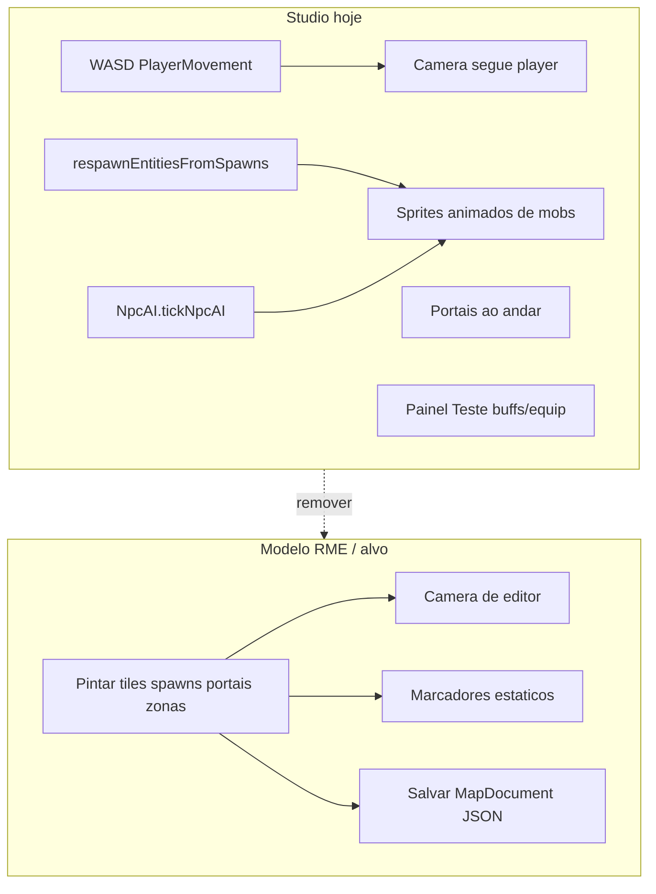

# Studio editor-only (estilo RME)

## Diagnóstico atual

O projeto **já separa** Studio e Play em MPAs distintas (`studio.html` → [`src/main.ts`](src/main.ts); `play.html` → [`src/game/playApp.ts`](src/game/playApp.ts)). Porém o Studio ainda executa um **mini-loop de jogo** dentro de `main.ts`:



| Comportamento de jogo no Studio | Onde está | Deve ir para |
|---|---|---|
| WASD + colisão + sprite (oculto) | `PlayerMovement.updateMovement` em `update()` | Remover — só câmera |
| Mobs se movendo / perseguindo | `NpcAI.tickNpcAI` + `respawnEntities()` | Remover — marcadores estáticos na aba Spawns |
| Portais ao pisar no tile | bloco `enteredNewTile` em `update()` | Remover — edição visual na aba Portais |
| Ataque/sit/dead/cast (Space, x, h, c) | `keydown` em `main.ts` | Remover do Studio |
| Buffs, botas, haste/slow | menu **Teste** + `setupMovementDevControls` | Remover — só no Play |
| Colisão ativa / barco | painel **Mecânicas** | Remover do Studio |

**O que já está correto (manter):** pintura de mapa, auto-borda, spawns/portais/zonas como dados, editores de sprites/mobs/magias/itens, save/export JSON, APIs `/api/*` em dev.

**Referência RME** ([`remeres-map-editor-main`](C:\Users\Robson-PC\.antigravity\projetos\remeres-map-editor-main)): app desktop que **só edita** mapas e exporta arquivos; o servidor/cliente de jogo (Canary/OTClient) consome esses dados depois. Equivalente no Elarion: Studio local → `public/maps/*.json` → deploy → Play lê `/maps/`.

---

## Arquitetura alvo

```mermaid
flowchart LR
    subgraph local [Maquina do GM - npm run dev]
        Studio[studio.html]
        Save[public/maps + tiles]
        Studio --> Save
    end
    subgraph prod [Railway - producao]
        Play[play.html]
        Maps[/maps/ e volume DATA_ROOT]
        Play --> Maps
    end
    Save -->|git commit + push| Deploy[CI / Railway build]
    Deploy --> Maps
```

- **Studio:** ferramenta local de criação (como um programa instalado).
- **Play:** único lugar para movimento, IA, combate, multiplayer.
- **Publicação:** mapas versionados no repositório + volume em produção após deploy (fluxo já documentado em [`docs/hosting.md`](docs/hosting.md)).

---

## Fase 1 — Câmera de editor (sem player)

**Novo módulo:** [`src/editor/editorCamera.ts`](src/editor/editorCamera.ts)

- Estado: `viewTileX`, `viewTileY`, `viewZ`, `offsetX`, `offsetY`, `zoom`.
- Funções: `panByPixels`, `panByTiles`, `focusOnTile(x,y,z)`, `syncCameraFromView(canvas, tileSize)`.
- Input:
  - **Manter:** Espaço + arrasto, botão do meio (já em `mousedown` ~1666).
  - **Adicionar:** setas ou WASD **só para pan da câmera** (não player).
  - **Manter:** PageUp/PageDown para andar de edição.

**Alterar [`src/main.ts`](src/main.ts):**

- Em `isStudioMode()`: não usar objeto `player` para navegação; `focusEditorOnTile` chama `editorCamera.focusOnTile` em vez de `PlayerMovement.teleportPlayer`.
- `draw()`: calcular `camX`/`camY` a partir de `editorCamera`, não de `player.worldX/Y`.
- Status bar (`posXEl`, etc.): mostrar tile sob o cursor ou centro da câmera.
- Modal de teleporte (`#teleportModal`): renomear para **"Ir para coordenadas"** — move a câmera, não um avatar.

**Alterar [`studio.html`](studio.html):** hint do canvas — remover "WASD mover player"; documentar pan (espaço/meio/setas).

---

## Fase 2 — Desligar simulação de jogo no Studio

**Estender [`src/studio/studioBoot.ts`](src/studio/studioBoot.ts):**

```ts
export interface StudioBootOptions {
  // ...existentes
  editorOnly: boolean; // true no bootstrap
}
```

**Em `update()` quando `editorOnly`:**

- Não chamar `NpcAI.tickNpcAI`, `speedBuffs.tick`, `PlayerMovement.updateMovement`, trigger de portais, `gameNet?.syncPositionIfChanged`.
- Loop reduzido: só invalidação de cache/UI se necessário (minimap dirty, animação de overlays de editor).

**Spawns:**

- Não chamar `respawnEntities()` no Studio (`onSpawnsChanged`, `loadMap`, etc.).
- Manter overlay estático já existente na aba Spawns (emoji + cor em `draw()` ~2788).
- Opcional: desenhar thumbnail estático do preset (`drawCreaturePresetThumbnail`) no overlay — sem `GameEntity`.

**Em `draw()` quando `editorOnly`:**

- Pular `collectNpcDepthDrawables(npcs, ...)`.
- Pular `collectLocalPlayerDepthDrawable` (já parcial com `hidePlayerSprite`).

**Em `keydown` quando `editorOnly`:**

- Remover handlers de `triggerPlayerAttack`, sit/dead/cast.
- Espaço = só pan (nunca ataque).

**Remover wiring:** `setupMovementDevControls`, `refreshPlayerMovementSpeed`, `activeCharacterController` no loop do Studio (manter apenas nos calibradores de personagem, que são editores de asset).

---

## Fase 3 — Limpar UI do Studio

**Remover de [`studio.html`](studio.html):**

- Menu **Teste** (linhas ~101–106) e seção `data-panel="dev"` (~416–423).
- Seção **Mecânicas** `data-panel="mechanics"` (colisão/barco) — são mecânicas de runtime do Play.
- Hint WASD (~126).

**Ajustar menus Ver/Mapas:** garantir que ferramentas restantes são só criação/edição (tiles, spawns, portais, zonas, casas, sprites, mobs, magias, itens).

**Roster / links:** em produção, ocultar link para Studio (ver Fase 4). Em dev, manter acesso via `characters.html` ou URL direta.

---

## Fase 4 — Studio somente local

**Frontend (build):**

- Variável `VITE_STUDIO_ENABLED` — default `true` em dev, `false` em build de produção.
- Em [`vite.config.ts`](vite.config.ts): incluir entrada `studio` **somente** se `VITE_STUDIO_ENABLED !== 'false'`.
- [`src/characters/roster.ts`](src/characters/roster.ts) e [`index.html`](index.html): link "Área do Desenvolvedor" só se `import.meta.env.VITE_STUDIO_ENABLED`.

**Backend:**

- Nova flag em [`server/src/config/env.ts`](server/src/config/env.ts): `studioEnabled` (`STUDIO_ENABLED !== 'false'` em dev; `false` em produção por default).
- Em [`server/src/app.ts`](server/src/app.ts):
  - `GET /studio.html` → 404 em produção (ou redirect para `/`).
  - `app.use('/api', createStudioRouter())` condicionado a `studioEnabled`.
- Manter leitura de mapas/tiles em produção (Play precisa); bloquear **escrita** GM na produção.

**Workflow documentado:**

1. `npm run dev` → editar no Studio local.
2. Salvar mapas em `public/maps/` (botão dev existente `#saveMapDevBtn`).
3. `git add` + `commit` + `push` → Railway rebuild.
4. Play em produção carrega mapas atualizados de `dist/` + volume.

---

## Fase 5 (opcional, recomendada) — Ponte "Testar no Play"

Hoje não há atalho Studio → Play. Para testar um mapa editado:

- Botão **"Testar no Play"** no Studio (dev only).
- Fluxo: salvar mapa se dirty → abrir `play.html?characterId=<gm_test>&mapId=<currentMapId>`.
- Implementar em [`src/game/bootstrap.ts`](src/game/bootstrap.ts) / [`playApp.ts`](src/game/playApp.ts): query `mapId` sobrescreve spawn do personagem (somente conta GM / dev).

Isso substitui a simulação dentro do Studio sem perder a capacidade de validar o mapa no jogo real.

---

## Fase 6 — Documentação e testes

Atualizar:

- [`docs/architecture.md`](docs/architecture.md) — Studio = editor local; Play = runtime.
- [`docs/hosting.md`](docs/hosting.md) — Studio não exposto em produção; pipeline git → deploy.
- [`docs/studio-improvements-log.md`](docs/studio-improvements-log.md) — nova seção anti-regressão.
- [`.cursor/rules/studio-map-sprites.mdc`](.cursor/rules/studio-map-sprites.mdc) — invariante: Studio não roda NpcAI/PlayerMovement.

**Testes Vitest sugeridos:**

- `isStudioMode() + editorOnly` → `update()` não incrementa posição de entidades.
- `editorCamera.focusOnTile` atualiza `camera.x/y` corretamente.
- Build prod sem entrada `studio.html` quando flag desligada.

---

## Ordem de implementação sugerida

1. `editorCamera.ts` + substituir navegação no Studio (maior impacto visual imediato).
2. Desligar NpcAI, respawnEntities, portais walk, keydown de combate.
3. Limpar `studio.html` (menus Teste/Mecânicas).
4. Flags local-only (Vite + Express).
5. Botão "Testar no Play" (opcional).
6. Docs + testes.

## Riscos e mitigação

| Risco | Mitigação |
|---|---|
| `main.ts` muito acoplado | Usar `isStudioMode()` + `editorOnly` com guards claros; refactor para `studioApp.ts` só se necessário depois |
| GM precisa hotfix em prod | Workflow git rápido; Fase 5 permite testar local antes do push |
| Calibrador de personagem usa animações | Isolar em modal próprio; não depende do game loop do mapa |

## Resultado esperado

O Studio passa a se comportar como o map editor do Tibia/RME: **criar mapas, colocar spawns, portais, zonas, salvar JSON**. Movimento de mobs, combate e jogabilidade ficam exclusivamente no `play.html`. O Studio roda só na máquina do desenvolvedor; produção recebe o conteúdo via deploy.
