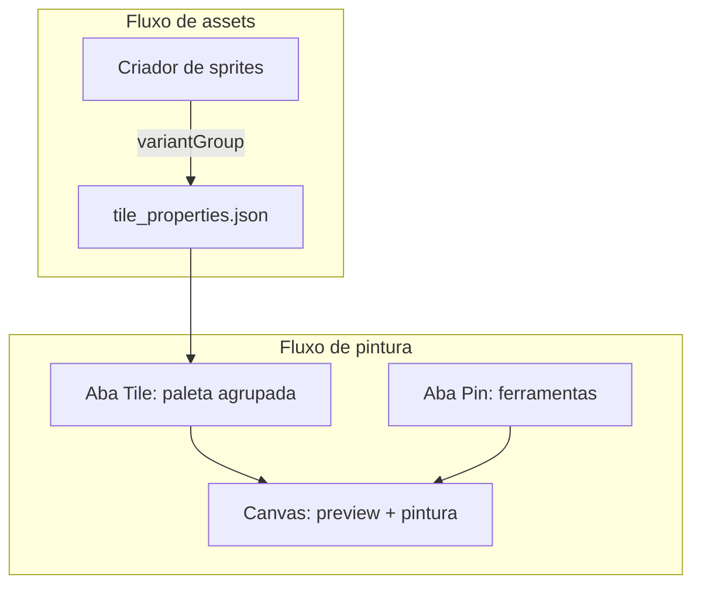

# Plano: tiles com variação aleatória (estilo Tibia)

> **Pós-implementação (2026-05-31):** melhorias de estabilidade e UX documentadas em [docs/studio-improvements-log.md](../../docs/studio-improvements-log.md). Regra anti-regressão: [.cursor/rules/studio-map-sprites.mdc](../rules/studio-map-sprites.mdc).

## Invariantes (não regredir)

1. **Random só na pintura** — `resolvePaintTileId()`; mapa salvo = ids/refs fixos.
2. **Load com registry** — `await tileRegistryReady` antes de `loadMapFromJson(..., tileRegistry)`.
3. **Ref estável** — células com `ref`; resolver via `tileRefResolver.ts`.
4. **Strips sem grupo** — fail-safe `inferVariantGroupForStrip()` → pincel 🎲 na paleta.
5. **Exclusão** — sempre `sprite-usage` antes de apagar PNG/metadados.

---

A lógica de sorteio (`resolvePaintTileId`) vem **depois** da UI estar definida e navegável. Ordem de entrega:

1. Markup + CSS dos componentes
2. Paleta agrupada (dados mock ou registry real)
3. Campo no criador de sprites
4. Feedback na status bar
5. Engine + pintura

---

## Situação atual (contexto técnico)

- Mapa = ID numérico por célula ([`MapDocument`](src/engine/types.ts)).
- PNGs em `tiles/maps/**` → registry ([`buildTileRegistry()`](src/engine/tileRegistry.ts)).
- Variantes existentes: `01_grama`, `02_grama` em [`tiles/maps/grass/`](tiles/maps/grass/).
- Aba **Tile** hoje: grid 2 colunas plano [`.tile-grid` / `.tile-option`](src/style.css) em [`studio.html`](studio.html) `#mapTabContent_tileset`.

---

## Modelo de dados (resumo)

- **`variantGroup`** em cada PNG (`tile_properties.json`) — pertencimento ao grupo.
- **Manifest opcional** (fase 2) — label do pincel, pesos.
- **Pincel virtual** (ID reservado) — só na paleta; mapa guarda IDs concretos após pintar.

---

# Especificação de UI

## Visão geral — três superfícies



| Superfície | Onde | Papel |
|------------|------|--------|
| **Paleta agrupada** | Mapa → aba **Tile** | Escolher pincel aleatório ou variante fixa |
| **Criador de sprites** | Criar → Sprites de mapa | Declarar `variantGroup` ao importar PNG |
| **Status bar** | Rodapé do studio | Confirmar tile/pincel ativo e modo 🎲 |

Não criamos aba nova no map editor — tudo fica na aba **Tile** existente, com grupos visuais.

---

## Limite de variantes por grupo

**Não há máximo fixo no sistema** (nem 4, nem 16). O grupo é uma lista de tile IDs — pode ter 2, 4, 20 ou 200 variantes (ex.: spritesheet fatiada em muitos PNGs com o mesmo `variantGroup: "grass"`).

| Camada | Limite |
|--------|--------|
| **Dados / engine** | Ilimitado na prática (todos os PNGs com o mesmo `variantGroup`) |
| **Sorteio na pintura** | Sorteia entre **todos** os membros do grupo |
| **Preview do pincel 🎲** | Mosaico mostra no **máximo 4 thumbnails** (as primeiras ou amostra) — só visual, não restringe o sorteio |
| **Grid “variantes fixas”** | **Scroll vertical** dentro do bloco do grupo (`max-height` ~120–160px) se houver muitas entradas |
| **Header do grupo** | Contagem real: `Grama · 23 variantes` |

O “4” nos wireframes abaixo é **exemplo de layout**, não cap de negócio. Tibia/RME usam quantas variantes o tileset tiver.

**MVP UI com muitas variantes:** pincel 🎲 + lista rolável 2 colunas; mosaico 2×2 no pincel com até 4 previews + texto `+19` se `n > 4`.

**Fase 2 (opcional):** paginação ou “mostrar mais” no grid de variantes; pesos no manifest para variantes raras.

---

## 1. Aba Tile — paleta agrupada (principal)

### Layout (grupos sempre abertos — escolha confirmada)

Dentro de `#tileSelector`, em vez de lista plana, renderizar **seções por `variantGroup`** + seção **“Outros tiles”** para tiles sem grupo.

```
┌─ Busca + filtros (Pisos | Natureza | …) ─────────────┐
│ 🔍 Buscar tiles…                                    │
├─ ▼ GRAMA · 4 variantes ────────────────────────────┤
│ ┌─────────────────┐  ← pincel aleatório (largura 2 cols)
│ │  🎲  [mosaic]   │     preview = até 4 thumbs; se n>4, badge "+N"
│ │ Grama aleatório │
│ └─────────────────┘
│ ── variantes fixas ──  (label flyout-hint, 1 linha)
│ ┌──────┐ ┌──────┐
│ │ prev │ │ prev │  01-grama   02-grama
│ └──────┘ └──────┘
│ ┌──────┐ ┌──────┐
│ │ prev │ │ prev │  03-grama   04-grama
│ └──────┘ └──────┘
├─ ▼ PEDRA · 3 variantes ────────────────────────────┤
│ … mesmo padrão …
├─ OUTROS TILES ─────────────────────────────────────┤
│ água, parede, escada… (sem grupo, grid normal)
└─────────────────────────────────────────────────────┘
```

### Componentes HTML/CSS novos

| Classe | Uso |
|--------|-----|
| `.variant-group-block` | Container de um grupo (`grass`, `stone`, …) |
| `.variant-group-header` | Título: nome amigável + contagem `(4 variantes)` |
| `.tile-option--variant-brush` | Pincel aleatório — **largura total** (grid-column: 1 / -1), borda tracejada ou cor accent secundária |
| `.tile-option--variant-brush .tile-preview--mosaic` | Mini-grid até 2×2 (máx. 4 thumbs no preview); badge `+N` se houver mais variantes |
| `.variant-group-divider` | Linha + texto `Variantes fixas` entre pincel e grid |
| `.variant-group-members` | Sub-grid 2 colunas, **scroll** se muitas variantes |
| `.tile-option--variant-member` | Variante individual (tile-option atual, badge opcional `#2`) |

**Estados visuais**

- `.active` no pincel 🎲 → borda accent + badge `ALEATÓRIO` no canto
- `.active` em variante fixa → borda accent normal (como hoje)
- Hover no pincel → tooltip: *“Cada célula pintada usa uma variante diferente ao acaso”*

**Busca e categorias**

- Filtro **Pisos** mostra blocos cujo `paletteCategory === ground` (pelo menos um membro).
- Busca por texto filtra **grupo inteiro** se nome do grupo, pincel ou qualquer variante bater.
- Grupo com **1 só membro** → não mostra pincel 🎲; só tile normal em “Outros” ou dentro do grupo sem divisor.

### Nome amigável do grupo (MVP)

| `variantGroup` (id) | Label na UI |
|---------------------|-------------|
| `grass` | Grama |
| `stone` | Pedra |
| `dirt` | Terra |
| *outros* | Capitalizar id (`sand` → Sand) |

Fase 2: override via `tile_variant_groups.json` → `label`.

---

## 2. Aba Pin — ferramentas (ajuste mínimo)

Sem duplicar ferramentas. Mantém `#toolGrid` como está.

**Adição:** linha de contexto só quando pincel aleatório está selecionado (injetada via JS abaixo do hint de atalhos):

```
🎲 Pincel ativo: Grama aleatório (4 variantes) — pinte no mapa para sortear
```

Oculta quando tile fixo ou borracha selecionados.

---

## 3. Status bar — feedback persistente

Chip existente ou novo ao lado do mapa:

```
🧱 Grama aleatório · 🎲×4
```

| Seleção | Texto |
|---------|--------|
| Pincel aleatório | `🎲 {label} ({n} var.)` |
| Variante fixa em grupo | `🧱 {nome} · grupo {label}` |
| Tile sem grupo | `🧱 {nome}` (como hoje) |

Elemento sugerido: `#statusTileBrush` em [`studio.html`](studio.html) footer, preenchido por `mapEditor` / `main.ts` no `onSelectedTileChanged`.

---

## 4. Canvas — feedback opcional (MVP leve)

Sem overlay pesado. Duas opções **MVP**:

1. **Cursor** — crosshair normal; tooltip no hover de célula vazia não necessário.
2. **Preview fantasma** (fase 1.5) — ao mover mouse com pincel 🎲, 1 frame aleatório semi-transparente no tile sob o cursor (só se performance ok).

Implementar preview fantasma **depois** da paleta + pintura básica.

---

## 5. Criador de sprites — cadastro do grupo

Em [`mapSpriteEditor`](src/editor/mapSpriteEditor.ts), bloco **Propriedades do Terreno**, após escada:

```
┌─ Variação aleatória ─────────────────────────┐
│ Grupo de variação (opcional)               │
│ [ grass          ▼ ]  datalist + input       │
│ ℹ️ Tiles com o mesmo grupo formam um       │
│    pincel aleatório na aba Tile.          │
│ ☐ Excluir deste grupo (tile único/fixe)   │
└────────────────────────────────────────────┘
```

| Campo | Comportamento |
|-------|----------------|
| `mapSpriteVariantGroupInput` | Texto livre, slug (`grass`, `stone_floor_var`) |
| `mapSpriteVariantGroupList` | Datalist: grupos já usados no projeto + sugestões (`grass`, `dirt`, `stone`) |
| Checkbox “Excluir” | Se marcado, **não** grava `variantGroup` (tile só individual) |

Ao **carregar sprite existente** com `variantGroup`, preencher input.

Ao **salvar**, gravar em `properties.variantGroup` (backend [`vite.config.ts`](vite.config.ts) `save-map-sprite`).

**Lista “Sprites existentes”** — badge opcional `🎲 grass` ao lado do nome se tiver grupo.

---

## 6. Conta-gotas (comportamento UI)

| Ação | Resultado na paleta |
|------|---------------------|
| Conta-gotas em célula com tile de grupo (2+ membros) | Seleciona **pincel aleatório** do grupo + scroll até o bloco do grupo |
| Conta-gotas em tile sem grupo | Seleciona tile individual |
| Conta-gotas com grupo de 1 membro | Seleciona tile individual |

Feedback: toast curto *“Grupo Grama — pincel aleatório selecionado”*.

---

## 7. O que NÃO entra na UI do MVP

- Modal “Gerenciador de grupos” com drag-and-drop
- Editor de pesos por variante (fase 2 / manifest)
- Toggle global “sempre aleatório”
- Nova aba “Variações” no map editor

---

## Arquivos de UI (checklist)

| Arquivo | Mudança |
|---------|---------|
| [`studio.html`](studio.html) | `#statusTileBrush`; bloco variant group no sprite editor; datalist |
| [`src/style.css`](src/style.css) | classes `.variant-group-*`, `.tile-option--variant-brush`, mosaic preview |
| [`src/editor/mapEditor.ts`](src/editor/mapEditor.ts) | `renderGroupedPalette()`, agrupamento, busca |
| [`src/editor/mapSpriteEditor.ts`](src/editor/mapSpriteEditor.ts) | input variantGroup + save/load |
| [`src/main.ts`](src/main.ts) | hint aba Pin, status bar, scroll-to-group no eyedropper |

---

## Engine e pintura (após UI)

Detalhes inalterados em essência — ver seções anteriores do plano:

- [`src/engine/tileVariants.ts`](src/engine/tileVariants.ts) — índice + pincéis virtuais ID 9000+
- [`main.ts`](src/main.ts) — `placeTile()` + sorteio no balde/retângulo/linha
- Híbrido B + manifest C (fase 2)

---

## Critérios de aceite — UI

- [ ] Grupos com 2+ variantes aparecem como bloco sempre aberto: pincel 🎲 + divisor + variantes.
- [ ] Pincel aleatório ocupa linha inteira com preview mosaico.
- [ ] Tiles sem grupo continuam em “Outros tiles” / grid normal.
- [ ] Busca e filtro Pisos/Natureza funcionam com grupos.
- [ ] Status bar reflete pincel 🎲 vs variante fixa.
- [ ] Criador de sprites grava e mostra `variantGroup`.
- [ ] Hint na aba Pin quando pincel aleatório ativo.

## Critérios de aceite — comportamento (fase lógica)

- [ ] Pintar com 🎲 sorteia variantes; balde sorteia por célula.
- [ ] Mapa salvo mantém IDs concretos.
- [ ] Conta-gotas seleciona pincel do grupo.

---

## Fluxo ADM (grama da spritesheet)

1. Criador de sprites → fatiar sheet → salvar cada PNG com `variantGroup: grass`.
2. Aba **Tile** → bloco **Grama** → selecionar **Grama aleatório**.
3. Aba **Pin** → lápis ou balde → pintar mapa.
4. Ajuste fino → clicar variante fixa `03-grama` no bloco do grupo.
5. Salvar mapa em `public/maps/`.
