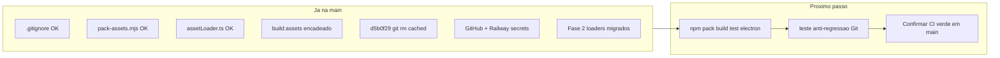

# Plano: validar empacotamento na main (sem commit de “correção fantasma”)

## Diagnóstico: análise externa vs. estado real

A auditoria que você colou provavelmente leu a árvore via **GitHub raw** (que colapsa quebras de linha em comentários/strings). No workspace atual, os quatro “problemas críticos” **não existem**:

| Item da auditoria | Estado em [`main`](.) (arquivos locais) |
|-------------------|----------------------------------------|
| `.gitignore` numa linha | **OK** — 55 linhas reais; inclui `*.pem.bak` ([`.gitignore`](.gitignore) L46–54) |
| `pack-assets.mjs` sintaxe quebrada | **OK** — `// 1. Coletar arquivos` na L18 ([`scripts/pack-assets.mjs`](scripts/pack-assets.mjs)) |
| `assetLoader.ts` tipos/strings quebrados | **OK** — `Record<string, PakManifestEntry>`, `Promise<void>`, strings em uma linha ([`src/game-data/assetLoader.ts`](src/game-data/assetLoader.ts) L14–16, L49–52, L139–141) |
| `package.json` sem `build:assets` | **OK** — `"build": "npm run build:assets && tsc && vite build..."` ([`package.json`](package.json) L12–13) |
| `.env.example` linhas soltas | **OK** — seção empacotamento toda com `#` ([`.env.example`](.env.example) L64–69) |
| `.pem`/`.pak` versionados | **Corrigido** em `d5b0f29` — removidos do tracking |



## O que já está integrado (fase 2 em grande parte feita)

Loaders do Play já usam `assetLoader` com fallback loose quando `VITE_USE_LOOSE_ASSETS=true`:

- JSON: [`itemCatalog.ts`](src/game-data/itemCatalog.ts), [`spellCatalog.ts`](src/game-data/spellCatalog.ts), [`vocationRegistry.ts`](src/game-data/vocationRegistry.ts), [`creaturePresets.ts`](src/editor/creaturePresets.ts), [`gameRates.ts`](src/game-data/gameRates.ts), [`loadOutfitPresets.ts`](src/game-data/default/loadOutfitPresets.ts), [`tileVariants.ts`](src/engine/tileVariants.ts)
- Mapas: [`worldLoader.ts`](src/engine/worldLoader.ts), [`mapDiscovery.ts`](src/engine/mapDiscovery.ts)
- Sprites: [`tileRegistry.ts`](src/engine/tileRegistry.ts), personagens, ícones, efeitos de magia, combat ring
- Bootstrap Play: [`playApp.ts`](src/game/playApp.ts) chama `assetLoader.initialize()` antes dos catálogos

Os `fetch(resolveApiUrl(...))` restantes são **ramo dev/loose** ou APIs HTTP (`authClient`) — esperado.

## Próximo commit recomendado (objetivo real)

**Não** refatorar arquivos que já estão válidos. Fazer um commit de **hardening + verificação**:

### 1. Teste anti-regressão (novo)

Adicionar teste Vitest ou script Node (ex. [`scripts/check-pack-artifacts-tracked.mjs`](scripts/check-pack-artifacts-tracked.mjs)) que falha se `git ls-files` listar:

- `private_key.pem`, `public_key.pem`, `*.pem.bak`
- `public/assets.pak`, `public/assets.sig`, `public/public_key.pem`

Integrar em `npm test` (padrão do repo: vitest em [`vitest.config.ts`](vitest.config.ts)).

### 2. Rodar checklist completo (local + CI)

Antes do commit, sem `ASSET_PACK_PRIVATE_KEY` inválida no shell:

```bash
npm run pack
npm test
npm run build
npm run electron:check
```

**Footgun conhecido:** se `ASSET_PACK_PRIVATE_KEY` estiver definida no ambiente com valor inválido, `pack` falha mesmo com arquivos locais OK — limpar env ou usar par base64 correto.

### 3. Confirmar CI na `main`

[`.github/workflows/ci.yml`](.github/workflows/ci.yml) já roda em `push` para `main` com secrets `ASSET_PACK_*`. Após o commit de hardening, verificar run verde em Actions (você já configurou os secrets).

### 4. Documentação mínima (opcional, 1 arquivo)

Atualizar [`docs/01plan.md`](docs/01plan.md) ou adicionar nota curta em [`docs/hosting.md`](docs/hosting.md):

- Checklist “pronto para produção”
- Aviso: auditorias via GitHub raw geram falsos positivos em comentários/strings
- Lembrete: chave antiga do histórico = vazada; usar par atual dos secrets

**Não** editar o arquivo de plano anexado pelo Cursor.

## O que NÃO fazer agora

- Reescrever `.gitignore`, `pack-assets.mjs`, `assetLoader.ts` ou `package.json` “porque o ChatGPT disse” — risco de regressão sem benefício
- Novas features (inventário, loja, trade, UI)
- BFG/filter-repo no histórico Git (fora de escopo; chave antiga já tratada como vazada)

## Critério de “empacotamento estável”

- [ ] `git ls-files` sem `.pem`/`.pak`/`.sig` rastreados (teste automatizado)
- [ ] `npm run pack` + `npm run build` OK localmente
- [ ] `npm test` + `npm run electron:check` OK
- [ ] CI `main` verde com secrets configurados
- [ ] Railway deploy gera `assets.pak` assinado (variáveis já coladas no painel)
- [ ] Dev local: `VITE_USE_LOOSE_ASSETS=true` no [`.env`](.env) (Studio hot-reload)

## Depois disso (fase 3 opcional)

Só se quiser ir além do estado atual:

1. Smoke test E2E: build **sem** `VITE_USE_LOOSE_ASSETS` e abrir Play confirmando catálogos via pak
2. Unificar padrão `isPackaged() ? getJson : fetch` → sempre `assetLoader.fetchJson()` (menos duplicação, mesmo comportamento)
3. Electron: confirmar que `release/` inclui `assets.pak` + `assets.sig` + `public_key.pem` do build
