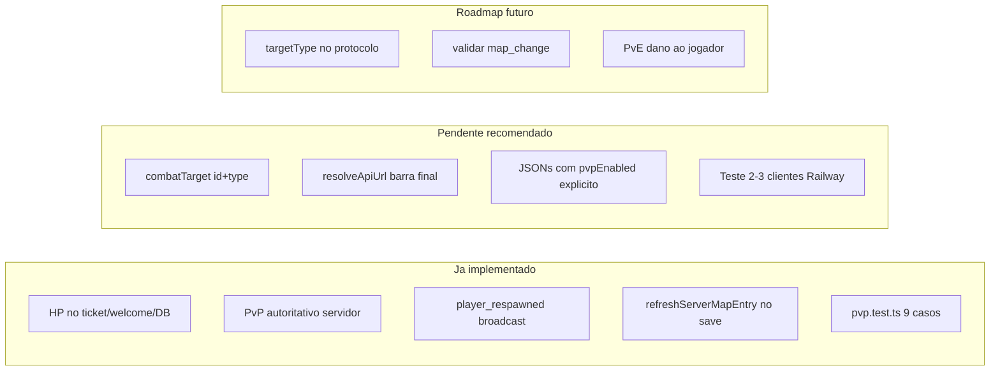

# Validação da análise ChatGPT e melhorias necessárias

## Veredito geral

O projeto **saiu de MVP multiplayer** para uma **base real de MMORPG 2D** (PvP autoritativo, HP persistente, mapa configurável, feedback visual). A análise em [`docs/analise-chatgpt.md`](docs/analise-chatgpt.md) é **boa e acionável**, com um ponto já resolvido no código.

**Não é necessário um refactor grande agora.** O que falta é um commit pequeno de robustez + higiene de dados + QA manual.



---

## Validação ponto a ponto (analise ChatGPT)

### 1. Ataque depende de ID com prefixo `p_` — **CONFIRMADO, melhoria recomendada**

No cliente, [`src/game/playCombat.ts`](src/game/playCombat.ts) guarda só `combatTargetId` e decide PvP com:

```327:327:src/game/playCombat.ts
    if (combatTargetId.startsWith('p_')) {
```

`findTargetAtWorldPoint()` já retorna `{ id, type: 'monster' | 'player' }`, mas o `type` é descartado ao salvar o alvo (linhas 223–227).

No servidor, [`server/src/GameRoom.ts`](server/src/GameRoom.ts) usa a mesma heurística (`msg.creatureId.startsWith('p_')`) e gera IDs sempre como `p_${Date.now()...}` (linha 169).

**Risco hoje:** baixo — formato é consistente em cliente e servidor.
**Risco futuro:** médio — se IDs mudarem (UUID, characterId), PvP quebra silenciosamente.

**Ação:** trocar `combatTargetId: string | null` por `combatTarget: { id: string; type: 'monster' | 'player' } | null` em `playCombat.ts`, usando `type` em `tickPlayCombat` em vez de `startsWith('p_')`. Escopo pequeno (~30 linhas).

---

### 2. `AttackMessage.creatureId` semanticamente estranho — **CONFIRMADO, baixa prioridade**

[`shared/protocol.ts`](shared/protocol.ts) usa `creatureId` para monstro **ou** jogador. Funciona porque ambos os lados usam `p_`.

**Ação agora:** nenhuma mudança de protocolo (evita quebra de compatibilidade).
**Ação futura:** `targetId` + `targetType: 'creature' | 'player'` em v2 do protocolo, ou campo opcional com fallback para `startsWith('p_')`.

---

### 3. `resolveApiUrl()` e barra dupla — **CONFIRMADO, fix simples**

[`src/shared/apiUrl.ts`](src/shared/apiUrl.ts) concatena sem normalizar:

```typescript
return `${apiBaseUrl}${path}`;
```

Testes em [`src/shared/apiUrl.test.ts`](src/shared/apiUrl.test.ts) não cobrem `VITE_API_BASE_URL` com `/` final.

**Ação:** `apiBaseUrl.replace(/\/$/, '')` antes de concatenar + teste novo. Importante para Electron/Capacitor com URL absoluta configurada.

---

### 4. `refreshServerMapEntry` após salvar mapa — **JA IMPLEMENTADO**

ChatGPT não conseguiu confirmar; o código **ja chama** após `saveMap`:

```491:492:server/src/studio/studioService.ts
        const mapId = safeName.replace(/\.json$/i, '');
        refreshServerMapEntry(mapId);
```

Também recarrega colisão. **Nenhuma acao necessaria.**

---

### 5. Teste manual PvP com 2–3 clientes — **OBRIGATORIO, nao automatizado**

Fluxo servidor esta completo (dano → morte → penalidade XP → respawn → `player_respawned` → persistencia). Testes unitarios cobrem regras em [`src/server/combat/pvp.test.ts`](src/server/combat/pvp.test.ts), mas **nao substituem** validacao visual multi-cliente no Railway.

**Checklist manual (antes de "PvP pronto"):**
- A mata B; B ve dano, morte e respawn no templo
- A e C (observador) veem B teleportar com HP cheio
- B reloga e permanece no spawn com HP persistido
- Mapa sem PvP (rookgaard) bloqueia ataque com toast `NO_PVP_MAP`

---

## Achados adicionais (alem do ChatGPT)

| Item | Status | Prioridade |
|------|--------|------------|
| Build Railway (`TS6133` em `mapManager.ts`) | Corrigido localmente (variavel `fileInput` removida) | P0 — commit + push |
| JSONs em `public/maps/*.json` sem `pvpEnabled` no disco | Rookgaard protegido pelo builtin; demais defaultam `pvpEnabled: true` | P2 — re-salvar mapas no Studio ou script de migracao |
| `map_change` pula adjacencia e rate limit | Intencional para portais; exploitavel | Backlog seguranca |
| PvE nao causa dano ao jogador | Gap de gameplay, nao de PvP | Backlog |
| `PositionPersistence.flushAll()` sem hook no shutdown | Risco minimo (save imediato em morte) | Backlog |
| Client prediction / lag compensation / AOI | Documentado em [`docs/multiplayer-remote-players.md`](docs/multiplayer-remote-players.md) | Roadmap escala |

---

## Plano de implementacao recomendado

### Fase A — Robustez imediata (1 commit pequeno)

Arquivos:
- [`src/game/playCombat.ts`](src/game/playCombat.ts) — `combatTarget { id, type }`
- [`src/shared/apiUrl.ts`](src/shared/apiUrl.ts) + [`src/shared/apiUrl.test.ts`](src/shared/apiUrl.test.ts)

Validar: `npm test` + `npm run build`

### Fase B — Higiene de dados de mapa

Abrir cada mapa no Gerenciador de Mapas e salvar (grava `pvpEnabled`/`instanced` no JSON), **ou** script que adiciona flags explicitas aos 4 mapas (`rookgaard`, `mainland`, `orc_cave`, `meu_mapa`) alinhado aos builtins em [`server/src/mapRegistry.ts`](server/src/mapRegistry.ts).

### Fase C — QA no Railway

Deploy apos Fase A + push do fix de build. Testar checklist da secao 5 com 2–3 browsers/contas.

### Fase D — Backlog (nao bloqueia agora)

- Protocolo `targetType` opcional
- Endurecer `map_change` (validar portal conhecido ou distancia maxima)
- PvE contra jogador
- `flushAll` no graceful shutdown

---

## Conclusao

| Pergunta | Resposta |
|----------|----------|
| A analise ChatGPT esta correta? | Sim, em 4/5 pontos; ponto 4 ja estava feito |
| Precisa de melhorias? | Sim, mas **pequenas** — nao um refactor |
| PvP esta pronto para producao publica? | **Nao ainda** — falta commit de robustez + teste manual multi-cliente |
| O que fazer agora? | Fase A + push do fix Railway + Fase C |
