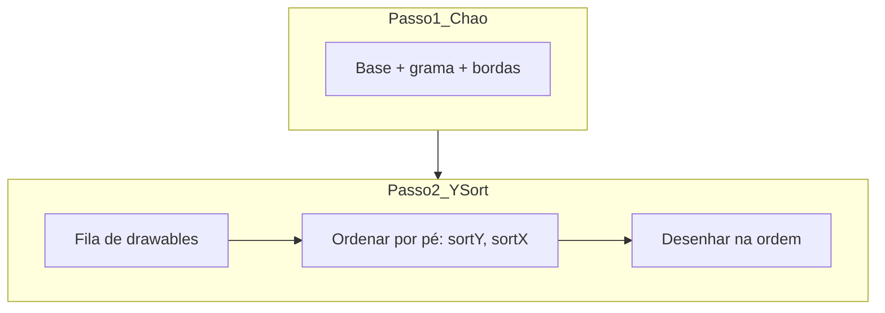

# Y-sorting de profundidade (personagem vs árvores)

## Nome técnico

O tratamento que você descreveu chama-se **Y-sorting** (também: **depth sorting**, **ordenação por profundidade** ou **painter's algorithm** em 2D top-down). A regra é simples:

- Objetos com o **pé mais ao sul** na tela (maior `Y` no mundo) são desenhados **depois** → aparecem **na frente**.
- Objetos mais ao norte ficam **atrás**.



## Diagnóstico no código atual

Hoje o motor usa **duas passadas fixas** (documentado em [docs/studio-improvements-log.md](docs/studio-improvements-log.md) §16):

| Passo | O que desenha | Arquivos |
|-------|---------------|----------|
| 1 | Chão base, grama, auto-borda | [src/game/playApp.ts](src/game/playApp.ts) L492–510, [src/main.ts](src/main.ts) L2532–2550 |
| 2 | **Todos** os itens (`itemsOverlayMap`) | L512–530 / L2552–2638 |
| 3 | NPCs, remotos, jogador local | L549–580 / L2677–2747 |

O Pass 2 desenha **toda** a camada `items` antes de qualquer entidade, sem comparar posição Y. Com sprites 64×64 (árvores), a copa transborda células vizinhas e o personagem fica sempre na ordem errada ao passar ao norte/sul da árvore.

A âncora (`anchorX`/`anchorY` em [src/engine/tileDraw.ts](src/engine/tileDraw.ts)) já alinha o **pé** do sprite ao tile — é exatamente esse ponto que deve definir a profundidade.

## Abordagem escolhida

Manter **Pass 1 intacto** (chão nunca entra no Y-sort — evita regressão de auto-borda e corte lateral).

Substituir Pass 2 + desenho separado de entidades por **uma fila unificada de drawables** por andar `z`, ordenada por:

```
sortY = pé do sprite em pixels mundo (placement.drawY + placement.drawH)
sortX = centro horizontal do pé (placement.drawX + placement.drawW / 2)  // desempate
```

Reutilizar [`getSpriteTilePlacement`](src/character/spriteDraw.ts) — mesma base dos personagens e dos tiles de mapa.

### Escopo (confirmado)

Entram na fila Y-sort, no **mesmo andar `z`**:

- Itens em `itemsOverlayMap` (árvores, decorações, paredes na overlay)
- Jogador local (`player.worldX` / `player.worldY` interpolados durante o passo)
- NPCs/monstros (`GameEntity` em [src/character/entity.ts](src/character/entity.ts))
- Jogadores remotos (`gameNet.getRemotePlayers`)

**Fora** da fila (continuam por cima, só editor/UI):

- Overlays de zonas, portais, spawns, preview de pintura, minimap
- Andares acima do jogador com alpha 0.3 (lógica existente)

## Implementação

### 1. Novo módulo compartilhado

Criar [src/engine/depthSortDraw.ts](src/engine/depthSortDraw.ts):

```ts
interface DepthDrawable {
  sortY: number;
  sortX: number;
  draw: (ctx: CanvasRenderingContext2D) => void;
}

// Helpers:
getRegistryTileFootSortKey(tile, tileX, tileY, tileSize)  // usa getTileDrawSize + getSpriteTilePlacement
getEntityFootSortKey(worldX, worldY, rect, tileSize, drawScale?, zoom?)

collectItemDrawables(itemsOverlay, z, viewport, registry, camera, tileSize): DepthDrawable[]
collectEntityDrawables(...): DepthDrawable[]

sortDepthDrawables(drawables): void  // sortY asc, sortX asc
drawDepthSorted(ctx, drawables): void
```

- Só varre células visíveis (`startX`…`endX`, `startY`…`endY`) — alinhado à regra de viewport culling.
- Reutiliza `drawRegistryTile` dentro do callback `draw` de cada item.
- Para entidades, reutiliza lógica de desenho já em `GameEntity.draw` / bloco do jogador em `playApp.ts`.

### 2. Refatorar Play

Em [src/game/playApp.ts](src/game/playApp.ts) `draw()`:

1. Pass 1 — **sem mudança**
2. Remover loop fixo de itens (L512–530) + bloco separado de NPCs/jogador (L549–580)
3. Por andar `z`:
   - `drawables = [...collectItemDrawables(...), ...collectEntityDrawables(...)]`
   - `sortDepthDrawables(drawables)`
   - `drawDepthSorted(ctx, drawables)`
   - Manter portais pulsantes **depois** do Y-sort (UI de mapa)

### 3. Refatorar Studio

Mesma refatoração em [src/main.ts](src/main.ts) `draw()`:

- Pass 1 intacto
- Y-sort para itens + NPCs + remotos + jogador local
- Overlays de editor (zonas, portais, spawns, `editingTileKey`, preview de pincel) **após** o Y-sort no mesmo andar

Respeitar `hidePlayerSprite` do boot do Studio.

### 4. Jogadores remotos (placeholder)

Hoje remotos são retângulos rosas. Incluir na fila com `sortY` baseado em `tileX/tileY` (pé no centro inferior do tile) até haver sprite animado.

### 5. Metadados opcionais (fase 2 — não bloquear v1)

Campo futuro em `tile_properties.json`: `sortYOffset` para objetos especiais. **v1:** pé derivado de âncora + `frameHeight` (suficiente para `01_arvore`).

### 6. Documentação

- [docs/studio-improvements-log.md](docs/studio-improvements-log.md) — nova §22: Y-sorting; atualizar §16 item 4 (duas passadas → chão fixo + Y-sort de entidades/itens)
- [docs/architecture.md](docs/architecture.md) — nota curta no pipeline de render
- [.cursor/rules/studio-map-sprites.mdc](.cursor/rules/studio-map-sprites.mdc) — invariante: chão em pass 1; itens/entidades em Y-sort; não voltar a desenhar items sempre após player

## Comportamento esperado

| Posição do jogador vs árvore | Resultado |
|------------------------------|-----------|
| Norte da árvore (menor `tileY`) | Árvore cobre o personagem |
| Sul da árvore (maior `tileY`) | Personagem cobre a árvore |
| Mesma linha `tileY` | Desempate por `sortX` (esquerda atrás, direita na frente) |
| Durante movimento | `worldY` interpolado atualiza `sortY` suavemente |

## Performance

- Custo: coletar + ordenar ~`(células visíveis com item) + entidades no andar` por frame — tipicamente centenas de entradas, desprezível vs `drawImage`.
- Sem recalcular vizinhos de borda; viewport culling preservado.

## Validação manual

1. `npm run dev` → Play com `01_arvore` no mapa
2. Aproximar ao **norte** da árvore → personagem parcialmente oculto pela copa
3. Aproximar ao **sul** → personagem na frente do tronco/copa
4. Repetir no Studio (com jogador visível)
5. NPC na mesma linha que árvore — ordem correta
6. Tile 32×32 sem item overlay — inalterado
7. Auto-borda e grama — sem regressão visual

## O que NÃO fazer

- Não mover chão/borda para o Y-sort (regressão documentada em §16)
- Não fatiar sprites em múltiplas partes (tronco/copa) nesta fase
- Não mudar `TILE_SIZE` nem formato de mapa
