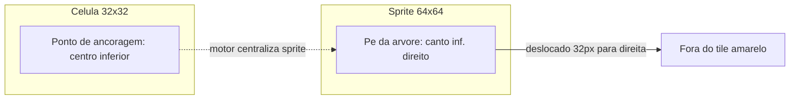

# Âncora de sprites de mapa (árvores 64×64)

## Diagnóstico

O problema **não é o save do mapa** nem o tamanho do PNG — é **como o motor posiciona sprites maiores que o tile**.

Hoje [`drawRegistryTile`](src/engine/tileDraw.ts) usa regra fixa para todo tile:

```76:77:src/engine/tileDraw.ts
const drawX = Math.round(dx + (size - tw) / 2);  // centraliza horizontalmente
const drawY = Math.round(dy + (size - th));      // alinha base do sprite com base do tile
```

Para `01_arvore` ([`tiles/tile_properties.json`](tiles/tile_properties.json): `frameWidth/Height: 64`, tile lógico `32px`):

| Ponto | Posição atual | Onde deveria estar |
|-------|---------------|-------------------|
| Pé da árvore (canto inf. direito do PNG) | `dx + 48` (16px à direita do tile) | `dx + 16` (centro inferior do tile) |



Personagens já resolvem isso com `anchorX` / `anchorY` em [`getSpriteTilePlacement`](src/character/spriteDraw.ts) — **tiles de mapa não usam esses campos**.

Gap adicional: o calibrador em **Criar Sprites** retorna `anchorX/anchorY`, mas [`mapSpriteEditor.ts`](src/editor/mapSpriteEditor.ts) abre o calibrador com `anchorX: 0` e [`calibrationToPropertyPayload`](src/editor/mapSpriteCalibration.ts) **não persiste âncora** no `tile_properties.json`.

---

## Abordagem correta (escolhida)

**Modelo Tibia:** 1 célula = 32×32 (colisão + referência); o sprite pode ser maior e “transbordar”. O ponto do **pé** no PNG deve coincidir com o **centro inferior** da célula pintada.

Usar o **mesmo modelo de offset dos personagens** (já documentado em AGENTS.md):

- Base: centro horizontal + base alinhada ao tile (`getSpriteTilePlacement`)
- `anchorX` / `anchorY`: ajuste fino em pixels

Para `01_arvore` com pé em `(64, 64)` dentro do frame 64×64:

- `anchorX = -32`, `anchorY = 0` (derivado: pé deve ir para `dx+16`, hoje vai para `dx+48`)

Fórmula geral para calibrador futuro (pé em `footX`, `footY` no frame):

- `anchorX = TILE_SIZE/2 - footX + (TILE_SIZE - frameWidth)/2`
- `anchorY = TILE_SIZE - footY`

---

## Implementação

### 1. Estender metadados do tile

- Adicionar `anchorX?: number` e `anchorY?: number` em [`TileProperties`](src/functions/tileConfig.ts) e garantir que [`registerSingleTile`](src/engine/tileRegistry.ts) propaga do `tile_properties.json`.

### 2. Unificar posicionamento no draw

- Extrair helper compartilhado (ex. em [`src/engine/tileDraw.ts`](src/engine/tileDraw.ts)) reutilizando a lógica de [`getSpriteTilePlacement`](src/character/spriteDraw.ts):

```ts
// tileScreenX/Y = canto superior esquerdo da célula (dx, dy)
placement = getSpriteTilePlacement(dx, dy, cameraX=0, cameraY=0, tileSize, { sw: tw, sh: th, ax: tile.anchorX, ay: tile.anchorY })
```

- Atualizar `drawRegistryTile` para usar esse helper (Studio [`main.ts`](src/main.ts) e Play [`playApp.ts`](src/game/playApp.ts) já passam por aqui).

**Performance:** só soma/arredondamento por célula desenhada — impacto desprezível frente ao `drawImage` existente.

### 3. Persistir âncora ao salvar sprite

- Incluir `anchorX` / `anchorY` em [`calibrationToPropertyPayload`](src/editor/mapSpriteCalibration.ts).
- Em [`mapSpriteEditor.ts`](src/editor/mapSpriteEditor.ts):
  - Ao abrir calibrador: ler `anchorX/anchorY` de `loadedSpriteProperties` (não forçar `0`).
  - No `onConfirm`: gravar `result.anchorX/anchorY` em `currentCalibration` / `properties` antes do save no servidor.

### 4. Dado inicial para `01_arvore`

Atualizar [`tiles/tile_properties.json`](tiles/tile_properties.json):

```json
"01_arvore": {
  ...
  "frameWidth": 64,
  "frameHeight": 64,
  "anchorX": -32,
  "anchorY": 0,
  "paletteCategory": "nature"
}
```

(Ajustar `assetType`/`paletteCategory` se necessário para manter pintura no overlay `items` — hoje pasta `nature/tree` já resolve categoria na paleta.)

### 5. Calibrador — uso manual (sem redesign nesta fase)

- Os campos **Ajuste Âncora X/Y** já existem em [`studio.html`](studio.html) (`#calAnchorX`, `#calAnchorY`).
- Após persistência, o fluxo será: **Criar Sprites → 01_arvore → Calibrar Grade → ajustar âncora → Salvar no Servidor**.
- Melhoria opcional posterior: preview da célula 32×32 + clique no “pé” para calcular âncora automaticamente (como no preview de personagem).

### 6. Documentação

- Atualizar [`docs/map-format.md`](docs/map-format.md) (seção sprites > tile) e entrada em [`docs/studio-improvements-log.md`](docs/studio-improvements-log.md): tiles grandes usam `anchorX/anchorY` em `tile_properties`.

---

## Validação manual

1. `npm run dev` → Studio → pintar `01_arvore` no tile destacado.
2. Pé da árvore alinhado ao centro inferior da célula amarela; copa pode transbordar para cima/esquerda.
3. Salvar mapa → F5 → árvore permanece alinhada.
4. Abrir Play → mesma posição visual.
5. Testar tile 32×32 sem âncora — comportamento idêntico ao atual (`anchor` default 0).

---

## O que NÃO fazer

- **Não** redimensionar o PNG só para “consertar” (você escolheu âncora no motor).
- **Não** mudar `ENGINE_CONFIG.TILE_SIZE` (32) — a célula lógica continua 32px; só o desenho transborda.
