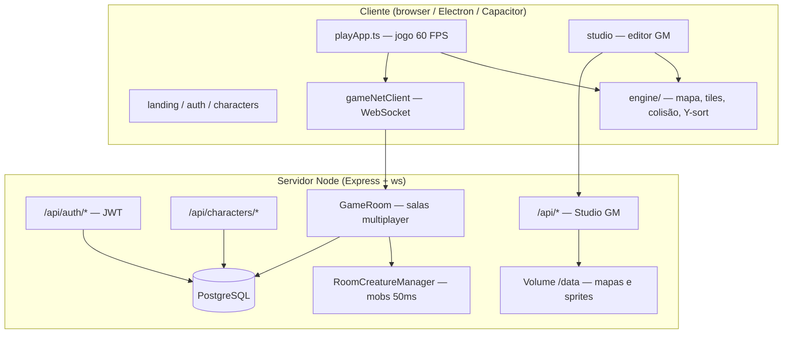

# Game 2D Railway

MMORPG 2D no browser estilo Tibia — editor de mapas (Studio GM), engine Canvas 2D, dungeons instanciadas, combate com mobs autoritativos no servidor e multiplayer em tempo real via WebSocket.

**Versão:** `0.1.0` · **Stack:** Vite + TypeScript + Canvas 2D · Express + WebSocket + PostgreSQL · Deploy [Railway](https://railway.app)

---

## Índice

- [Recursos](#recursos)
- [Início rápido](#início-rápido)
- [Comandos](#comandos)
- [Rotas (MPA)](#rotas-mpa)
- [Arquitetura](#arquitetura)
- [Estrutura do repositório](#estrutura-do-repositório)
- [Jornada do jogador](#jornada-do-jogador)
- [Studio GM (editor)](#studio-gm-editor)
- [Mapas, tiles e camadas](#mapas-tiles-e-camadas)
- [Multiplayer e combate](#multiplayer-e-combate)
- [Clientes instalados (Electron / Android)](#clientes-instalados-electron--android)
- [Configuração (.env)](#configuração-env)
- [Deploy (Railway)](#deploy-railway)
- [Debug e diagnóstico](#debug-e-diagnóstico)
- [Testes](#testes)
- [Documentação](#documentação)

---

## Recursos

| Área | O que funciona hoje |
|------|---------------------|
| **Conta e personagens** | Registro/login JWT, até 4 personagens por conta (PostgreSQL); mock localStorage em dev |
| **Play** | Movimento em grid 32×32, andares Z (−7…+7), portais, dungeons instanciadas, XP/nível |
| **Multiplayer** | Salas `mapId@instanceId`, posição autoritativa, jogadores remotos com interpolação visual |
| **Combate** | Ataque a mobs e PvP (servidor autoritativo), chase AI, dano/XP, anel de alvo, texto flutuante |
| **Studio GM** | Pintura de mapas, auto-borda de grama, spawns, portais, zonas, sprites, outfits, presets |
| **Persistência** | Mapas/sprites no volume Railway; posição de personagem no PostgreSQL via WS |
| **Multiplataforma** | Cliente Electron (Windows) com auto-update, shell Capacitor (Android), resync ao voltar de background |
| **Segurança WS** | Ticket HMAC no join, reconexão proativa (~13 min), rate limit de movimento/resync |

---

## Início rápido

### Pré-requisitos

- **Node.js** 20+ (recomendado LTS)
- **npm** 10+
- **PostgreSQL** — opcional em dev (mock funciona sem banco); obrigatório em produção

### Instalação

```bash
git clone <repo-url> game-2d-railway
cd game-2d-railway
npm install
npm install --prefix server
cp .env.example .env   # Windows: copy .env.example .env
npm run dev
```

Abra **http://localhost:5173/**

| Passo | URL |
|-------|-----|
| Landing | http://localhost:5173/ |
| Login (mock: qualquer e-mail/senha) | http://localhost:5173/login.html |
| Personagens | http://localhost:5173/characters.html |
| Jogo | http://localhost:5173/play.html |
| Studio GM (dev: `gm@gm.dev`) | http://localhost:5173/studio.html |

O comando `npm run dev` sobe **dois processos**:

| Serviço | Porta | Função |
|---------|-------|--------|
| Vite (frontend) | `:5173` | MPA, hot reload, proxy `/api` → Express |
| Express + WebSocket | `:8787` | Auth, personagens, APIs Studio, jogo WS |

---

## Comandos

| Comando | Descrição |
|---------|-----------|
| `npm run dev` | **Recomendado** — Vite `:5173` + API/WS `:8787` |
| `npm run dev:web` | Só frontend (sem APIs; mapas offline limitados) |
| `npm run dev:server` | Só Express/WebSocket |
| `npm run build` | Compila frontend (`dist/`) + servidor (`server/dist/`) |
| `npm run start` | Produção local em `:8787` (requer `npm run build` antes) |
| `npm run start:railway` | Build + start (usado pelo Railway) |
| `npm run preview` | Preview do build Vite |
| `npm test` | Vitest — protocolo WS, tile refs, políticas de sync |
| `npm run electron:dev` | Dev + janela Electron apontando para `:5173/play.html` |
| `npm run electron:build` | Build + instalador NSIS (Windows) + publish GitHub Releases |
| `npm run electron:compile` | Compila só `desktop/electron/` |
| `npm run electron:check` | Build web + compile Electron (validação pré-release) |
| `npm run mobile:build` | Build web + `cap sync android` |
| `npm run mobile:open:android` | Abre projeto no Android Studio |

---

## Rotas (MPA)

O frontend é uma **Multi-Page Application** (Vite) — cada tela é um HTML independente.

| URL | Arquivo | Público |
|-----|---------|---------|
| `/` | `index.html` | Landing |
| `/login.html` | Login | Sim |
| `/register.html` | Registro | Sim |
| `/characters.html` | Roster (seleção de personagem) | Autenticado |
| `/characters-new.html` | Criação de personagem | Autenticado |
| `/play.html` | Jogo (Canvas) | Autenticado + personagem |
| `/studio.html` | Editor GM | Conta com `can_access_studio` |
| `/terms.html`, `/privacy.html` | Legal (placeholder) | Sim |

**Fluxo padrão:**

```
/ → login → characters → [novo personagem] → play.html?characterId=...
```

Guia detalhado: [docs/player-journey.md](docs/player-journey.md)

---

## Arquitetura



### Camadas do código

| Camada | Pasta | Responsabilidade |
|--------|-------|------------------|
| **Engine** | `src/engine/` | Mapa, tiles, colisão, registro de tiles, Y-sort, formato `MapDocument` |
| **Movimento** | `src/movement/` | Grid, passos, tween, escadas |
| **Personagem** | `src/character/` | Speed, equipamento, buffs, sprites |
| **Jogo (Play)** | `src/game/` | Loop do jogo, combate, UI, lifecycle, diagnóstico |
| **Rede** | `src/net/` | Cliente WS, sync de criaturas/remotos, resync, state store |
| **Editor** | `src/editor/` | Ferramentas do Studio (mapa, sprites, spawns, portais) |
| **Studio shell** | `src/studio/` | Bootstrap GM, guard de acesso |
| **Auth / conta** | `src/auth/`, `src/characters/` | Login, registro, roster, criação |
| **Servidor** | `server/src/` | HTTP, WS, auth, persistência, APIs Studio |
| **Protocolo compartilhado** | `shared/` | Tipos WS, políticas testáveis (Vitest) |
| **Desktop** | `desktop/electron/` | Main/preload Electron |
| **Dados** | `public/maps/`, `tiles/`, `database/` | Mapas JSON, assets PNG, migrations SQL |

Documentação de arquitetura: [docs/architecture.md](docs/architecture.md)

### Pipeline de render (mapa)

1. **Passo 1 — chão:** base (`worldMap`) + overlay grama + auto-borda; viewport culling.
2. **Passo 2 — Y-sort:** itens, NPCs, jogadores remotos e local na mesma fila (`depthSortDraw.ts`).
3. **Overlays:** zonas, portais, spawns, preview de editor, UI de combate.

Studio e Play compartilham o mesmo modelo de mapa.

---

## Estrutura do repositório

```
game-2d-railway/
├── src/
│   ├── engine/           # Núcleo: mapa, tiles, colisão, worldMap
│   ├── game/             # playApp, combate, runtime, debug (F3)
│   ├── net/              # gameNetClient, serverStateStore, resyncController
│   ├── editor/           # Ferramentas Studio (mapa, sprites, spawns…)
│   ├── studio/           # Bootstrap GM
│   ├── auth/             # Login/registro
│   ├── characters/       # Roster e criação
│   ├── ui/               # Toast auto-update Electron, version gate
│   ├── movement/         # Grid movement
│   ├── character/        # Stats, sprites, equipamento
│   └── shared/           # Auth client, API fetch, tipos
├── server/
│   └── src/
│       ├── GameRoom.ts           # Salas WS, movimento, combate, resync
│       ├── game/                 # Mobs, persistência de posição/XP
│       ├── routes/               # auth, characters, studio, ws-ticket
│       └── studio/               # Serviço de APIs GM
├── shared/               # protocol.ts, políticas compartilhadas
├── desktop/electron/     # Cliente Windows
├── public/
│   ├── maps/             # MapDocument JSON
│   └── tile_catalog.json
├── tiles/
│   ├── maps/             # Sprites de mapa (registry)
│   ├── effects/          # FX combate/UI (fora do registry)
│   └── characters/       # Outfits/NPCs (fora do registry)
├── database/migrations/  # Schema PostgreSQL
├── docs/                 # Documentação técnica
├── capacitor.config.ts
├── electron-builder.yml
├── railway.json
└── AGENTS.md             # Guia para agentes IA (Cursor)
```

---

## Jornada do jogador

1. **Registro/login** — JWT em produção; mock em dev (`localStorage`).
2. **Roster** — até 4 personagens; preview com sprite calibrado (Chroma Key, frame Sul).
3. **Criação** — vocação, outfit, spawn inicial.
4. **Play** — carrega mapa do spawn, conecta WS se multiplayer configurado, loop 60 FPS.
5. **Progressão** — XP e level sincronizados pelo servidor em produção.

Controles no jogo: **WASD** movimento, **Espaço** ataque, **F3** painel de diagnóstico (dev).

---

## Studio GM (editor)

Acesso: **http://localhost:5173/studio.html**

Em dev, use e-mail **`gm@gm.dev`** (mock) ou `STUDIO_MOCK_GM=true`. Em produção, a conta precisa de `can_access_studio = true` no PostgreSQL.

### Ferramentas principais

| Ferramenta | Função |
|------------|--------|
| **Pintura de mapa** | Camadas base, grama (overlay), itens, bordas manuais |
| **Auto-borda** | Filetes automáticos entre grama e chão (`grass_edges`) |
| **Tileset / paleta** | Todos PNGs em `tiles/**` (exceto `characters/`, `effects/`) |
| **Criar Sprites** | Export PNG + metadados em `tile_properties.json` |
| **Spawns** | Pontos de spawn de criaturas |
| **Portais** | Transição entre mapas / dungeons |
| **Zonas** | Áreas nomeadas (PvP, safe, etc.) |
| **Personagens / outfits** | Calibrador de âncoras, chroma key, export JSON |
| **Presets** | Criaturas e outfits em JSON |

### APIs Studio (dev e prod unificadas)

Implementação única em `server/src/routes/studio/`. Em dev, Vite faz proxy de `/api/*` → `:8787`.

| Método | Rota | Uso |
|--------|------|-----|
| GET | `/api/list-map-sprites` | Dropdown Criar Sprites |
| GET | `/api/sprite-usage?filename=` | Verificar uso antes de excluir |
| DELETE | `/api/delete-map-sprite` | Exclusão (409 se em uso) |
| POST | `/api/save-map-sprite` | Salvar PNG + `tile_properties` |
| POST | `/api/save-map` | Salvar mapa JSON |
| … | … | Ver [docs/sprite-exporter-walkthrough.md](docs/sprite-exporter-walkthrough.md) |

Guia de sprites: [docs/sprite-exporter-walkthrough.md](docs/sprite-exporter-walkthrough.md)  
Log de melhorias: [docs/studio-improvements-log.md](docs/studio-improvements-log.md)

---

## Mapas, tiles e camadas

### Constantes importantes

- **Tile visual:** `ENGINE_CONFIG.TILE_SIZE = 32` px
- **Andares:** Z de **−7** a **+7**
- **Formato:** `MapDocument` v1 esparso — [docs/map-format.md](docs/map-format.md)
- **Refs estáveis:** células guardam `ref` (nome do PNG); ids numéricos são resolvidos em runtime via `tileRefResolver.ts`

### Pastas de assets

| Pasta | Entra no tile registry? | Uso |
|-------|-------------------------|-----|
| `tiles/maps/**` | Sim | Chão, grama, bordas, natureza, paredes, itens |
| `tiles/effects/**` | Não | FX de combate/UI (`target_ring.png`, etc.) |
| `tiles/characters/**` | Não | Outfits e sprites de criaturas |

Metadados: `tiles/tile_properties.json` (chave = nome do arquivo **sem** `.png`).

Taxonomia completa: [docs/asset-taxonomy.md](docs/asset-taxonomy.md)  
Auto-borda: [docs/auto-border.md](docs/auto-border.md)

### Dungeons instanciadas

Mapas com `instanced: true` no registry recebem cópia em RAM com `instanceId` único ao entrar. Cada entrada = dungeon fresca; limite de 8 instâncias na RAM.

Detalhes: [docs/instanced-maps-and-multiplayer.md](docs/instanced-maps-and-multiplayer.md)

---

## Multiplayer e combate

### Modelo de salas

- Chave de sala: `mapId@instanceId` (`shared/roomKey.ts`)
- Servidor **autoritativo** para posição, combate, XP, vida de mobs
- Cliente envia intenção (`move`, `attack`); servidor valida e broadcasta

### Protocolo WebSocket (v1)

Tipos em [`shared/protocol.ts`](shared/protocol.ts).

**Cliente → servidor (principais):**

| `type` | Descrição |
|--------|-----------|
| `join` | Entrada na sala (+ ticket HMAC, `platform`, `clientBuildVersion`) |
| `move` / `map_change` | Passo de grid com `stepDurationMs`, direção |
| `attack` | Ataque a criatura ou jogador (PvP conforme mapa/zona) |
| `resync_request` | Pedido de snapshot completo (rate limit 2 s) |
| `ping` | Latência |

**Servidor → cliente (principais):**

| `type` | Descrição |
|--------|-----------|
| `welcome` / `state_sync` | Jogadores na sala |
| `player_moved` / `player_joined` / `player_left` | Sync de jogadores |
| `creature_sync` / `creature_moved` / `creature_damaged` | Mobs |
| `position_correction` | Tile autoritativo (anti-cheat visual) |
| `player_progress` | Level/XP |

### Jogadores remotos

O cliente **nunca** desenha remotos direto no tile do servidor — mantém posição lógica (grid) e visual (interpolação). Ver [docs/multiplayer-remote-players.md](docs/multiplayer-remote-players.md).

### Background / alt-tab

- Browser pausa `requestAnimationFrame` em aba oculta (normal)
- Servidor continua (`RoomCreatureManager` tick 50 ms)
- Ao voltar foco: `resyncController` snap visual + `resync_request` → `state_sync` + `creature_sync` + `position_correction`
- Hardening alt-tab: sync de posição antes de limpar `stepping`

### Testar multiplayer local

```bash
npm run dev
```

Abra **duas abas** em `http://localhost:5173/play.html` com personagens diferentes.

---

## Clientes instalados (Electron / Android)

### Electron (Windows)

Cliente desktop com `backgroundThrottling: false` — timers e rede não pausam ao minimizar.

```bash
npm run electron:dev      # requer npm run dev implícito (API + Vite)
npm run electron:check    # valida build + compile TypeScript do main
npm run electron:build    # gera instalador NSIS e publica no GitHub Releases
```

Arquivos principais:

| Arquivo | Função |
|---------|--------|
| `desktop/electron/main.ts` | Janela, IPC, inicialização do updater |
| `desktop/electron/updater.ts` | `electron-updater` — check, download, install |
| `desktop/electron/preload.ts` | `electronAPI` exposto ao renderer |
| `src/ui/desktopUpdateToast.ts` | Toast de progresso e restart |
| `src/ui/desktopVersionGate.ts` | Bloqueio de clientes abaixo da versão mínima |
| `src/ui/initDesktopClient.ts` | Shell Electron (toast + gate) nas páginas |

#### Auto-update (GitHub Releases)

- Updates via `electron-updater` + `electron-builder` (`publish` → `robinCardoso/game-2d-railway`)
- **Nunca** reinicia automaticamente em combate: download só com confirmação do jogador
- Toast aparece em landing, login, roster e play (~8 s após abrir o app)
- Na página de jogo, o botão de restart fica oculto até o usuário sair do mundo

#### Version gate (servidor)

`GET /api/desktop/version?clientVersion=0.1.0&platform=electron` retorna se o cliente pode entrar no mundo.

| Campo | Descrição |
|-------|-----------|
| `allowed` | `false` bloqueia entrada no roster/play |
| `minVersion` | Versão mínima exigida (`DESKTOP_MIN_VERSION`) |
| `latestVersion` | Versão mais recente publicada (`DESKTOP_LATEST_VERSION`) |

> **Importante:** defina **domínio próprio** (`VITE_API_BASE_URL`, `VITE_WS_BASE_URL`) antes de distribuir. URL Railway que muda quebra instaladores antigos.

> **Publicar release:** exporte `GH_TOKEN` (PAT com escopo `repo`) antes de `npm run electron:build`. Sem code signing, o Windows SmartScreen avisa na primeira instalação.

### Capacitor (Android)

```bash
npm run mobile:build
npm run mobile:open:android
```

Lifecycle via `@capacitor/app` (`appStateChange`) → resync obrigatório ao voltar do background.

Detalhes: [docs/hosting.md](docs/hosting.md) (seção Electron e Capacitor) · [docs/playstore-steam-roadmap.md](docs/playstore-steam-roadmap.md)

---

## Configuração (.env)

```bash
cp .env.example .env
```

### Ambientes

| Modo | Auth | Multiplayer WS |
|------|------|----------------|
| Dev padrão | Mock localStorage | `ws://localhost:8787` |
| Dev + API | `VITE_USE_API_AUTH=true` + `DATABASE_URL` | Igual |
| Produção Railway | JWT + PostgreSQL | Same-origin `wss://` (sem `VITE_GAME_SERVER_WS`) |

### Variáveis essenciais

**Servidor (produção):**

| Variável | Obrigatória | Descrição |
|----------|-------------|-----------|
| `DATABASE_URL` | Sim | PostgreSQL (Railway: Variable Reference) |
| `JWT_SECRET` | Sim | Assinatura dos tokens de sessão |
| `ENTER_TICKET_SECRET` | Sim | HMAC do ticket WebSocket |
| `DATA_ROOT` | Sim | Volume Railway (`/data`) — mapas/sprites |
| `DATABASE_SSL` | Railway | `true` para Postgres gerenciado |
| `CLIENT_ORIGIN` | Recomendado | URL pública (CORS) |

**Cliente (build Vite):**

| Variável | Descrição |
|----------|-----------|
| `VITE_GAME_SERVER_WS` | Dev: `ws://localhost:8787`; prod: vazio (same-origin) |
| `VITE_BUILD_VERSION` | Versão no join WS e painel F3 |
| `VITE_API_BASE_URL` | Electron/Capacitor — HTTP fixo |
| `VITE_WS_BASE_URL` | Electron/Capacitor — WebSocket fixo |

**Servidor — snapshots periódicos (opcional):**

| Variável | Padrão | Descrição |
|----------|--------|-----------|
| `PLAYER_STATE_SNAPSHOT_INTERVAL_MS` | `1000` | `state_sync` periódico; `0` desliga |
| `CREATURE_SNAPSHOT_INTERVAL_MS` | `1000` | `creature_sync` periódico; `0` desliga |
| `RESYNC_MIN_INTERVAL_MS` | `2000` | Rate limit de `resync_request` |

**Servidor — version gate Electron (opcional):**

| Variável | Padrão | Descrição |
|----------|--------|-----------|
| `DESKTOP_MIN_VERSION` | `0.1.0` | Clientes abaixo desta versão não entram no mundo |
| `DESKTOP_LATEST_VERSION` | `0.1.0` | Versão mais recente (informativo no endpoint) |

Lista completa: [.env.example](.env.example) · [server/README.md](server/README.md)

---

## Deploy (Railway)

Um único serviço Node serve frontend compilado, APIs, WebSocket e assets.

```bash
npm run build
npm run start --prefix server
```

Configuração em [`railway.json`](railway.json):

- **Build:** `npm install && npm install --prefix server && npm run build`
- **Start:** `npm run start --prefix server`
- **Health:** `GET /health`

### Checklist de produção

- [ ] PostgreSQL conectado (`DATABASE_URL` via Variable Reference)
- [ ] Volume montado em `/data` + `DATA_ROOT=/data`
- [ ] `JWT_SECRET`, `ENTER_TICKET_SECRET` — strings longas e aleatórias
- [ ] `NODE_ENV=production`, `HOST=0.0.0.0`
- [ ] **Não** usar `STUDIO_MOCK_GM=true` nem `ALLOW_CLIENT_PROGRESS_SYNC=true`
- [ ] Conta GM com `can_access_studio = true` para acessar Studio
- [ ] `DESKTOP_MIN_VERSION` alinhada à release Electron publicada (se usar version gate)

Guia passo a passo: **[docs/hosting.md](docs/hosting.md)**

### Backup recomendado

```bash
# Volume (mapas/sprites):
tar -czf backup-data-$(date +%Y%m%d).tar.gz /data

# PostgreSQL:
pg_dump "$DATABASE_URL" > backup-db-$(date +%Y%m%d).sql
```

---

## Debug e diagnóstico

### Painel F3 (Play)

Durante o jogo, pressione **F3** para alternar overlay com:

- Plataforma (`web` / `electron` / `capacitor`)
- Versão de build, status WS, ping RTT
- Timestamps de último `state_sync`, `creature_sync`, `progress_sync`
- Estado de visibilidade/foco da aba

Arquivo: `src/game/debug/clientDiagnostics.ts`

### localStorage (dev)

| Chave | Efeito |
|-------|--------|
| `debug.perf` | Métricas de performance no Studio |
| `debug.paint` | Log de pintura de tiles |
| `debug.map.save` | Log de save de mapa |
| `debug.movement` | Log de movimento |
| `debug.play.join` | Timeline de boot do Play |

Ver [docs/studio-improvements-log.md](docs/studio-improvements-log.md) §7.8.

---

## Testes

```bash
npm test
```

Suite Vitest (~90 testes) cobre:

- Resolução de `ref` em mapas (`tileRefResolver`)
- Protocolo WS (`resync_request`, mensagens cliente)
- Políticas de `steppingDest` e `progress_sync`
- Chase de criaturas (`creatureChase`)
- Combate PvP no servidor (`src/server/combat/pvp.test.ts`)
- Feedback visual de combate (remotos, floating damage, Y-sort)
- Version gate Electron (`shared/desktopVersion`, `/api/desktop/version`)
- Navegação auth compatível com `file://` (Electron)

Invariantes críticos para contribuidores: [AGENTS.md](AGENTS.md)

---

## Documentação

| Documento | Conteúdo |
|-----------|----------|
| [docs/hosting.md](docs/hosting.md) | Deploy Railway, volume, WS, Electron/Capacitor |
| [docs/architecture.md](docs/architecture.md) | Camadas engine / editor |
| [docs/map-format.md](docs/map-format.md) | Formato `MapDocument`, `ref`, camadas |
| [docs/asset-taxonomy.md](docs/asset-taxonomy.md) | Pastas de tiles e metadados |
| [docs/auto-border.md](docs/auto-border.md) | Auto-borda grass_edges |
| [docs/sprite-exporter-walkthrough.md](docs/sprite-exporter-walkthrough.md) | Calibrador e APIs de sprites |
| [docs/instanced-maps-and-multiplayer.md](docs/instanced-maps-and-multiplayer.md) | Dungeons, salas, protocolo WS |
| [docs/multiplayer-remote-players.md](docs/multiplayer-remote-players.md) | Jogadores remotos, resync, background |
| [docs/player-journey.md](docs/player-journey.md) | Fluxo conta → personagem → play |
| [docs/studio-improvements-log.md](docs/studio-improvements-log.md) | Log de melhorias + checklists |
| [docs/playstore-steam-roadmap.md](docs/playstore-steam-roadmap.md) | Steam, Play Store, Tauri |
| [docs/ui-menus.md](docs/ui-menus.md) | IDs de UI estáveis |
| [server/README.md](server/README.md) | Servidor Node unificado |
| [AGENTS.md](AGENTS.md) | Guia para agentes IA (Cursor) |

---

## Stack técnica

| Camada | Tecnologia |
|--------|------------|
| Frontend | Vite 5, TypeScript, Canvas 2D, MPA |
| Backend | Express, `ws`, Node.js 20+ |
| Banco | PostgreSQL (migrations em `database/migrations/`) |
| Auth | JWT + bcrypt |
| WS segurança | Ticket HMAC (`ENTER_TICKET_SECRET`) |
| Desktop | Electron 36 + electron-builder + electron-updater |
| Mobile | Capacitor 8 (Android) |
| Testes | Vitest |
| Deploy | Railway (`railway.json`) |

---

## Licença e contribuição

Projeto privado (`"private": true` no `package.json`).

Ao alterar mapas, tiles ou sprites, leia **[AGENTS.md](AGENTS.md)** e a regra Cursor em `.cursor/rules/studio-map-sprites.mdc` — contém invariantes anti-regressão obrigatórios.
