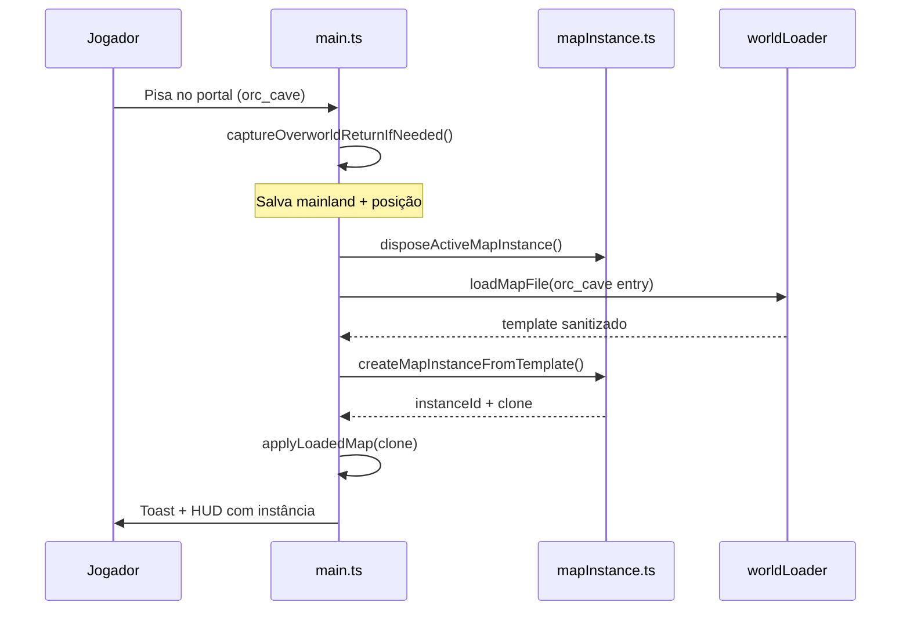
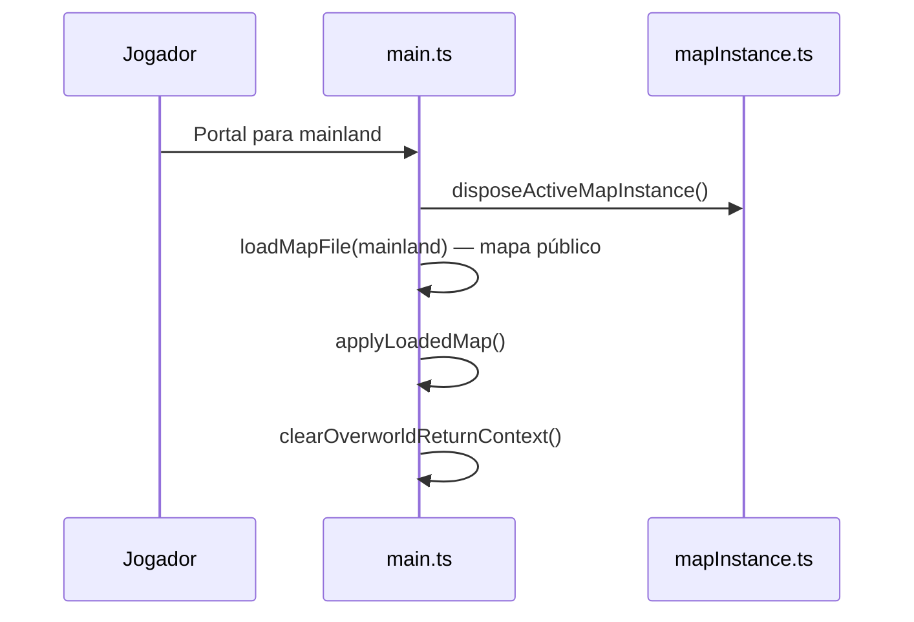
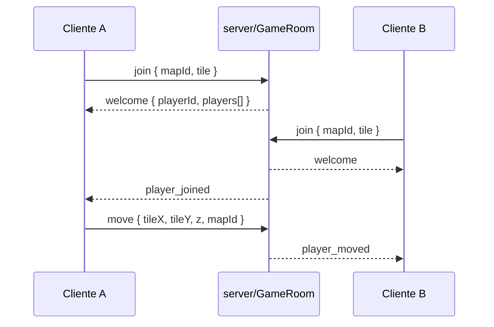

# Dungeons instanciadas e arquitetura multiplayer

Documentação completa do sistema de mapas, instâncias (Fase 1 implementada) e roteiro para multiplayer.

---

## 1. Glossário

| Termo | Significado |
|--------|-------------|
| **Mapa público** | Um único `MapDocument` carregado de `public/maps/<id>.json`. Todos que entram veem o mesmo estado (no MVP: um jogador por aba). |
| **Template** | O arquivo JSON em disco usado para **criar** dungeons instanciadas. Ex.: `public/maps/orc_cave.json`. |
| **Instância** | Cópia em RAM do template, com `instanceId` único. Alterações (tiles mortos, spawns) ficam só nessa cópia. |
| **MAP_REGISTRY** | Lista de mapas (`src/engine/mapRegistry.ts`) com `id`, `file`, `instanced`, etc. |
| **Overworld return** | Posição/mapId salvos ao entrar numa dungeon, para referência futura (escape, UI). |

---

## 2. Estado atual do projeto

### 2.1 Já existia antes da Fase 1

- Multi-mapas: `MAP_REGISTRY`, `loadMapFile`, `transitionToMap`, portais.
- Campo `instanced: boolean` em `MapEntry` (apenas metadado + UI).
- `orc_cave` marcado como `instanced: true`.

### 2.2 Fase 1 implementada (`src/engine/mapInstance.ts`)

- Ao entrar em mapa com `entry.instanced === true`:
  1. `fetch` do template (mesmo arquivo JSON).
  2. **Deep clone** (`cloneLoadedMapResult`).
  3. `instanceId` único (ex.: `inst_a1b2c3d4-...`).
  4. Estado aplicado com `applyLoadedMap` na cópia.
- Ao sair para mapa **não** instanciado: instância ativa é **descartada** da RAM.
- Cada nova entrada = **nova** instância (dungeon “fresca”).
- Limite: até **8** instâncias na RAM (as mais antigas são removidas, exceto a ativa).
- HUD mostra sufixo da instância quando dentro de dungeon.

### 2.3 Fase 2 — MVP localhost (implementado)

- Pacote `server/` com WebSocket (`ws://localhost:8787`).
- Protocolo v1 em `shared/protocol.ts`: `join`, `move`, `map_change`, broadcast `player_moved`.
- Cliente em `src/net/gameNetClient.ts` — em dev conecta automaticamente; outros jogadores aparecem como sprites rosa no mesmo `mapId`.
- Ver [`server/README.md`](../server/README.md).

### 2.4 Fase 2b — salas + walkable (implementado)

- Salas `mapId@instanceId` (`shared/roomKey.ts`).
- Servidor valida **walkable** (template JSON) e **passo adjacente** (ortogonal ou diagonal + anti-corte de canto) em `move` — ver `shared/tileWalkable.ts` (`canAdjacentStep`).
- Mapas `instanced: true`: servidor agrupa jogadores e retorna `instanceId` no `welcome`.
- Mensagem `position_correction` quando movimento é rejeitado.

### 2.5 Ainda NÃO implementado (Fase 2 completa+)

- Servidor **autoritativo** completo (speed, combate, estado de tiles da instância).
- Instância compartilhada por party.
- Persistir instância entre F5 (`sessionStorage` / servidor).
- Despawn automático por TTL no servidor.
- Auth / anti-cheat / rate limit.

---

## 3. Fluxo Fase 1 (single-player)

### 3.1 Entrar na dungeon



### 3.2 Sair da dungeon



### 3.3 O que é isolado por instância

| Dado | Isolado? |
|------|----------|
| `worldMap` (tiles) | Sim (clone de grades) |
| `metadata` | Sim (JSON clone) |
| `houses` | Sim |
| `spawns` / NPCs vivos | Sim (+ IDs de spawn/portais sufixados) |
| `portals` | Sim |
| Arquivo `public/maps/orc_cave.json` | **Não** — permanece template |

---

## 4. Arquivos do sistema

| Arquivo | Responsabilidade |
|---------|------------------|
| `src/engine/mapRegistry.ts` | Catálogo; `instanced: true` em `orc_cave` |
| `public/maps/orc_cave.json` | Template da dungeon |
| `src/engine/worldLoader.ts` | `loadMapFile` → fetch + sanitize |
| `src/engine/mapImportSanitizer.ts` | Validação anti-JSON malicioso |
| `src/engine/mapInstance.ts` | **Clone + registry de instâncias em RAM** |
| `src/main.ts` | `transitionToMap`, portais, HUD |
| `src/utils/mapDevSave.ts` | Salvar template em dev (com aviso se em instância) |
| `shared/protocol.ts` | Tipos de mensagens WebSocket v1 |
| `server/src/` | Game server MVP (join + tile sync) |
| `src/net/gameNetClient.ts` | Cliente WebSocket no browser |

---

## 5. Como configurar uma dungeon instanciada

### Passo 1 — Registry

Em `src/engine/mapRegistry.ts`:

```typescript
{
    id: 'orc_cave',
    name: 'Caverna dos Orcs',
    file: 'maps/orc_cave.json',
    size: 256,
    instanced: true,  // ← obrigatório para Fase 1
    description: '...',
},
```

### Passo 2 — Template JSON

Criar/editar `public/maps/orc_cave.json` (MapDocument v1):

- `mapId`: `"orc_cave"`
- `spawn`: ponto inicial dentro da cave
- `portals`: pelo menos um portal de saída para mapa **não** instanciado (ex.: `mainland`)
- `spawns`: monstros da dungeon (cada run clona e respawna via `respawnEntities`)

### Passo 3 — Portal de entrada (overworld)

No mapa público (ex.: `mainland.json`), portal:

```json
{
  "id": "portal_to_orc_cave",
  "targetMapId": "orc_cave",
  "targetX": 50,
  "targetY": 50,
  "targetZ": 0,
  "tileX": 60,
  "tileY": 50,
  "tileZ": 0
}
```

### Passo 4 — Testar

1. `npm run dev`
2. Carregar `mainland` (ou mapa com portal).
3. Andar até o portal → loading “Instanciando…”.
4. Console: `[MapInstance] Nova instância inst_...`
5. HUD: nome do mapa + sufixo da instância.
6. Matar NPCs / pintar tiles — **não** altera `orc_cave.json` no disco.
7. Portal de volta → `mainland` público.
8. Entrar de novo → **nova** instância (monstros de novo).

### Passo 5 — Salvar template (GM)

- **Arquivo → Salvar em public/maps** grava o **template**, não a instância.
- Se estiver **dentro** da instância, o jogo pede confirmação antes de sobrescrever o JSON.

---

## 6. Cuidados e armadilhas (Fase 1)

### 6.1 Clone e memória

- **Sempre** usar `cloneLoadedMapResult` — nunca reutilizar o objeto retornado por `loadMapFile` sem clonar.
- Mapas 256×256 × 15 andares consomem RAM; limite de 8 instâncias evita vazamento em testes repetidos.

### 6.2 Template vs instância

| Ação | Afeta template? | Afeta instância? |
|------|-----------------|------------------|
| Pintar tile no editor (dentro da run) | Não (se não salvar) | Sim |
| Export download | Exporta estado **atual** (instância se estiver dentro) | — |
| Salvar public/maps (dev) | **Sim** — sobrescreve JSON | — |
| F5 / recarregar página | Template intacto | Instância **perdida** |

### 6.3 Portais

- Anti-loop: portal só dispara ao **entrar** no tile (não parado em cima).
- Cooldown após transição (~700 ms).
- `targetMapId` deve existir no `MAP_REGISTRY` (sanitizer descarta inválidos).

### 6.4 Spawns e combate (futuro próximo)

- Cada instância deve ter seus próprios `npcs` derivados de `worldSpawns` — já via `respawnEntities()` após `applyLoadedMap`.
- Loot/contadores por instância: guardar em estrutura keyed por `instanceId` quando implementar.

### 6.5 GM / Editor

- Editar mapa no painel GM dentro de instância altera só a cópia RAM.
- Para editar o template permanente: sair da instância, carregar template via “Trocar mapa”, editar, **Salvar em public/maps**.

---

## 7. Fase 2 — Multiplayer

### 7.0 MVP implementado (localhost)

**Rodar:** `npm run dev:server` + `npm run dev` (duas abas no mesmo mapa público).



| Mensagem | Direção | Status |
|----------|---------|--------|
| `join` | C→S | Implementado |
| `move` / `map_change` | C→S | Implementado |
| `welcome` / `player_*` | S→C | Implementado |
| `input` (direção) | C→S | Futuro |
| `state` (tick completo) | S→C | Futuro |
| `enter_instance` | C→S | Futuro |

### 7.1 Princípios (próximas iterações)

1. **Servidor autoritativo** — cliente envia intenção; servidor valida e broadcast.
2. **Nunca confiar** no `main.ts` do browser para PvP, posição final ou loot.
3. **Sala = instanceId** — jogadores do mesmo party recebem o mesmo `instanceId` ao entrar.

### 7.2 Componentes (atual + sugeridos)

```
server/
  index.ts          # ✅ HTTP health + WebSocket
  GameRoom.ts       # ✅ sala única, filtro por mapId
  MapInstanceStore.ts # futuro: templateId → instâncias

shared/
  protocol.ts       # ✅ tipos v1

src/net/
  gameNetClient.ts           # ✅ join + sync tile + stepDurationMs
  remotePlayerSprites.ts     # ✅ interpolação visual + walk remoto
  # Ver docs/multiplayer-remote-players.md — buffer snapshots / AOI = backlog
```

### 7.3 Protocolo futuro (além do MVP)

| Mensagem | Direção | Conteúdo |
|----------|---------|----------|
| `input` | C→S | direção, ação |
| `state` | S→C | posições, HP, map diff |
| `enter_instance` | C→S | `templateMapId`, `partyId` |
| `instance_created` | S→C | `instanceId`, spawn |

### 7.4 Instância no servidor

1. Primeiro jogador do party em `orc_cave` → servidor clona template → `instanceId`.
2. Demais do party com mesmo `partyId` → entram na mesma instância.
3. Último jogador sai → TTL 5–10 min → `delete instance`.

### 7.5 Cuidados multiplayer

- Rate limit e max message size.
- Validação de movimento (walkable, speed, Z).
- Cheating: rejeitar teleporte não autorizado.
- Separar canal **admin** (editor) do canal **game**.

---

## 8. Fase 3 — Persistência opcional de instância (single-player)

Se quiser que F5 **não** resete a dungeon na mesma sessão:

1. Após `createMapInstanceFromTemplate`, `sessionStorage.setItem('active_instance', JSON.stringify({ instanceId, serialized }))` — **cuidado com tamanho** (limite ~5 MB).
2. Ou persistir só “progresso” (boss morto, baú aberto) em estrutura pequena.
3. Ao sair para overworld: `sessionStorage.removeItem(...)`.

---

## 9. Checklist de verificação

### Fase 1 (implementada)

- [ ] Entrar `orc_cave` cria log `[MapInstance] Nova instância`
- [ ] HUD mostra sufixo da instância
- [ ] Alterações na cave não aparecem em segunda aba/outro reload do JSON sem salvar template
- [ ] Sair para `mainland` descarta instância (log `Instância descartada`)
- [ ] Reentrada gera nova instância (NPCs resetados)
- [ ] Salvar em public/maps dentro da instância mostra aviso

### Fase 2 MVP (localhost)

- [ ] `npm run dev:server` sobe na porta 8787
- [ ] Duas abas em `mainland` — jogador remoto visível (rosa)
- [ ] Console: `[GameNet] conectado como p_...`
- [ ] `VITE_GAME_SERVER_WS=false` desliga a rede no cliente

### Fase 2b (salas + walkable)

- [ ] Duas abas em `orc_cave` — mesma sala de rede (log `sala instanciada do servidor`)
- [ ] Andar para parede — console `NOT_WALKABLE` ou `INVALID_STEP`
- [ ] Portal entre mapas — `map_change` aceito

### Fase 2 completa (futuro)

- [ ] Estado de tiles da instância no servidor (não só template)
- [ ] Party join explícita por `partyId`

---

## 10. Referências no código

- Clone: `cloneLoadedMapResult` em `src/engine/mapInstance.ts`
- Transição: `transitionToMap` em `src/main.ts`
- Template orc: `public/maps/orc_cave.json`
- Portal exemplo: `public/maps/mainland.json` → `orc_cave`

---

*Última atualização: Fase 1 (instâncias RAM) + Fase 2 MVP (`server/` + `shared/protocol.ts`).*
