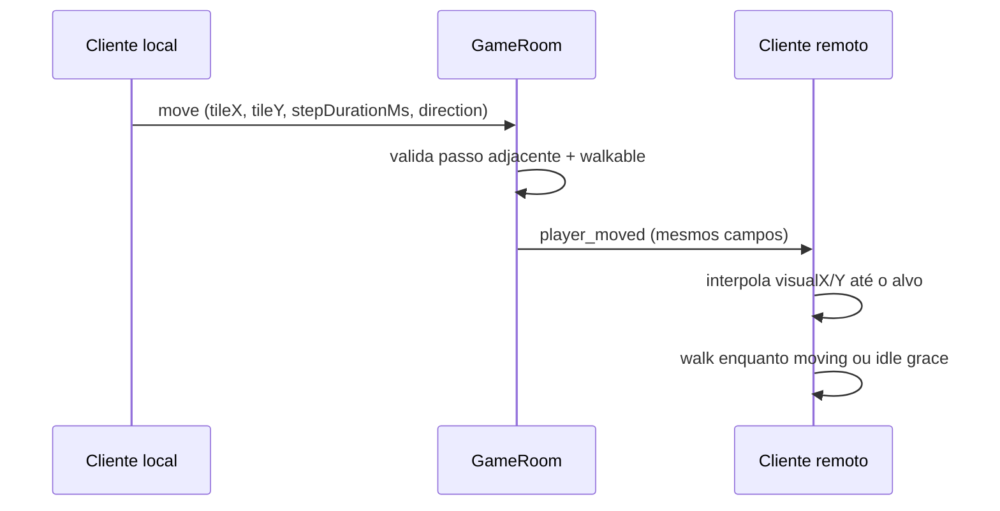

# Jogadores remotos — estado atual e roadmap de escala

Documento de referência para humanos e agentes IA. Descreve o que **já está implementado** no Play (2+ jogadores na mesma sala) e o que **fazer quando houver muitos players online**.

Última revisão: **2026-06-09**

Relacionado: [instanced-maps-and-multiplayer.md](./instanced-maps-and-multiplayer.md) (salas, instâncias, protocolo base), [hosting.md](./hosting.md) (deploy).

---

## Resumo executivo

| Camada | Status |
|--------|--------|
| Posição por tile (servidor autoritativo) | ✅ |
| Aparência (`PlayerAppearance`) no join | ✅ |
| Interpolação visual remota (não teleporta no grid) | ✅ |
| Walk / idle + direção | ✅ |
| `stepDurationMs` no `player_moved` | ✅ |
| Buffer de snapshots atrasado (100–150ms) | ⏳ backlog |
| AOI — jogadores/criaturas/eventos PvP (25×20 OTC) | ✅ |
| Viewport cull — NPCs e remotos no draw | ✅ |
| Cap aggro chase (~10 mobs ativos/alvo) | ✅ |
| `stepDurationMs` calculado no servidor | ⏳ backlog |
| `move_request` (intenção, não posição) | ⏳ backlog |

---

## 1. Princípio de ouro

**Nunca desenhar o remoto direto no tile do servidor.**

O servidor manda estado **discreto** (grid). O cliente remoto mantém duas posições:

| Posição | Uso | Exemplo |
|---------|-----|---------|
| **Lógica** (`tileX`, `tileY`, `z`) | Rede, colisão, combate, portas | `10, 8, 0` |
| **Visual** (`visualX`, `visualY`) | Desenho, interpolação, animação | `320.4, 256.8` px |

O jogador **local** usa `gridMovement` + input. O **remoto** usa `RemotePlayerSpriteManager`.



---

## 2. O que já está implementado

### 2.1 Protocolo (`shared/protocol.ts`)

| Campo / mensagem | Quando |
|------------------|--------|
| `PlayerAppearance` | `welcome`, `player_joined`, `state_sync`, ticket WS |
| `direction` | `player_moved`, snapshots |
| `stepDurationMs` | `move`, `map_change` (C→S) → `player_moved` (S→C) |
| `parseStepDurationMs()` | Clamp **55–600 ms** (`MIN_SERVER_STEP_DURATION_MS` = `AT_MAX_SPEED`) |

**Não reenviar** `appearance` nem `stepDurationMs` em todo frame — só em join e a cada passo.

### 2.2 Servidor (`server/src/GameRoom.ts`)

- Valida tile, passo adjacente, walkable, sala `mapId@instanceId`.
- **Rate limit:** `lastMoveAcceptedAtMs` — intervalo mínimo `stepDurationMs × 0.80` entre passos (`MOVEMENT_TOO_FAST`).
- **`MOVEMENT_TOO_FAST`:** envia só `error` (sem `position_correction`) — evita rubber-band em latência alta; o cliente reenvia o tile com `forceResyncPosition()`.
- **`INVALID_STEP` / `NOT_WALKABLE` / `INVALID_TILE`:** só `error` (sem `position_correction`); cliente valida passo antes do WS (`validateOutgoingMove`) e faz rollback suave ao tile autoritativo (`onMovementRejected`).
- **Anti-spam rejeição:** `rejectMove()` — no máximo um par `error` (+ correção quando aplicável) a cada 400ms **por jogador**; demais `move` inválidos no intervalo são ignorados silenciosamente.
- Guarda `lastStepDurationMs` do cliente e repassa em `player_moved`.
- Kick por `characterId` duplicado na mesma conexão.

### 2.3 Cliente local (`src/game/playApp.ts` + `gameNetClient.ts`)

- `getLocalState()` envia `gridMovement.stepDurationMs` (já inclui fator diagonal √2 do grid local).
- Sync só quando tile / mapa / direção mudam (não a cada frame).

### 2.4 Cliente remoto (`src/net/remotePlayerSprites.ts`)

| Mecanismo | Constante / comportamento |
|-----------|---------------------------|
| Interpolação linear tile→tile | `fromX/Y` → `toX/Y` |
| Duração do passo | Prioriza `stepDurationMs` do servidor; senão estima intervalo entre pacotes |
| Idle grace (evita “anda e trava”) | `REMOTE_IDLE_GRACE_MS = 120` |
| Estimativa fallback | `packetInterval + 40ms`, clamp 160–320ms |
| Walk contínuo | `walk` enquanto `moving` **ou** dentro do grace |
| Cache de sprite | Um `SpriteAnimationController` por `playerId`; JSON carregado por `spriteSheetUrl` |

### 2.5 Desenho (`src/engine/depthSortDraw.ts`)

- `collectRemoteDepthDrawables` usa `worldX` / `worldY` interpolados (não só `tileX * 32`).
- Depth sort pelo pé do sprite na posição visual.
- **Viewport cull:** `collectNpcDepthDrawables` e `collectRemoteDepthDrawables` ignoram entidades fora do retângulo visível (`playApp.ts` passa `viewport`).

### 2.6 AOI espectador (`shared/creatureSpectatorRange.ts`)

Retângulo **25×20** tiles (paridade OTC `Map::clientMap*`):

| Evento | Filtro |
|--------|--------|
| `welcome` / `state_sync` — jogadores e criaturas | `filterPlayerSnapshotsForViewer` / `filterCreatureSnapshotsForViewer` |
| `player_moved`, `player_joined`, `player_left` | `broadcastToPlayerSpectators` |
| `player_damaged`, `player_died`, `player_respawned` | `broadcastToPlayerSpectators` (tile do alvo / morte) |
| `creature_*` (dano, morte, movimento) | `broadcastToSpectators` via `RoomCreatureManager` |
| Tick chase servidor | `creatureHasPlayerInAwareRange` — IA só com jogador no retângulo |

### 2.7 Chase em escala (`shared/creatureChase.ts`, `RoomCreatureManager`)

- **Cap aggro:** no máximo `MONSTER_MAX_ACTIVE_CHASERS_PER_TARGET` (10) mobs **se aproximando** por jogador-alvo; mobs já no alcance melee mantêm IA (virar / dançar).
- **Pathfinding:** BFS cardinal `findCardinalPathFirstStep` quando greedy falha.

---

## 3. Arquivos-chave (não espalhar lógica)

```
shared/protocol.ts              PlayerSnapshot, PlayerMovedMessage, parseStepDurationMs
server/src/GameRoom.ts          autoridade, broadcast player_moved
server/src/routes/wsTicket.ts   appearance no ticket (prod)
src/shared/enterTicket.ts       appearance no ticket (dev mock)
src/net/gameNetClient.ts          WS cliente, mapa de remotos
src/net/remotePlayerSprites.ts  interpolação + walk/idle remoto
src/world/playerAppearance.ts   appearanceFromCharacter, loadOutfitSpriteConfig
src/game/playApp.ts             wiring Play + rede
```

**Regra:** nova lógica de remoto → `RemotePlayerSpriteManager` (ou extrair `RemotePlayerController` quando crescer). **Não** colocar interpolação dentro do `draw()` ou handlers WS soltos.

---

## 4. Checklist de regressão (2 jogadores, dev)

Rodar após mudanças em protocolo, `GameRoom`, `remotePlayerSprites` ou `depthSortDraw`:

1. [ ] Duas abas Play, mesmo mapa — ambos veem outfit correta (não quadrado rosa permanente).
2. [ ] Remoto **desliza** entre SQMs (não teleporta).
3. [ ] Remoto **anda** (walk) enquanto se move; **idle** ao parar.
4. [ ] Direção do sprite muda ao virar (N/S/L/O).
5. [ ] Velocidade remota **parecida** com a local (terreno rápido/lento, diagonal).
6. [ ] Trocar de mapa — remoto some/entra na sala certa.
7. [ ] Reconectar — `welcome` + lista de jogadores na sala.
8. [ ] Aba em background — servidor continua; ao voltar foco, `resync_request` alinha mobs/remotos.
9. [ ] Matar mob online em perseguição — corpo no SQM autoritativo (`creature_died` com tile); sem offset visual após mover 1 tile.
10. [ ] `localStorage debug.creature.sync=1` — logs de desync; F3 mostra “Creature desync max” quando mob desliza.

### Aba em background (Page Visibility)

- Browser pausa `requestAnimationFrame` em aba oculta — render e input local param (esperado).
- **Servidor** não depende do foco: mobs, combate e cooldowns usam `setInterval` no Node.
- Ao voltar (`visibilitychange` → visible): cliente envia `resync_request`; servidor responde com `state_sync`, `creature_sync`, `position_correction` (jogador local) e `player_progress`.
- Ao perder foco (`hidden` / minimizar): cliente envia `syncPositionIfChanged`, limpa input e estabiliza posição/câmera antes do browser throttlar rAF.
- **Blur** (alt-tab sem minimizar): só limpa teclas — não realinha posição (evita conflito com restore no Windows).
- Offline (`VITE_GAME_SERVER_WS=false`): simulação inteira no cliente — pausa com a aba é aceitável.

### Multiplataforma (Electron / Capacitor)

- **Electron:** Aplicativo roda no desktop. O motor e o WebSocket não devem pausar ao minimizar (`backgroundThrottling: false`). IPC: `window-background` / `window-foreground` (minimize) separados de `window-blur` / `window-focus`. Detalhes: [electron-desktop.md](./electron-desktop.md) §4.
- **Capacitor (Android/iOS):** Em background, o SO pode matar o app. O `capacitorLifecycle` usa o plugin `App` para ouvir `appStateChange`. O WebWorker/WebSocket pode ser pausado pelo SO. Ao voltar a foreground (`isActive: true`), força-se um `resync_request` se muito tempo tiver passado, ignorando o estado stale. O `serverStateStore` protege contra atrasos no draw se a thread visual demorar a acordar.

---

## 5. Roadmap — quando tiver **muitos** jogadores online

Prioridade sugerida. Implementar **na ordem**; cada item é independente o suficiente para um PR.

### Fase A — Fluidez sob latência (sem mudar autoridade)

| # | Item | Por quê | Onde |
|---|------|---------|------|
| A1 | **Buffer de snapshots + render atrasado ~100ms** | Dois pontos no tempo para interpolar; padrão Source / Unity Netcode | Novo `remoteSnapshotBuffer.ts`; `RemotePlayerSpriteManager` |
| A2 | **`serverTime` / `timestamp` em `player_moved`** | Ordenar snapshots com ping variável | `shared/protocol.ts`, `GameRoom` |
| A3 | **Easing** (ease-out no fim do passo) | Menos sensação mecânica | `remotePlayerSprites.tick()` |

**Gatilho:** ping médio > 80ms ou reclamação de “tranco” mesmo com `stepDurationMs`.

### Fase B — Escala por sala (performance rede + CPU)

| # | Item | Por quê | Onde |
|---|------|---------|------|
| B1 | **AOI (Area of Interest)** — broadcast só jogadores a ~15–25 tiles | 100 players no mapa ≠ 100 × movimento para todos | ✅ `creatureSpectatorRange.ts` + `broadcastToSpectators` |
| B2 | **Cap de snapshots em `welcome`** — só jogadores no AOI | Join não lista o mapa inteiro | ✅ `joinHandlers` + `filterPlayerSnapshotsForViewer` |
| B3 | **Rate limit** por socket (movimentos/seg) | Anti-flood | middleware WS ou `GameRoom` |
| B4 | **Cache global de `HTMLImageElement` por `spriteSheetUrl`** | 50 knights = 1 PNG carregado | `remotePlayerSprites` ou `spriteCache.ts` |

**Gatilho:** > 20–30 jogadores na **mesma sala** ou CPU/rede subindo no devtools.

### Fase C — Autoridade e anti-cheat (MMO sério)

| # | Item | Por quê | Onde |
|---|------|---------|------|
| C1 | **`stepDurationMs` calculado no servidor** (stats, terreno, buffs) | Cliente não define velocidade | `GameRoom` + tabela speed por vocação/ tile |
| C2 | **`move_request` com direção** em vez de “estou em X,Y” | Servidor calcula destino | `protocol.ts`, refactor `gameNetClient` |
| C3 | **Correção suave** no local quando servidor diverge | Prediction + reconcile | `playApp`, `position_correction` estendido |
| C4 | **Teleporte explícito** se distância > N tiles | Evita interpolar 10 tiles | `RemotePlayerSpriteManager.applyNetworkPosition` |

**Gatilho:** play público, PvP, ou suspeita de speed hack.

### Fase D — Infra (só com volume alto)

| # | Item | Notas |
|---|------|-------|
| D1 | Sharding por `mapId` ou processo por região | Múltiplos `GameRoom` / workers |
| D2 | Protocolo binário | Só se JSON virar gargalo medido |
| D3 | Redis / pub-sub entre instâncias Node | Vários replicas Railway |

---

## 6. Constantes ajustáveis (tuning)

Arquivo: `src/net/remotePlayerSprites.ts`

| Constante | Valor atual | Efeito |
|-----------|-------------|--------|
| `REMOTE_STEP_DURATION_MS` | 240 | Fallback se sem histórico de pacotes |
| `REMOTE_IDLE_GRACE_MS` | 120 | Quanto tempo mantém walk após chegar no tile |
| `REMOTE_SMOOTHING_EXTRA_MS` | 40 | Compensa latência na estimativa |
| `MIN_REMOTE_STEP_MS` | 160 | Piso da estimativa |
| `MAX_REMOTE_STEP_MS` | 320 | Teto da estimativa |

Se com muitos players ainda houver micro-pausas: subir `REMOTE_IDLE_GRACE_MS` para **160** antes de implementar Fase A.

---

## 7. O que **não** fazer

1. **Mandar `worldX/worldY` a cada frame** — explode tráfego; grid + interpolação basta.
2. **Desenhar remoto no `tileX/tileY` do snapshot** — volta o teleporte.
3. **Idle imediato ao chegar no tile** — volta o “anda e trava”.
4. **Replicar diagonal no remoto** quando `stepDurationMs` já veio do servidor — o local já inclui √2 no passo.
5. **Misturar canal Studio (editor)** com sync de jogo sem auth separada.

---

## 8. Atualizar este documento quando

- Adicionar campo ao protocolo WS (`timestamp`, `serverTime`, `move_request`, …).
- Mudar `RemotePlayerSpriteManager` ou extrair `RemotePlayerController`.
- Implementar AOI ou buffer de snapshots.
- Alterar limites de `parseStepDurationMs`.

Registrar também uma linha em [studio-improvements-log.md](./studio-improvements-log.md) (tabela resumo).

---

## 9. Referências rápidas

| Tópico | Arquivo |
|--------|---------|
| Protocolo v1 | `shared/protocol.ts` |
| Sala WS | `server/src/GameRoom.ts` |
| Cliente WS | `src/net/gameNetClient.ts` |
| Interpolação remota | `src/net/remotePlayerSprites.ts` |
| Grid local (referência) | `src/movement/gridMovement.ts`, `playerMovement.ts` |
| Análises anteriores (histórico) | `docs/analise-chatgpt.md` |
